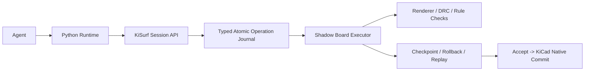

# Python as the Long-Term Script Runtime for an AI-Native PCB Editor

## Executive conclusion

Python can be the long-term **primary** script language for an AI-native PCB editor, and it can even be the **only exposed authoring language** for a long time, but only under one condition: Python must sit **above** an editor-owned, language-neutral execution substrate that controls every board mutation as a typed atomic operation. In other words, the right answer is **not** “Python instead of IR,” but “Python on top of an internal typed operation journal and session engine.” KiCad already supports Python-based scripting and plugins, and its newer IPC API exposes board/document access, headless server mode, typed board objects, and grouped undo commits. At the same time, KiCad’s own docs still show that raw Python can obtain and modify the currently loaded board directly, and the IPC docs explicitly warn that `run_action` is unstable. Those facts make Python a strong front-end language, but a weak sole authority for mutations. citeturn1view0turn1view1turn10search17turn10search3turn11view0

For your use case, I would **not** build a general-purpose user-facing JSON DSL / AST interpreter first. I **would** build an internal typed mutation layer, a shadow-board preview engine, and a replayable operation journal. Python should generate operations through that session API, never by touching KiCad internals directly. That gives you the ergonomics the agent needs—variables, loops, conditionals, geometry, batch operations, iterative correction—while preserving preview-first, checkpoint/rollback, deterministic replay, and a clean path into a single KiCad undo step. This recommendation is consistent with how mature editors separate a scripting layer from a transaction/command core: KiCad now has grouped board commits, FreeCAD exposes document transactions with commit/abort, AutoCAD’s transaction manager groups and rolls back nested edits, Fusion has an `executePreview` model that can reuse preview results on accept, and Unreal explicitly recommends using a lower-level foundation with a scripting layer on top rather than making the scripting surface the whole system. citeturn11view0turn12view0turn14view0turn14view1turn14view2turn13view0turn19view0

## What existing editor platforms actually teach

The strongest evidence in favor of Python is simple: serious design tools already use it. KiCad’s PCB editor supports Python action plugins, ships with a Python console, and documents that `pcbnew.GetBoard()` returns the loaded board, which can then be inspected and modified. KiCad’s newer `kicad-python` IPC layer also supports connecting to a running KiCad instance, launching API plugins with a socket/token, or starting a headless `kicad-cli api-server`, and its `Board` API includes typed accessors such as `get_vias`, `get_zones`, `get_tracks`, `get_items_by_id`, `create_items`, `update_items`, grouped commits, and render/export functions. Fusion 360 also officially supports Python scripts and add-ins. Blender and FreeCAD have been Python-scriptable for years, and those ecosystems are proof that Python is perfectly viable as the human- and tool-facing language in content creation and CAD-style software. citeturn1view1turn1view0turn10search17turn11view0turn20search0turn13view1

What those same tools teach, however, is that **language choice is not enough**. Transaction and preview ownership belongs to the host editor. In KiCad’s IPC board API, `begin_commit()` opens a grouped commit and `push_commit()` produces a single undo step; if you do not open a commit, changes are committed immediately and may generate multiple undo-history entries. FreeCAD’s `App::Document` has `openTransaction`, `commitTransaction`, and `abortTransaction`, with explicit undo/redo support. AutoCAD’s transaction manager exists specifically to group multiple object operations into one operation, and Autodesk also documents nested transactions where aborting an outer transaction unwinds everything inside it. Fusion’s preview model goes even further: during `executePreview`, the command can mark the preview result as valid so it can be reused when the user clicks OK. That is exactly the family of mechanics you want for an AI construction workflow. citeturn11view0turn29view0turn12view0turn14view0turn14view1turn14view2turn13view0

The opposite lesson comes from direct object scripting. KiCad’s older documentation explicitly warned that undo/redo did not work for Python scripts in the then-current action-plugin model. Blender’s Python docs warn not to keep direct references to Blender data when undo/redo may happen, and current operator docs say any operator modifying data should use the undo option, while modal operators are the right fit for interactive tools that keep running until `FINISHED` or `CANCELLED`. In other words, raw host-object access is convenient, but as soon as you care about iterative preview, rollback, and long-lived agent state, you need editor-mediated handles and transaction ownership, not naked object pointers. citeturn10search2turn17search2turn17search0turn17search3turn24search3turn24search14

A final lesson comes from visual scripting systems. Unity and Unreal both use graph-based scripting, but Epic’s own guidance is that most projects benefit from mixing Blueprint with C++, using C++ as the foundation and exposing functionality upward. Epic also notes that large C++ text is easier to modify than large Blueprint graphs, and that C++ is better for lower-level systems, complex algorithms, and large data sets. That analogy maps well to your problem: a node graph can be useful for user macros or visual inspection, but it is the wrong primary format for an LLM that needs to iteratively author loops, geometry, conditions, and corrective edits. citeturn18search0turn18search1turn19view0

## Why Python can be the only exposed script language but not the only architectural layer

If by “Python as the long-term only runtime” you mean “the only language the agent ever writes,” that is defensible. Python is expressive, compact, familiar to both humans and models, and naturally handles variables, loops, geometry helpers, and incremental scripting. It is also already the idiom used by KiCad plugins, Fusion scripts, Blender tools, and many engineering automation workflows. You do not need a user-facing JSON DSL to get those benefits. citeturn10search0turn10search17turn13view1turn24search5

If, however, “only runtime” means “Python code directly mutates the live board object graph and there is no internal typed operation boundary,” then the answer is no. KiCad’s own docs say the Python console can modify the current board directly. The IPC board API says that if you skip `begin_commit`, changes are committed immediately, and even when you use grouped commits, the API is still exposing host objects and mutators. The board API is also versioned in detail, with methods added across KiCad 9, 10, and 11, while the top-level client even provides `check_version()` to verify the library matches the connected KiCad version. That means a direct Python-to-KiCad binding creates long-term version-lock pressure and makes it too easy for scripts to depend on raw host behavior rather than your product contract. citeturn10search17turn11view0turn29view0turn1view1

So the right split is this:



In that architecture, Python is the **control language**. The **source of truth** is the session engine and journal. The journal is your internal IR, but it is not a user-facing programming language. That distinction matters. It gives you long-term stability without forcing agents to author verbose JSON trees for ordinary algorithmic work. citeturn11view0turn12view0turn14view0turn19view0

## The recommended architecture

The most stable design is **Python-first runtime + KiSurf session API + typed operation journal**. I would define the session API as the **only mutation surface**. Python would be allowed to do ordinary computation and call session methods such as `create_via`, `create_zone`, `update_item`, `remove_item`, `query_board`, `render_preview`, `run_checks`, and `rollback_to`. But Python would **not** receive a raw `BOARD*`, raw `BOARD_ITEM*`, or direct SWIG/IPC-host object with unrestricted mutation methods. Instead, it would receive opaque references such as `ItemRef(id, revision)` or typed value objects. This is the same design instinct implied by Blender’s warnings about object references across undo/redo and by KiCad’s own use of internal unique identifiers for board items. KiCad’s board API already exposes `get_items_by_id` and says `update_items` matches existing items by internal UUID; that is a good foundation for opaque handles rather than direct host pointers. citeturn17search2turn17search8turn11view0turn29view0

The mutation engine below Python should record every change as a typed atomic operation. Examples would include `CreateVia`, `CreateTrackSegment`, `CreateZone`, `MoveItem`, `SetNet`, `SetPadstack`, `DeleteItem`, `RefillZones`, `AssignMetadata`, and `BatchUpdate`. Each operation should have typed arguments, precondition checks, deterministic output IDs, and a structured result. The journal entry should record at least the step label, operation kind, arguments, resolved target IDs, created IDs, warnings, clamps, validation output, and the before/after revision hashes. KiCad’s current board API already exposes enough semantics to justify this direction: items are typed, updates are matched by UUID, invalid ranges may be clamped, grouped commits exist, and zone refills are explicit. That is exactly the sort of surface that should be normalized into your own stable contract rather than leaked upward unchanged. citeturn20search0turn29view0

This is also why I would not use “tool-calling + action bundles” as the primary architecture. KiCad’s `run_action` is explicitly documented as unstable and not intended for general use, with no guarantee of stable action names and possible unintended side effects. Action bundles are fine for a few editor commands, but they are the wrong substrate for an agent that needs unbounded combinations, geometric loops, and corrective iteration. Stable atomic operations are the substrate; Python is the orchestrator. citeturn1view1turn10search3

A concise way to frame the decision is this:

| Architecture choice | Recommendation |
|---|---|
| User-facing JSON DSL / AST interpreter | **No** as the primary authoring model |
| Internal typed IR / operation journal | **Yes**, mandatory |
| Python as the primary agent authoring language | **Yes** |
| Python direct access to raw KiCad board internals | **No** |
| Node graph as the main agent runtime | **No** |
| WASM as the primary runtime today | **No**, but useful later for third-party isolated extensions |

That recommendation follows the pattern seen in major tools: expose a friendly scripting surface, keep transactions and preview in the host, and preserve a lower-level stable core for scale and evolution. citeturn12view0turn14view0turn13view0turn19view0turn9search1

## How step execution, checkpoint, rollback, preview, and accept should work

The critical design choice is that Python should execute against a **shadow board session**, not the live board. KiCad’s current `begin_commit()` mechanism groups changes and keeps them from being reflected in the editor until `push_commit()`. That is good for undo grouping, but it is not enough for an AI workflow where you want to show the user—and the model—intermediate visual results after each meaningful step. So your session engine should own a shadow state that can be rendered by the native renderer and inspected between steps. This is an inference from KiCad’s commit semantics, not something the current API gives you out of the box. citeturn11view0turn29view0

The step abstraction should be explicit. A good Python shape is a context manager such as:

```python
with session.step("place stitching vias") as st:
    for i in range(count):
        angle = i * 2 * math.pi / count
        p = center + polar(radius, angle)
        via = st.create_via(position=p, net=net_gnd, diameter=via_d, drill=drill_d)
        st.tag(via, name=f"stitch_{i}", metadata={"ring": "outer"})
obs = st.observe(render=True, run_checks=True)
```

At the end of each step, the engine should finalize the step journal, refill zones if requested, run geometric and rule checks, render the intermediate preview, and return a structured observation object containing item diffs, rule feedback, warnings, and visual frame handles. Blender’s modal-operator model is the right analogy here: interactive tools stay alive across multiple small interactions and finish or cancel explicitly. Fusion’s `executePreview` model is another good precedent: preview is not a side effect of accept; it is a first-class stage whose result can be reused. citeturn24search3turn24search14turn13view0

Checkpoint and rollback should operate on the **board session**, not on the arbitrary Python heap. That distinction is extremely important for long-term stability. A checkpoint should store the journal index, shadow-board revision hash, and object-ID mapping state needed to reconstruct the shadow board. What it should **not** promise is full time-travel of arbitrary Python variables. Rewinding the board is tractable; rewinding the entire interpreter state is not a good architectural contract. The practical design is to let the agent work in a cell/REPL/generator style, where after rollback it reissues corrected Python code against the rewound board state. Any Python object representing a board item should therefore be an **opaque handle** with a revision/generation number. If the model tries to use a stale handle after rollback, the API should raise a deterministic “stale reference” error and require re-resolution by UUID or a fresh query. Blender’s undo/reference warnings strongly support this design. citeturn17search2turn17search8turn29view0

Preview-first should also determine your UI. The default user-facing view should show **step-level semantic diffs**, not an overwhelming flat list of every atomic op. For example, “Created annular zone,” “Placed 48 vias,” “Adjusted via spacing,” and “Refilled zones” are understandable steps. Each of those can expand into the exact atomic operation log for debugging or audit. When the user clicks **Accept**, the engine should replay or apply the validated journal to the real board inside a single native KiCad commit, so the whole accepted construction appears as one undo step in KiCad history. KiCad’s board API already documents that a pushed commit becomes a single undo step. If the user clicks **Reject**, you just discard the shadow session. If they click **Undo** after accept, KiCad handles it natively. If they click **Replay**, you rerun the same journal against the same base hash. citeturn11view0turn29view0

For checks, the host should own them. KiCad already has a Design Rules Checker and explicitly documents that it verifies the PCB against board rules and connectivity, with options to refill zones and report violations. Your AI runtime should expose a stable `run_checks()` surface that uses KiCad’s own rule system underneath, but the agent should never need to invoke unstable GUI action names for this. citeturn28search0turn1view1

## Process model, determinism, and future extensibility

The best process model for this architecture is a **per-session out-of-process Python worker** connected to the editor core over a structured RPC channel. KiCad’s IPC API already shows a model based on socket/token communication to a running KiCad instance and supports headless API-server mode. Python’s own docs make it clear that separate processes are the standard mechanism for isolation and control, and both `multiprocessing` and `subprocess` support timeouts and process termination. VS Code is a useful precedent here: extensions run in a separate extension-host process, and the workbench can recover from unexpected extension-host termination. That is exactly the property you want for an AI editing runtime attached to a GUI editor. citeturn1view1turn7search1turn21search0turn21search1turn6search0turn6search8

I would **not** recommend in-process embedded Python as the default long-term agent runtime. It is viable for a console or developer mode, and Python is explicitly designed to be embeddable in larger applications, but in-process execution makes cancellation, crash containment, and resource accounting materially harder. Python’s own docs also say audit hooks are not suitable for implementing a sandbox; malicious code can bypass them. Even though you are not primarily optimizing for hostile code, that warning is still relevant for robustness: do not mistake “some auditing” for strong control. Use a separate worker process, and let the editor core remain the owner of board state and mutations. citeturn8search0turn8search3turn7search6turn7search10

For deterministic replay, the contract should be engineering-grade rather than mathematically absolute. Record the base board hash, KiSurf API version, KiCad version, Python version, script text or cell history, explicit seed, session options, and the operation journal. Python’s `random` module documents that reusing a seed should reproduce sequences as long as multiple threads are not running, which is a strong reason to keep the worker single-threaded for agent scripts unless concurrency is editor-managed. Time, random, filesystem, network, and subprocess creation should either be disabled, stubbed, or routed through deterministic session services if you care about exact replay. The worker process also gives you a clean hard-stop path when a script exceeds time or resource limits. citeturn7search3turn21search1turn21search0

WebAssembly is worth mentioning, but not as the primary answer to your current problem. WASI’s official model is capability-based: a module starts with no ambient authority and only gets what the host grants. That is excellent if, later, you want third-party, multi-language, strongly isolated compute plugins. But your current priority is interactive, geometry-heavy, agent-authored editor scripting on a local engineering workstation. For that, Python gives far better ergonomics and ecosystem fit today. The right long-term move is not “replace Python with WASM,” but “keep the session/journal boundary language-neutral so WASM can be added later without rewriting the engine.” citeturn9search0turn9search1

## The recommended MVP and the long-term boundary you should not cross

The first shippable MVP should be **Python-first**, but with the final architecture already in place. That means: a per-session Python subprocess; a language-neutral KiSurf session API; a shadow board; typed atomic operations and a step journal; native renderer snapshots after each step; stable opaque item handles; checkpoint and rollback at the board-session level; and one-click accept that replays into a single KiCad undo commit. KiCad’s current API already supports typed board items, grouped commits, item lookup by internal ID, exports, render output, and zone refill; those capabilities make a Python-first MVP realistic without betting the architecture on direct mutable board objects. citeturn11view0turn20search0turn29view0

The boundary you should never cross is this: **Python must not become the owner of board truth**. Python can compute, plan, loop, branch, and decide. Python can create or update editor objects only through the KiSurf session contract. Python should never directly mutate KiCad internals, never bypass typed operations, never write straight into the live board outside the session engine, and never define your replay/undo semantics. If you keep that boundary, then Python can remain your only exposed script language for years without painting you into a corner. If you break that boundary, you will eventually be forced to build the missing journal/transaction/preview layer later under more painful conditions. citeturn10search17turn11view0turn1view1turn17search2

So the final recommendation is clear:

- **Recommended architecture:** Python-first runtime + KiSurf session API + typed atomic operation journal + shadow-board preview engine.
- **Must-have lower boundary:** every mutation goes through typed atomic operations owned by the editor core.
- **What Python can directly do:** computation, loops, geometry, planning, batching, calling session APIs, inspecting structured observations, and orchestrating corrective iterations.
- **What Python must not directly do:** mutate raw KiCad board internals, own undo/redo semantics, own preview truth, or bypass the journal.
- **Whether you need a self-built DSL:** not as the user-facing language; yes as an internal typed journal/IR.
- **Whether Python can be the long-term only exposed script language:** yes.
- **Whether Python can be the whole architecture:** no. citeturn11view0turn12view0turn14view0turn13view0turn19view0