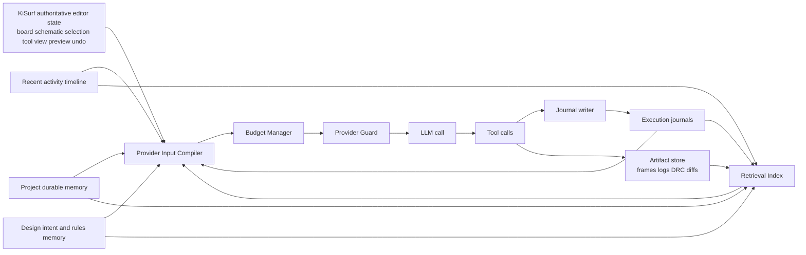
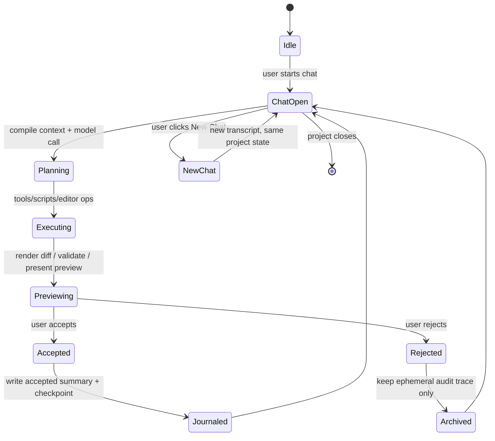
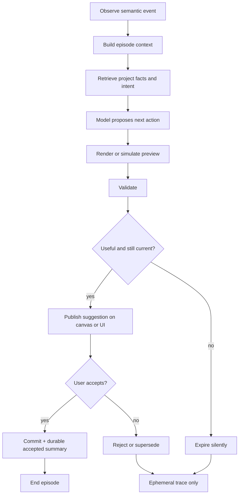

# AI Native Provider Input, Memory, Artifacts, and Runtime Lifecycle Architecture for KiSurf

## Executive summary

KiSurf should not treat “conversation history” as the primary source of model input. The evidence base points the other way: long context is useful, but it is also a finite and degrading resource. Anthropic explicitly frames context as a limited token budget with diminishing returns, and Liu et al. show that models often recall information best from the beginning or end of a long prompt while degrading on content buried in the middle. In practice, that means a KiCad-based AI editor should rebuild model-facing provider input on every call from the *current design state*, a narrow task-local working set, compact summaries, and selectively retrieved durable memory-not by replaying an ever-growing transcript. citeturn6view1turn24view4turn28view2

The recommended long-term architecture for KiSurf is a **hybrid hierarchical memory system** with an **event-sourced journal** and **retrieval-augmented provider input assembly**. This is more suitable than pure transcript truncation or chat-only rolling summaries because KiSurf is not a chatbot with static documents; it is a stateful editor with structured design state, user selections, preview sessions, validation results, rollback, and accept/reject workflows. The most relevant architectural analogies come from hierarchical-memory work such as MemGPT, dynamic memory/retrieval patterns such as Generative Agents and Reflexion, and production guidance from OpenAI and Anthropic on compaction, prompt caching, tool-context management, and observability. citeturn24view0turn23view0turn23view4turn9view2turn33view1turn20search0

For the **Chat Agent**, KiSurf should use bounded chat sessions with explicit “New Chat” semantics. A new chat should create a new visible transcript and a new model conversation/session boundary, but it should *not* reset the editor’s board/schematic state, undo history, project-level durable memory, or accepted-edit summaries. This is closely aligned with how Claude Code describes session behavior: each session begins with a fresh context window, while concise project memory carries across sessions and deeper memory files are read on demand. citeturn8view3

For the **Next Action Agent**, KiSurf should avoid a single continuous background “memory stream.” Instead, it should run **short-lived episodes** keyed to semantic editor events such as stable selection, active tool mode, routing step, placement interaction, validation deltas, or structured-panel focus. Those episodes should be small, task-local, and heavily state-derived. They should not inherit arbitrary chat history. Short, isolated contexts are consistent with Anthropic’s production account of multi-agent systems, where separate context windows and artifact references improve signal density and reduce token overhead. citeturn25view0turn28view1

Across both agents, KiSurf should share only a narrow set of durable memories: project facts, design intent, design constraints, stable user preferences, accepted-edit summaries, and accepted validation learnings. It should *not* durably share raw chat logs, hidden failed attempts, rejected previews, expired suggestions, or large transient tool outputs. Recent memory-security work argues that writable long-term memory must be designed around provenance, versioning, policy-aware retention, and verifiable rollback from the start, not as an afterthought. That is especially important in an EDA tool where bad memory can silently contaminate future edits. citeturn31view0

The practical implementation center of gravity in C++ KiSurf core should therefore be six things: a **Provider Input Compiler**, a **Token Budget Manager**, a **Conversation and Episode Manager**, a **Memory Store with provenance**, a **Retrieval Index**, and a **Provider Guard/Trace layer**. Every model call should be observable, reproducible, and shrinkable before execution. On provider errors, KiSurf should distinguish between transient infrastructure failure and provider-input assembly failure: retry 5xx/overload errors with exponential backoff and jitter, but handle context-limit problems by shrinking, compacting, or reassembling provider input rather than blindly retrying the same oversized request. OpenAI and Anthropic both recommend retries with backoff for transient service failures; Anthropic also exposes a `model_context_window_exceeded` stop reason on supported models, while both vendors now expose compaction/context-management primitives that reinforce the same broader architectural lesson: long-running agent systems need explicit provider input and memory management. citeturn17view0turn17view1turn17view2turn4view6turn9view2turn33view1

## Principles and evidence base

The strongest design principle for KiSurf is simple: **the model-facing context should be the smallest high-signal set of tokens that can reliably produce the next correct action**. Anthropic’s context-engineering guidance makes this explicit, arguing that agent building is increasingly about curating the right configuration of tokens, not merely writing a better system prompt. Their guidance also warns that adding more tokens can reduce focus and introduces the idea of context rot as prompts grow. citeturn6view1turn32search1

That warning is not just theoretical. “Lost in the Middle” found a robust positional effect in long prompts: models frequently use information better when it appears near the start or end of context, and worse when the same information is buried in the middle. For KiSurf, this matters directly because user-directed editing sessions, tool results, validation traces, and Python outputs can rapidly push critical design facts into precisely the least reliable portion of the prompt. This is a central reason to prefer retrieval and summaries over transcript replay. citeturn24view3turn24view4

A second principle is that **memory should be hierarchical, not flat**. MemGPT explicitly argues for virtual context management inspired by hierarchical memory systems in operating systems, with movement between fast and slow tiers instead of pretending the active window can hold everything. That framing maps well to KiSurf: the “fast tier” is the immediate prompt context; the “slow tiers” are journals, summaries, artifact stores, validation histories, design-rule stores, and project memory. citeturn24view0turn24view1

A third principle is that **retrieval for engineering systems must be lexical as well as semantic**. Classic RAG combines parametric and non-parametric memory, while Anthropic’s Contextual Retrieval work shows that combining contextual embeddings with BM25 and reranking materially improves retrieval accuracy. This is especially important in EDA because many relevant facts are exact identifiers, not fuzzy semantics: reference designators, net names, differential-pair classes, rule IDs, ERC/DRC codes, footprint names, and script error strings. BM25 helps exact-match retrieval for those terms, while embeddings help recall design-intent language and prior accepted-edit summaries. citeturn24view5turn35view1turn35view3

A fourth principle is that **agents benefit from scoped contexts and durable artifacts**. Anthropic’s production account of their multi-agent research system explains that subagents work well partly because they operate in parallel with separate context windows, then compress findings for a lead agent. The same article recommends external artifact outputs to reduce the “game of telephone” and token overhead from copying large outputs through conversation history. That is highly relevant to KiSurf: board diffs, validation bundles, rendered previews, and script outputs should live as referenced artifacts, with concise model-facing summaries. citeturn25view0

A fifth principle is that **long-running sessions need explicit context management, but not every continuation should reuse old context**. OpenAI and Anthropic now both provide compaction primitives for long-running agentic workflows. At the same time, Anthropic’s prompt guidance notes that for some multi-window workflows, starting fresh from external state can be better than compacting, especially when the canonical truth is in the filesystem or workspace. KiSurf should adopt exactly that split: use compaction and summaries for human conversations and execution journals, but let authoritative editor state, journals, and project memory rehydrate new sessions or episodes when a fresh start is cleaner. citeturn9view2turn33view1turn33view0

## Recommended memory hierarchy for KiSurf

KiSurf should implement memory as **four distinct classes**: local runtime state, ephemeral model memory, durable recoverable memory, and artifact storage. OpenAI’s agent guidance draws a useful boundary here: conversation history is what the model sees, while local runtime context is what the application sees. KiSurf should generalize that separation beyond chat and make it foundational. citeturn28view1

| Layer | Scope and owner | Stored form | Included in model context when | Retention policy |
|---|---|---|---|---|
| Runtime-local state | KiSurf core only | Native editor objects, selection handles, GUI state, pointers, caches | Never directly; only via compiled capsules | Process lifetime or document lifetime |
| Immediate prompt working set | Per LLM call | Structured prompt blocks | Always, but strictly budgeted | Single call only |
| Live editor state capsule | Current board/schematic view | Structured JSON or protobuf summary of document version, selection, active tool, visible region, focused sheet/board, pending preview IDs | Always for editing calls; minimal subset for suggestions | Rebuilt every call |
| AI execution journal | Per Chat task or background episode | Event log of tool calls, diffs, validation outcomes, accept/reject decisions, checkpoints | Retrieved by relevance and role; never replayed raw in full | Durable, versioned |
| Chat session memory | Per visible chat | Transcript tail + rolling session summary + accepted edit synopsis | Last few turns and current summary only | Session lifetime; summary durable, raw transcript bounded |
| Next Action episode memory | Per background suggestion episode | Observation slice, candidate suggestion, validation status, publish/reject/expire outcome | Only inside that episode | Short TTL, expires aggressively |
| Recent user activity timeline | Per document/user | Structured events: selection changes, pan/zoom, tool switches, commands, validation runs, undo/redo, edits | Retrieved for active intent prediction and Next Action only | Short rolling window, such as hours to days |
| Project durable memory | Per project/repo | Concise facts, preferences, process rules, known layout constraints, stable conventions | Retrieved by relevance; optionally bootstrap-loaded as concise index | Long-lived, user-auditable |
| Design-intent and rule memory | Per project and design revision | Constraints, DRC/ERC policy, stackup assumptions, netclass intent, placement/routing rationale, waived violations with provenance | Retrieved when task touches affected objects/rules | Long-lived, versioned |
| Artifact store and retrieval index | Cross-cutting | Files/blobs for frames, large tool outputs, DRC reports, script logs, board diffs, summaries, embeddings, BM25 index | By reference or summary only; raw artifacts on demand | Policy-based, auditable |

This design mirrors several successful patterns in the literature and vendor guidance. MemGPT argues for different memory tiers, not a single monolithic window. Generative Agents store raw experiences, synthesize higher-level reflections, and retrieve them dynamically. Claude Code uses a concise startup memory index and on-demand deeper files, while multi-agent production systems externalize artifacts instead of replaying them through the prompt. citeturn24view0turn23view0turn8view3turn25view0

For KiSurf, the *most important distinction* is between **authoritative editor state** and **model memory**. The board, schematic, undo graph, current selection, and pending previews are not “memory” in the chatbot sense; they are the canonical application state. Model context should *derive* compact facts from that state at call time, rather than attempting to preserve the whole state in transcripts. This keeps “New Chat” from having surprising editor side effects and protects the system from stale chat-derived worldview drift. The same principle is consistent with OpenAI’s separation of local context from model context and Anthropic’s recommendation that fresh contexts can be rehydrated from external state for long-horizon tasks. citeturn28view1turn33view0

The retrieval layer should be hybrid. For KiSurf’s domain, semantic embeddings alone are not enough. Retrieval should combine contextualized embeddings, BM25 or equivalent lexical search, lightweight reranking, and hard filters on project/document/version scope. Anthropic’s Contextual Retrieval work is particularly relevant because it shows why chunks without enough surrounding context retrieve poorly, and because it shows strong gains from combining contextual embeddings with BM25 and reranking. In KiSurf terms, a chunk like “clearance 0.15 mm on net N$17” is retrieval-poor unless it is contextualized with board, class, sheet, rule scope, and relevant object IDs. citeturn35view1turn35view3

The hierarchy also implies a **durability rule**: only outcomes with lasting user or system value should move downward into durable memory. Accepted edits, validated rule interpretations, durable preferences, stable project conventions, and waived-but-documented violations should become long-lived memory. Rejected previews, expired suggestions, massive temporary logs, and hidden failed attempts should not. That retention discipline is strongly supported by recent memory-security research, which emphasizes provenance, versioning, share/propagate controls, and forget/rollback as first-class lifecycle stages. citeturn31view0

The following diagram shows the intended separation between authoritative editor state, memory tiers, and per-call compiled context. The structure reflects hierarchical-memory and artifact-reference patterns from the cited sources, adapted for an EDA editor. citeturn24view0turn25view0turn28view1



## Chat Agent session model and New Chat semantics

The Chat Agent should have an explicit session model built from **three linked but separate entities**: a `ChatSession`, an `ExecutionSession`, and one or more `PreviewSession`s. The `ChatSession` owns the visible transcript and session summary. The `ExecutionSession` owns the task journal, tool-call lineage, checkpoints, and validation history. Each `PreviewSession` owns a proposed diff, render/validate output, accept/reject state, and rollback handle. This is aligned with modern agent runtimes that distinguish conversation state, resumable workflow state, and approval/guardrail pauses rather than collapsing everything into messages. citeturn20search2turn20search3turn28view0

A **new chat** in KiSurf should therefore mean: create a new `ChatSession` and a new provider conversation boundary, clear the visible transcript, seed the new chat with project bootstrap memory and the current live editor state capsule, and leave the editor itself untouched. Claude Code’s memory model is a helpful precedent here: each session begins with a fresh context window, while concise project memory loads at session start and topic files are accessed only when needed. citeturn8view3

For clarity, KiSurf’s “New Chat” behavior should follow this policy table.

| Concern | Recommended KiSurf behavior |
|---|---|
| Visible transcript | Clear it and start a new chat thread |
| Model conversation/session | Start a new provider conversation or clear prior conversation state; do not keep chaining prior chat history into the next chat |
| Project memory | Preserve |
| Accepted-edit summaries | Preserve |
| Live board/schematic state | Preserve; this is editor state, not chat state |
| Undo/redo graph | Preserve; it belongs to the document model |
| Current selection/tool/view | Preserve in the editor, but include in the next prompt only if relevant to the user’s first message or requested action |
| Pending execution sessions | Cancel or detach from the new chat UI; do not silently keep them as hidden context |
| Pending previews | Force explicit resolution: accept, reject, or archive as abandoned preview |
| Journal state | Preserve for audit and recovery, but do not automatically replay as model-visible history |
| Rejected previews and hidden attempts | Preserve only as local audit traces with decay; do not seed the new chat with them |

This policy keeps the user experience intuitive. Starting a new chat should reset the *AI conversational surface*, not the PCB editor. It should feel like opening a new notebook while staying in the same design document. That separation is consistent with OpenAI’s distinction between model-visible conversation history and runtime-local application context, and with Anthropic’s multi-window guidance that fresh windows can continue work by rediscovering state from external sources. citeturn28view1turn33view0

The Chat Agent should also use **bounded transcript growth**. After the first few turns, older transcript should stop being the primary memory carrier. Instead, KiSurf should maintain: a short transcript tail, a rolling task summary, an accepted-edit summary, and references to journal artifacts. Anthropic and OpenAI both now expose compaction mechanisms for long-running interactions, and Anthropic explicitly recommends server-side compaction as the primary strategy for long-running agentic workflows. Even if KiSurf ultimately implements its own client-side context compiler, the strategic lesson is the same: summarize, retain key state, and stop replaying stale raw history. citeturn33view1turn9view2turn8view0

A good Chat Agent retention policy is the following:

| Data type | Raw retention | Summary cadence | Default inclusion in a model call |
|---|---|---|---|
| User/assistant messages | Keep raw for audit and UX | Summarize every few turns or after each accepted edit / major subtask | Only the last few turns plus current summary |
| Tool calls/results | Keep full journal and artifacts | Summarize immediately after result is consumed | Only concise result summary or artifact reference |
| Validation results | Keep full structured result | Summarize delta from prior validation state | Include only current open issues and changed issues |
| Accepted edits | Keep full diff + checkpoint | Summarize immediately into “accepted edit memory” | Included by retrieval when relevant |
| Rejected previews | Keep trace briefly | No durable semantic summary by default | Excluded |
| Python/script output | Keep artifact | Summarize at source; tail + error blocks only | Excluded unless task is debugging the script |

The lifecycle below is the recommended Chat Agent session model. It is adapted to KiSurf’s accept/reject and rollback workflow, using the same resumable, approval-aware ideas that current agent SDKs describe. citeturn20search2turn20search3turn28view0



## Next Action episode model and cross-agent sharing

The Next Action Agent should be organized around **short-lived semantic episodes**, not an unbounded background memory stream. The best support for this architecture comes from two directions. First, Generative Agents explicitly couple behavior to observation, planning, and reflection over retrieved memory rather than a single giant conversation. Second, Anthropic’s production account of multi-agent systems shows why narrower, isolated context windows improve signal density, reduce path dependency, and compress findings back to the orchestrator. For KiSurf, the analogue is clear: suggestions should be episode-local and grounded in current editor state, not in arbitrary historical chat residue. citeturn23view0turn25view0

An episode should begin when a semantically meaningful editor event occurs and the system has enough stable evidence to predict a useful next step. Examples include: a selection becoming stable for some dwell threshold; a switch into routing, placement, tuning, or rule-review tool modes; a board-region focus change; a validation run producing new deltas; a route segment ending; or a structured-surface focus change such as opening the netclass or DRC panel. These are not vendor-specified facts; they are the recommended KiSurf adaptation of observation-driven episodic agents. The design is supported by the broader observation-planning-reflection literature and by the practical need to isolate contexts in production agent systems. citeturn23view0turn25view0

Each Next Action episode should contain only five context sources: the live editor capsule, a tight recent activity slice, the relevant validation delta, a tiny retrieval result set from accepted project memory, and optionally one visual or cropped region frame if structural state is insufficient. It should *not* inherit the Chat Agent transcript by default. The shared memory should be limited to durable facts that improve future behavior without leaking irrelevant conversational history. OpenAI’s guidance on keeping local context separate from model context provides the right systems boundary here: if something is needed by KiSurf runtime but not by the model, it should stay out of the prompt. citeturn28view1

Episode termination should be explicit. A suggestion should expire when the board state version changes materially, when its prerequisite selection disappears, when the focused tool or surface changes, after a short TTL, or when the user rejects it. A newer suggestion can supersede an older one if it is attached to a later board-state version or a higher-priority event. Accepted suggestions should graduate into the durable strata only after user acceptance or another explicit workflow commitment. Rejected or expired suggestions should remain ephemeral traces for debugging and evaluation, not durable shared memory. That durability boundary is consistent with both the memory-literature distinction between episodic and long-term memory and the newer security literature’s emphasis on controlled write, share, and forget/rollback phases. citeturn23view4turn34view0turn31view0

The sharing contract between Chat Agent and Next Action Agent should look like this:

| Memory class | Share between agents | Why |
|---|---|---|
| Project memory and stable conventions | Yes | Shared project facts should be globally reusable across sessions and agents citeturn8view3turn31view0 |
| Design intent, constraints, waived-rule rationale | Yes, with provenance and versioning | These are canonical engineering facts, not conversational residue citeturn31view0 |
| Accepted-edit summaries | Yes | They represent durable state transitions and user-endorsed outcomes citeturn25view0turn31view0 |
| Recent activity timeline | Partially | Useful for Next Action prediction and for chat disambiguation, but should be short-lived and filtered |
| Raw chat transcript | No by default | It is high-volume, low-signal for proactive episodes, and prone to contamination from stale intent citeturn25view0turn28view1 |
| Hidden attempts / scratch attempts | No | They are useful for debugging, but poor durable memory candidates and a memory-poisoning risk citeturn31view0 |
| Rejected previews / expired suggestions | No | User or system has explicitly rejected them; keep only ephemeral traces citeturn31view0 |
| Large tool outputs and logs | No, except by summary/reference | They should live as artifacts, not as shared conversational memory citeturn25view0turn8view1 |

The recommended episode lifecycle is shown below. It reflects the observe → propose → render/validate → review → publish loop you described, but enforces isolation and expiry. citeturn23view0turn25view0



## Context compilation, budgeting, and provider handling

Before every LLM call, KiSurf should run a **Provider Input Compiler** that assembles provider input from first principles. The compiler should never simply forward “whatever happened so far.” Both vendor guidance and the research literature point to the same discipline: keep static prefixes stable, keep dynamic input small, summarize older work, retrieve previously stored facts on demand, and avoid large stale tool payloads in active provider input. OpenAI documents exact preflight token counting and server-side/standalone compaction; Anthropic documents token counting, prompt caching, compaction, explicit tool-result clearing, and programmatic tool calling explicitly to avoid ballooning conversation histories. citeturn4view1turn9view2turn8view0turn8view1

A sound provider-independent compile pipeline is:

1. Build a static prefix from system instructions, agent policy, stable tool definitions, and structured-output schemas.
2. Generate a fresh live editor capsule from authoritative document state.
3. Add task-local context: either Chat session tail plus session summary, or a Next Action episode slice.
4. Retrieve durable memories using hybrid lexical/semantic retrieval filtered by project, board/sheet, object IDs, and current tool mode.
5. Replace large tool outputs with summaries, error blocks, and artifact references.
6. Include visual frames only under an explicit policy.
7. Reserve output and reasoning budget before final assembly.
8. Preflight count tokens if the provider supports it; otherwise use a conservative calibrated estimator.
9. If over budget, shrink via a deterministic ladder rather than by ad hoc truncation.
10. Emit a trace of exactly what was included, excluded, summarized, cropped, and dropped.

That approach is the practical synthesis of context-engineering guidance, hierarchical memory research, and production agent patterns. citeturn6view1turn24view0turn35view3turn20search0

A good default budget policy is to make **all limits configurable**, but express them as percentages of the provider/model context window so KiSurf remains provider-independent:

| Budget slice | Chat Agent default | Next Action default | Notes |
|---|---:|---:|---|
| Reserved output | 12–20% | 8–12% | Leave room for answer, tool plan, or structured suggestion |
| Reserved reasoning / hidden overhead safety | 10–15% | 5–10% | Important because some providers count reasoning or add structure tokens citeturn28view2turn27view0 |
| Static prefix + tool schemas | 10–20% | 10–15% | Keep stable for prompt caching citeturn21view1turn22view5 |
| Live editor capsule | 10–20% | 25–40% | Next Action should be dominated by current state |
| Transcript / episode slice | 10–20% | 5–10% | Next Action should not get arbitrary chat residue |
| Retrieved memory | 10–20% | 10–20% | Hybrid retrieval, reranked |
| Visual frames | 0–15% | 0–20% | Default to zero unless structure is insufficient |

The **visual-frame inclusion policy** should be strict because vision is expensive. OpenAI and Anthropic both meter image input as tokens, with model-specific formulas. For example, OpenAI documents tile/patch-based image costing, and Anthropic documents image cost in 28×28 “visual tokens” with standard and high-resolution tiers. A single full-HD editor screenshot can already cost on the order of hundreds to a few thousand input tokens depending on provider and model. For routine editing, KiSurf should therefore prefer structured editor state over screenshots; when a frame is necessary, it should use cropped ROI images, stable resolution normalization, and a hard per-call visual budget. citeturn16view0turn16view1

Illustrative size estimates for common KiSurf artifacts are below. These are engineering estimates for planning and should be calibrated empirically in production; image-token estimates are grounded in provider formulas, while text-token estimates use OpenAI’s published English token rule of thumb that 1 token is roughly 4 characters. Dense JSON/log output often tokenizes somewhat worse, so the upper end of each range should be treated as the safer planning number. citeturn16view0turn16view1turn30search0

| Artifact | Typical raw size | Approximate token impact if included directly | Recommended handling |
|---|---:|---:|---|
| User chat message | 120–400 chars | ~30–100 tokens citeturn30search0 | Inline |
| Assistant task reply | 400–1,600 chars | ~100–400 tokens citeturn30search0 | Inline if recent |
| Small structured tool result | 1–3 KB | ~300–1,000 tokens | Summarize + inline summary |
| Full DRC report for tens to low hundreds of issues | 8–30 KB | ~2,000–8,000 tokens | Store as artifact; inline only changed/open issue summary |
| Python/script stdout/stderr | 20–100 KB | ~5,000–30,000+ tokens | Store as artifact; include error blocks and tail only |
| Board-state diff for localized accepted edit | 1–8 KB | ~300–2,500 tokens | Keep structured diff; summarize semantically |
| Full-HD visual frame | ~0.2–1.5 MB compressed, format-dependent | OpenAI example roughly ~910 tokens for a commonly resized high-detail frame; Anthropic standard/high-resolution examples for 1920×1080 are ~1560 / 2691 visual tokens citeturn16view0turn16view1 | Include only on visual ambiguity; crop ROI preferred |
| Cropped region frame | ~50–400 KB compressed, format-dependent | Often a few hundred tokens to low thousands, depending on dimensions/provider citeturn16view0turn16view1 | Preferred over full-frame inclusion |

The preflight counting strategy should be **provider-aware but provider-independent in architecture**. OpenAI now provides an input-token count endpoint that returns the exact number of input tokens for the same payload format used by the Responses API, including text, messages, images, files, tools, and structural formatting tokens. Anthropic provides a token-count endpoint over the same structured message surface, but explicitly says the result should be treated as an estimate, notes that system-added tokens may appear in the count, and warns that tokenization can differ materially across model families, including roughly 30% higher counts on some newer models compared with earlier ones. citeturn4view1turn27view0

That leads to the following comparison and handling guidance:

| Aspect | OpenAI | Anthropic | KiSurf handling |
|---|---|---|---|
| Preflight token count | Exact input-token count endpoint over the full structured request surface, including formatting tokens. citeturn4view1 | Count-tokens endpoint over the same structured message surface, but the count is an estimate and may include system-added tokens not billed. citeturn27view0 | Use provider preflight when available; otherwise estimate locally and calibrate from observed usage |
| Conversation state | Persistent conversation/session chaining is supported; Chat Completions state must be managed manually, Responses can chain with `previous_response_id` or Conversations. citeturn28view3turn28view0 | Messages are client-managed, with compaction/context editing available for long conversations. citeturn33view1turn8view0 | Keep KiSurf’s own session manager authoritative; treat provider sessions as transports |
| Compaction | Server-side compaction and a standalone compact endpoint return opaque carry-forward context. citeturn9view2 | Server-side compaction is the recommended strategy for long-running workflows and inserts a compaction block. citeturn33view1 | Prefer KiSurf-owned summaries plus provider compaction as an extra safety layer |
| Prompt caching | Automatic for prompts of 1024+ tokens; exact prefix reuse; `prompt_cache_key` can improve routing/hit rates. citeturn21view0turn21view1turn19view0 | Automatic or explicit block-level caching, full-prefix semantics, 5-minute default TTL with optional 1-hour TTL, model-specific minimums. citeturn22view2turn22view4turn22view5 | Stabilize static prefix and place dynamic editor state at the end |
| Tool-context control | Tool search/deferred loading prevents sending full tool catalogs. citeturn19view3 | Context editing can clear old `tool_result` blocks; programmatic tool calling prevents intermediate results from entering history. citeturn8view1turn8view0 | Do not inline large tool schemas/results unnecessarily; use artifacts and summaries |

If no reliable provider counter is available, KiSurf should use a **conservative local estimator**:

- Use provider tokenizer libraries where practical for plain text.
- For plain English prose, start with the documented OpenAI heuristic of roughly 1 token per 4 characters. citeturn30search0
- For dense JSON, logs, code-like output, and line-oriented data, use a stricter local heuristic such as “closer to 1 token per 3 characters” as an internal safety estimate, then calibrate against observed actual usage. This ratio is a recommended engineering guardrail, not a provider guarantee.
- Add fixed overhead buckets per message, per tool schema, and per image/frame.
- Maintain an EWMA calibration factor and a p95 error bound per provider/model family using actual post-call usage; Anthropic’s tokenizer-family differences make this especially important. citeturn27view0

The compiler’s shrink ladder should be deterministic. A good order is: drop stale raw tool results; replace long logs with summary + tail; reduce retrieved-memory `top_k`; replace older transcript turns with session summary; drop nonessential visual frames; compact the execution journal; and finally split the task or create a fresh session/episode if the request still does not fit. The reason to shrink in this order is evidence-based: large stale tool outputs, excessive mid-context history, and full-frame images are all high-token and often low-signal. citeturn8view1turn24view4turn16view0turn16view1

The following pseudocode captures the recommended compile algorithm. It is a synthesized KiSurf design based on the cited principles and provider features.

```text
function compile_context(call_spec, provider_caps, budget_cfg):
    state_capsule = build_live_editor_capsule(call_spec.document_id)
    task_ctx      = load_task_local_context(call_spec.agent_type, call_spec.session_or_episode_id)
    retrieved     = retrieve_memories(
                        query = derive_query(call_spec, state_capsule, task_ctx),
                        filters = {
                            project_id,
                            document_id,
                            board_state_version,
                            object_ids,
                            tool_mode
                        },
                        top_k = budget_cfg.initial_top_k
                    )

    artifacts = summarize_or_reference_artifacts(task_ctx.pending_artifacts)

    visuals = []
    if visual_needed(call_spec, state_capsule, task_ctx):
        visuals = select_visuals_with_policy(
                     roi_first = true,
                     max_frames = budget_cfg.max_frames,
                     max_visual_budget = budget_cfg.max_visual_budget
                  )

    prompt = assemble([
        static_prefix(call_spec.agent_type),
        state_capsule,
        task_ctx,
        retrieved,
        artifacts,
        visuals
    ])

    reserve = reserve_budget(provider_caps, budget_cfg)
    estimate = preflight_count_if_available(provider_caps, prompt)
               or conservative_local_estimate(prompt, provider_caps)

    while estimate.total + reserve.total > budget_cfg.soft_limit:
        prompt = shrink_once(prompt, order = [
            "drop_stale_tool_results",
            "replace_long_logs_with_summary",
            "reduce_retrieval_top_k",
            "compress_transcript_tail",
            "drop_nonessential_visuals",
            "summarize_journal_further",
            "fresh_session_or_split_task"
        ])
        estimate = recount(prompt)

    trace_compilation(prompt, estimate, reserve, dropped_items, summarized_items)
    return prompt
```

For **failure handling**, KiSurf should classify failures into four buckets:

| Failure class | Detection | Handling |
|---|---|---|
| Context-too-large before call | Preflight count exceeds soft/hard budget | Shrink deterministically before sending |
| Context overflow at provider | Provider stop reason / validation error / truncated response due to window pressure | Shrink or compact and retry once; do not resend identical oversized payload citeturn4view6turn28view2turn33view1 |
| Transient 5xx / overload / timeout | OpenAI 500/503, Anthropic 500/504/529, stream error events | Retry with exponential backoff and jitter; honor retry headers where present citeturn17view0turn17view1turn17view2turn11search5 |
| Post-tool-call ambiguity | Request failed after side effects may already have happened | Resume from journal checkpoint; do not blindly re-run irreversible tools |

That last row is the most important KiSurf-specific addition. In an editor that can mutate board state, **safe retry is not the same thing as safe re-execution**. If the model call failed *before* effectful tool execution, a retry is cheap. If it failed *after* a placement, route mutation, or script write may already have occurred, the next step should come from the journal and document version graph, not from rerunning the whole plan. This is a design recommendation, but it matches the broader production guidance on resumable state, approvals, and end-state evaluation for stateful agent systems. citeturn20search2turn20search3turn25view0

## KiSurf core implementation, storage policy, options, tests, rollout, and risks

The C++ KiSurf core should implement the architecture as a set of explicit components with stable interfaces. OpenAI’s and Anthropic’s current guidance both favor clear runtime ownership of state, tools, and observability for agent systems, and OpenAI’s tracing guidance is particularly useful here: every run should emit a structured record of model calls, tool calls, handoffs/approvals, and custom spans that can be inspected after the fact. KiSurf should build the same idea into its own product, independent of provider. citeturn20search0turn20search4turn28view1

A practical KiSurf component split is:

```cpp
struct ContextSegment {
    std::string id;
    std::string kind;          // system, state_capsule, transcript_tail, retrieval_hit, visual_ref, etc.
    std::string source_id;     // journal id, artifact id, memory id
    int est_tokens = 0;
    int priority = 0;
    bool droppable = false;
};

struct CompiledContext {
    std::vector<ContextSegment> segments;
    int estimated_input_tokens = 0;
    int reserved_output_tokens = 0;
    int reserved_reasoning_tokens = 0;
    std::string rendered_prompt_debug;
};

class IContextCompiler {
public:
    virtual CompiledContext Compile(const CallSpec& spec) = 0;
};

class ITokenBudgetManager {
public:
    virtual BudgetDecision Fit(std::vector<ContextSegment>& segments,
                               const ProviderCaps& caps,
                               const BudgetPolicy& policy) = 0;
};

class ISessionManager {
public:
    virtual ChatSessionId NewChat(ProjectId) = 0;
    virtual EpisodeId NewNextActionEpisode(ProjectId, EpisodeSeed) = 0;
    virtual void CloseSession(SessionId) = 0;
};

class IMemoryStore {
public:
    virtual void PutMemory(const MemoryRecord& record) = 0;
    virtual std::vector<MemoryRecord> Query(const MemoryQuery& query) = 0;
    virtual void Tombstone(MemoryId) = 0;
};

class IJournalStore {
public:
    virtual void Append(const JournalEvent& e) = 0;
    virtual std::vector<JournalEvent> Load(SessionOrEpisodeId id) = 0;
};

class IProviderGuard {
public:
    virtual ProviderResponse Execute(const ProviderRequest& req,
                                     const RetryPolicy& retry) = 0;
};
```

The storage policy should be explicit and item-specific:

| Artifact class | Keep raw | Summarize | Durable shared memory | Default retrieval target | Notes |
|---|---|---|---|---|---|
| Raw chat messages | Yes, bounded by retention policy | Yes | No, except session summary and accepted-edit synopsis | Session-local only | UX/audit artifact |
| Tool calls | Yes | Yes | Usually no | Journal retrieval | Keep full provenance |
| Tool results | Yes, usually as artifacts | Yes, aggressively | No unless distilled into stable fact | Artifact + summary | Clear dead results from active context citeturn8view1turn8view0 |
| Visual snapshots | Yes, referenced by artifact ID | Usually, via caption/ROI summary | No | Only via reference | Keep board-state-version binding |
| DRC/ERC results | Yes, structured | Yes, delta-focused | Yes for waivers/rule rationale, no for routine noise | Validation retrieval | Version by board state |
| Hidden attempts | Brief audit only | No | No | Debug-only | Ephemeral, decayed |
| Accepted previews | Yes | Yes | Yes, as accepted-edit summary | High | Durable with provenance |
| Rejected previews | Brief audit only | Usually no | No | Debug-only | Exclude from future planning |
| User activity events | Yes, rolling window | Optional | No, except learned stable preferences | Recent-activity retrieval | Excellent for Next Action |
| Board-state hashes/versions | Yes | N/A | Yes | Hard filter key | Core provenance anchor |
| Long script outputs | Yes | Yes | No | Error/tail retrieval only | Never inline full logs |

For retrieval indexing, KiSurf should index against *events and artifacts*, not just documents. A practical schema is:

- Primary keys: `project_id`, `document_id`, `sheet_or_board`, `board_state_version`.
- Secondary selectors: object UUIDs, refdes, net names, classes, tool mode, rule IDs, validation code, preview ID, acceptance state.
- Search fields: compact natural-language summaries, lexical terms, contextualized chunks.
- Index types: BM25, vector embeddings, optional reranker.
- Filters: by agent type, acceptance state, recency horizon, user scope.

That is the right place to use contextual chunking. Anthropic’s Contextual Retrieval results strongly support contextualized chunk augmentation plus BM25 fusion and reranking, especially for technical identifiers and chunks that would otherwise lack local meaning. citeturn35view1turn35view3

The major implementation options compare as follows:

| Option | Benefits | Weaknesses | Suitability for KiSurf |
|---|---|---|---|
| Pure transcript truncation | Very easy to implement | Loses important state; fails badly in long sessions; does not solve stale tool outputs or stateful editor workflows; vulnerable to “lost in the middle” effects citeturn24view4turn6view1 | Poor |
| Rolling summaries only | Better than truncation; cheap | Can collapse too much detail; weak for exact identifiers and editor-state recovery; summary quality drift | Fair as one layer only |
| Hierarchical memory | Strong conceptual fit; supports fresh working sets and durable stores citeturn24view0 | More moving parts; needs provenance/version discipline | Strong |
| Classic RAG over prior chats/docs | Good scaling beyond context window citeturn24view5 | Poor if chunks are decontextualized; weak for exact state transitions without journaling | Fair |
| Event-sourced journals | Excellent provenance, replay, rollback, end-state debugging | More engineering work; needs summarization and indexing layer | Very strong |
| Hybrid hierarchical + event-sourced + RAG | Best fit for stateful editor + long-running agents + accept/reject previews | Highest engineering complexity | Best long-term choice |

The recommended **long-term KiSurf design is the hybrid option**: transcript tail + rolling summary for UX continuity, event-sourced journals for provenance, hybrid retrieval over accepted edits and durable memories, aggressive artifact externalization, and per-agent compile policies. That recommendation is not just a matter of taste; it is the only option in this set that directly addresses context rot, long-horizon state mutation, exact technical retrieval, preview/rollback semantics, and reproducible debugging at the same time. citeturn6view1turn24view4turn24view0turn35view3turn31view0

For testing, KiSurf should define **context-guard contracts** that can be asserted in unit and integration tests:

- Compiled prompt must stay under soft limit with output/reasoning reserve.
- No raw rejected preview or hidden-attempt text may enter durable shared memory.
- Next Action compile must not include arbitrary prior chat history.
- Every tool result included in prompt must have provenance and a board-state version.
- Every accepted preview must produce an accepted-edit summary and a rollback checkpoint.
- “New Chat” must create a new conversation boundary without mutating board state or undo history.
- On provider failure after side effects, rerun must resume from checkpoint rather than blindly re-execute tool calls.

The evaluation strategy should emphasize **end-state correctness**, not exact step-by-step trajectory. Anthropic explicitly recommends end-state evaluation for agents that mutate persistent state across many turns, because valid agentic paths may differ even when the desired final state is the same. For KiSurf, that means evaluating whether the board/schematic and validation state end up correct, whether provenance is intact, and whether the suggestion or edit respected constraints and acceptance policy. Traces should then be used to debug *why* a bad end state occurred. citeturn25view0turn20search0

A sensible phased rollout is:

| Phase | Deliverables | Goal |
|---|---|---|
| Foundation | Session manager, event journal, board-state versioning, prompt trace logging, static budget caps | Stop unbounded context growth immediately |
| Controlled compaction | Rolling chat summaries, tool-result summarization, artifact externalization, large-log truncation | Remove biggest token sinks |
| Retrieval layer | Hybrid BM25 + embeddings index over journals, accepted edits, rules, validation facts | Replace transcript replay with relevant recall |
| Agent specialization | Separate Chat and Next Action context policies, episode manager, shared-memory allowlist | Enforce isolation and correct sharing |
| Reliability layer | Provider guard, preflight count adapters, shrink ladder, retry/backoff, checkpoint resume | Turn failures into recoverable events |
| Mature product | Durable project memory UI, audit/review tools, eval harness, regression suites, performance tuning | Make the system operable at scale |

The main risks are predictable. Memory poisoning from bad durable writes, stale rule summaries after board evolution, suggestion churn in Next Action, replay of irreversible operations after partial failure, and silent cost regressions from tool/schema/image growth are the highest-probability failure modes. The mitigations follow directly from the architecture above: provenance and versioning on all durable memory writes, board-state-version binding on retrieved memories, aggressive expiry/supersede for suggestions, checkpoint-based safe resume instead of blind re-execution, and prompt traces plus token telemetry on every call. Recent memory-security work argues that these governance properties must be designed into the memory lifecycle from the outset, not bolted on later. citeturn31view0turn20search0turn25view0

The bottom line is that KiSurf should behave less like a long-running chat thread and more like a **stateful engineering operating environment with selective memory recall**. That means authoritative editor state in the core, event-sourced journals for traceability, compact and explicit per-agent sessions, retrieval-augmented context compilation, durable memory only for accepted and versioned facts, and hard observability around what context was actually sent. That architecture is the best match to the evidence from long-context research, production agent design, and the specific EDA workflows KiSurf needs to support. citeturn24view0turn24view4turn25view0turn33view1turn28view1
