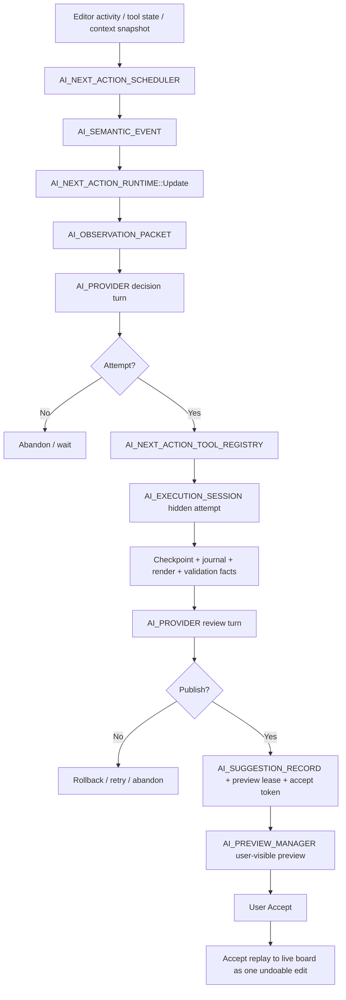

# KiSurf AI Native System Synthesis, Architecture, and Implementation Roadmap

本文以 2026-06-21 导入的 Next Action 调研报告为起点，并补充 `next-action-implementation-strategy-pre-repo-access.md`、`next-action-implementation-strategy-repository-aware.md`、`KiSurf Next Action Scheduling for Routing and Placement.md`、`KiSurf Auto-fi Refill Next Action Runtime Design.md`、`LLM-Mediated Inner Loop for an AI-Native EDA Next Action Runtime.md`、`ai-native-provider-input-and-runtime-substrate-research.md`、`ai-native-provider-input-and-runtime-substrate-research-2.md` 和 `ai-native-multimodal-provider-input-assembly-research.md` 中更精确的实现建议。当前范围已经从单一 Next Action 扩展为 KiSurf AI Native 系统级总架构和路线图文档：Chat Agent、Next Action Agent、session runtime、工具分层、脚本执行、provider input assembly、memory / retrieval、本地文本检索、多模态 message assembly、artifact、prompt trace、preview/review/accept governance、provider guard、observability 与后续实现路线。本文只保留对 KiSurf 长期实现有价值且符合当前架构原则的内容。被剔除的内容包括：重复的公开仓库介绍、没有本地源码验证的 KiCad API 猜测、过强的确定性表述，以及把算法/候选工具误当成决策者的说法。

这里的主语不是单一的 context、memory、VLM packet、工具列表或 Next Action。本文覆盖的是 KiSurf AI Native 系统从模型调用输入、观察、artifact、memory、工具执行、hidden attempt、review / gate、preview / accept 到实现路线的完整底层框架。`context` 只是其中一种输入材料；图片、工具结果、验证事实、journal、脚本输出、retrieved memory、preview artifact、response schema、provider trace、budget policy 和 accept provenance 都属于同一套 provider-input / runtime-substrate 编排链路。

## 1. 核心结论

KiSurf 的 Next Action 不应该拆成 Placement Agent、Routing Agent、Auto-fill Agent 三套系统。正确方向是一个统一的 `AI_NEXT_ACTION_RUNTIME`：

1. 观察当前编辑器状态。
2. 构造结构化 `ObservationPacket`。
3. 由 LLM 判断是否需要行动，以及调用哪些工具。
4. 在 hidden session / shadow board 中尝试操作。
5. 渲染、验证、再次观察尝试结果。
6. 由 LLM review，决定 retry、abandon 或 publish preview。
7. 用户 Accept 后，才把 journal replay 到 live board，形成一个 undoable commit。

这条链路应作为所有 Next Action work state 的 canonical runtime pipeline：

```text
semantic event
  -> observation packet
  -> LLM decide
  -> hidden attempt
  -> render / validate
  -> LLM review
  -> publish preview
  -> accept
```

其中 `hidden attempt` 在 Placement / Routing 中主要是 shadow board 上的几何或布线尝试；在 Auto-fill / Refill 中主要是 hidden patch attempt，也就是对 structured surface 的 `PatchPlan` / `SurfacePatch` 尝试。

Placement、Routing、Auto-fill 只是同一个 Runtime 下的三类工作状态。它们的差异主要体现在 observation adapter、tool catalog、validation facts 和 preview 表现形式上，而不是架构上分裂成不同 agent。

Routing / Placement 的调度策略应采用：**plan like proactive next-landing, publish like stability-gated preview**。也就是：一旦工具生命周期给出明确 active state，就立刻启动 hidden planning；但用户可见 preview 必须等到 context 仍然有效、验证通过、LLM review 通过，并且显示时机不会和工程师手上的操作竞争。

Auto-fill / Refill 的正确抽象不是“表格填充小工具”，而是统一 Runtime 下的 **Structured Surface work state**：表格、属性面板、规则面板、dialog、grid 都通过 Surface Adapter 暴露 schema、值、选区、验证和 patch mechanics；LLM 决定 scope 和 proposed values；Runtime 把 `PatchPlan` lowering 成 typed atomic patch ops，在 shadow surface 中验证和渲染，review 通过后才发布可接受的 `SurfacePatch` preview。

### 1.1 Inner Loop 和 Two-Gate 架构

最新 inner-loop 调研进一步明确了一个关键点：KiSurf 的 Next Action 不是单次 `decision -> attempt -> review`，而应该是一个受预算约束的 **LLM-mediated inner loop**：

```text
observe
  -> LLM decide
  -> open hidden attempt
  -> act with layered tools
  -> render / validate / observe
  -> LLM self-review
  -> revise or rollback
  -> repeat within budget
  -> request publish
  -> Preview Gate
  -> user-visible preview
  -> user Accept
  -> Accept Gate
  -> one undoable live commit
```

这里的 `act` 可以是一组工具调用，而不是单个工具调用。模型可以在同一次 hidden attempt 中调用 atomic tools、integrated tools 和 bounded script / batch composition；每执行一组动作后再调用 observation / render / validation 工具查看结果。如果模型发现结果不对，应该可以 rollback 到 checkpoint，修正参数或换策略，再继续尝试。这个循环类似 React 式的“执行一批动作 -> 观察结果 -> 再执行下一批动作”，直到模型认为可以请求发布 preview。

Deterministic validators 的正确位置是 **Hybrid + Two-Gate**：

1. **Inner-loop tools**
   - DRC、间距、连通性、碰撞、几何合法性、structured surface validation 都应作为工具暴露给模型。
   - 模型可以主动调用这些工具来改进候选结果。

2. **Preview Gate**
   - 模型请求 publish 后，runtime 必须自动运行 preview-grade checks。
   - 检查 context signature 是否仍然有效、attempt 是否有 hard validation failure、preview 是否 render-valid、candidate 是否仍与当前用户意图相关、预算是否未超限。
   - Preview Gate 由 native runtime / governance layer 拥有，模型不能绕过。

3. **Accept Gate**
   - 用户 Accept 时，runtime 必须运行更严格的 accept-grade checks。
   - 检查 live board base hash、selection / viewport / tool state / surface revision、preview lease、accept token、latest validation sufficiency、`preview_state_exact=true`，并 replay exact attempt journal。
   - Accept Gate 失败时不能“尽量应用”，必须拒绝并 expire / supersede 对应 preview。

因此，validator 既不是“可有可无的工具”，也不是“模型自己的责任”。它们是 native subsystem 产生的 facts：模型可以用这些 facts 推理和修正，但 publish / accept 权限归 runtime governance layer。

工程实现上，这条边界要拆成两个不同接口层：

- `validate.*` / `inspect.*` / `render.*` 是 inner-loop callable tools。它们允许模型在 hidden attempt 中主动检查、观察、修正和重试，但只能返回结构化 facts，不能产生用户可见 preview。
- `gate.preview` / `gate.accept` 是 runtime-only governance path。它们在模型请求 publish 或用户 Accept 时强制运行，拥有最终阻止 promotion / commit 的权限。

任何 candidate generator、router、script cell、render call 或 validation tool 都不能直接创建 active `AI_SUGGESTION_RECORD`。它们只能把候选、diff、render handle、validation fact、warning、budget state 附加到 attempt artifact；真正的 published preview 必须来自 `LLM review passed -> runtime gate passed -> promotion`。

这也排除了两个容易走偏的实现：第一，不能只把 DRC / geometry / surface validation 暴露成模型可选工具，因为那会把安全性变成“模型有没有想起来调用检查”；第二，也不能只在发布前做一次最终检查，因为那会让模型失去中间反馈，hidden attempt 很难自我修正。长期取舍应固定为：**validators are callable facts during the loop, mandatory policy gates at promotion / commit time**。

Preview Gate 失败不应该只有“直接 abandon”一种结果。对于 `render_freshness_failed`、`validation_freshness_failed`、`render_hint_not_satisfied`、`validation_hint_not_satisfied` 这类可由模型继续调用工具补齐证据的失败，runtime 应把结构化 `preview_gate_result` 作为 `preview_gate_feedback` 注入同一个 review tool trace，让 LLM 在预算内继续调用 `render_hidden_attempt` / `validate_hidden_attempt` / repair / rollback 工具。`render_gate_failed` / `validation_gate_failed` 默认仍是终止型；只有 review JSON 显式声明 `repairable_gate_failures:["render_gate_failed"]` 或 `repairable_gate_failures:["validation_gate_failed"]` 时，runtime 才会把它作为可修复 gate failure 回灌给模型。对于 `context_drift`、`budget_policy_failed`、`semantic_relevance_failed`、target scope mismatch 这类终止型失败，则不能重入，应直接 abandon / expire / supersede。

### 1.2 最新 inner-loop 调研应固化成的工程契约

最新调研的核心不是“多加一个 review prompt”，而是把 Next Action 明确成 **LLM 参与决策、native runtime 掌握权限** 的系统。模型可以决定是否尝试、调用哪些工具、如何修正；但 board truth、validation truth、preview publication、accept commit 和 rollback authority 都必须由 C++ runtime 拥有。

需要固化的 contract 有六条：

1. **Attempt 是一等 artifact**
   - 每次 hidden attempt 都要有 attempt id、work state、context signature、session id、checkpoint stack、observation frames、tool calls/results、validation facts、review decisions、preview record、budget counters 和 latency stats。
   - 后续调试、replay、质量评估、stale 判断、accept replay 都应基于 attempt artifact，而不是基于最终那条 suggestion 文本。

2. **Validation fact 必须结构化**
   - validation 不能只是 `passed=true/false`。
   - 需要记录 backend、scope、grade、exactness、refill/connectivity 状态、issue severity、issue geometry、rule-load warning、是否 `accept_validation_sufficient`，以及 accept-grade validation 是否精确对应当前 preview state。
   - LLM review 看到的是这些 facts；Preview Gate / Accept Gate 判断的也是这些 facts。

3. **Preview 分 internal attempt preview 和 user-visible published preview**
   - hidden attempt 内部可以多次 render / inspect / rollback。
   - 用户只应该看到通过 LLM review 和 Preview Gate 后被 promotion 的 published preview。
   - publish 是 runtime promotion，不是 render 的副作用。

4. **Validator 同时是工具和强制 gate**
   - LLM 可以在 inner loop 中主动调用 DRC、间距、连通性、碰撞、structured surface validation 等工具来改进候选。
   - 即使模型没有调用，runtime 在 publish 前也必须自动运行 preview-grade gate；Accept 前必须运行 accept-grade gate。
   - 这能避免 correctness 变成 prompt 工程问题。

5. **失败模式进入 runtime policy**
   - stale context、invalid preview、model overconfidence、validator false positive/false negative、runaway tool loop、premature publish、tool-surface sprawl 都不是 UI 细节，而是 runtime policy 要显式处理的失败模式。
   - 对应策略包括：cheap cancellation、one active published preview、budget cap、lease/token/fingerprint 校验、soft warning 与 hard blocker 分离、exact journal replay、以及 document-scoped write ownership。

6. **Tool-call loop 必须是真执行闭环**
   - Next Action provider request 里出现 callable tool catalog 只是第一步；如果 provider response 返回 `tool_calls`，runtime 必须执行这些 tool calls，生成结构化 `tool_results`，再把结果送回下一轮 LLM turn。
   - tool call execution 必须经过 `AI_NEXT_ACTION_TOOL_REGISTRY` / attempt context，记录 tool call id、safe provider tool name、internal tool name、arguments、result facts、warnings、budget delta 和 failure state。
   - unknown tool、schema-invalid arguments、tool execution failure、budget exceeded 都不能被静默忽略；它们应作为 tool result / attempt fact 反馈给模型，并可触发 retry、rollback 或 abandon。
   - `publish.preview` 仍不能成为 callable tool。模型只能通过 review / publish decision 请求 promotion；runtime gate 才拥有最终发布权。

### 1.3 Attempt 状态机和发布生命周期

最新 inner-loop 调研里最应该吸收的是：Next Action 的 runtime 不是“生成 suggestion 的函数”，而是一个 **editor-native attempt state machine**。建议把 canonical state machine 固化为：

```text
Idle
  -> ObserveContext
  -> DecideAttemptOrSkip
  -> OpenAttempt
  -> BeginStep
  -> Act
  -> Observe
  -> Review
  -> Revise or Rollback
  -> RepeatWithinBudget
  -> PreviewGate
  -> PublishPreview
  -> AwaitUserDecision
  -> AcceptGate
  -> CommitOneTransaction
  -> Closed
```

其中 `Act / Observe / Review / Revise` 只能发生在 shadow / hidden state 中。模型可以决定是否继续尝试、换工具、rollback、或请求 publish；但 `PreviewGate`、`AcceptGate`、preview lease、accept token、live commit 都属于 native runtime authority。这个边界比 prompt 约束更重要，因为它把正确性从“模型有没有记住规则”变成“runtime 是否允许 promotion”。

Suggestion 的生命周期也要和 hidden attempt 分开：

```text
PendingAttempt
  -> InternalPreviewRendered
  -> ReviewPassed
  -> PreviewPublished
  -> Accepted | Rejected | Expired | Superseded
```

`render` 只产生 internal attempt preview；`publish` 是 runtime promotion，不是 render 的副作用。用户只应该看到 `PreviewPublished` 的结果，而且同一 document 默认只允许一个 active published preview。这样 routing / placement 的内部反复尝试不会污染工程师的画布，也不会把失败候选闪给用户看。

失败模式要变成显式 policy：

- **stale context / fast user action**：unpublished attempt 立即 cancel；published preview 变为 expired / superseded，MVP 不做自动 rebase。
- **invalid preview**：validation fact 必须带 backend、scope、grade、exactness、connectivity/refill 状态、rule-load warning 和 issue geometry，不能只存 pass/fail。
- **model overconfidence**：LLM confidence 只能作为 review 输入，不能绕过 Preview Gate / Accept Gate。
- **validator false positive / false negative**：hard blocker 和 soft warning 分离；soft warning 可作为 annotated preview，hard blocker 阻止 accept。
- **runaway loop / latency**：budget 由 runtime policy 拥有，按 work state 限制 tool rounds、mutation count、render count、validation count、wall time。
- **premature publication**：candidate ready 不等于 preview ready；必须经过 LLM review + runtime gate。
- **tool surface sprawl**：新增工具只能扩展能力，不能绕过 session、journal、checkpoint、validation、preview、accept 的主链路。

### 1.4 外部系统对 KiSurf 的约束启示

最新调研里有价值的外部对比，不在于某个产品或论文的具体 API，而在于它们共同收敛到同一个工程模式：**模型负责语义决策，runtime 负责事实、边界和权限**。

对 KiSurf 来说，这应落实为以下约束：

1. **不能把 self-review 当成唯一停止条件**
   - Coding agent、CAD script refinement、robotics governance 的共同经验是：LLM 的自我判断需要外部反馈支撑。
   - 因此 KiSurf 的 review turn 必须绑定 render facts、validation facts、journal diff、context signature 和 budget counters；不能只接受自然语言形式的“看起来可以”。

2. **验证既是工具，也是 stop hook / gate**
   - LLM 可以主动调用 DRC、间距、碰撞、连通性、surface validation 来修正尝试。
   - 但 publish / accept 前仍必须由 runtime 自动执行最低等级检查；这等价于 EDA 里的 stop hook，而不是普通 optional tool。

3. **attempt trace 是产品能力，不只是 debug log**
   - 每一次 hidden attempt 都要可审计、可 replay、可归因。
   - 后续要评估 Next Action 是否真的有用，不能只看用户是否 accept，还要看 attempt trace 中的重试次数、验证失败原因、context stale 原因、post-accept edit distance 和 protected overwrite avoided rate。

4. **低干扰 preview 是核心 UX 约束**
   - 内部可以多次尝试、失败、rollback；用户不应该看到这些失败候选闪烁。
   - 用户只看通过 LLM review 和 runtime gate 后的一个 active published preview；其它结果应保持 internal 或直接 abandon。

5. **治理层不能埋在 prompt 里**
   - stale cancellation、lease ownership、accept token、budget cap、exact preview validation、one active preview、document-scoped write ownership 都必须是 C++ runtime policy。
   - Prompt 可以解释这些规则，但不能成为规则本身。

### 1.5 最新 inner-loop 报告补强的实现原则

这份报告最值得吸收的不是外部产品名，而是它把“模型每一步参与”和“runtime 掌握权限”之间的关系说得更清楚。后续实现时应固定下面这些工程原则：

1. **Review 必须基于 Evidence Frame**
   - LLM self-review 不能只看自己的自然语言计划。
   - 每次可发布 review 都必须看到同步的 `journal diff`、`render facts`、`validation facts`、`context signature` 和 `budget counters`。
   - 如果 evidence 不完整，review 可以继续调用工具或 abandon，但不能 publish。

2. **Validation 要分三个等级**
   - inner-loop validation：模型主动调用，用于修正 hidden attempt。
   - preview-grade validation：模型请求 publish 后，runtime 自动执行，决定能不能显示用户可见 preview。
   - accept-grade validation：用户 Accept 时，runtime 对 exact preview state 做更严格检查，决定能不能 replay 到 live board。

3. **Attempt Trace 是产品能力**
   - attempt trace 不只是 debug log，而是后续 replay、评估、学习用户偏好、定位 stale/reject 原因的基础数据。
   - 因此 tool calls、tool results、rollback、validation issue、render artifact、publish/abandon reason 都必须进结构化 trace。

4. **Internal Preview 和 Published Preview 必须隔离**
   - hidden attempt 中可以多次 render、失败、rollback、重试。
   - 用户只看到通过 LLM review 和 Preview Gate 后 promotion 出来的一个 active published preview。
   - 这条规则比具体 UI 形态更重要，因为它决定 Next Action 是否低干扰。

5. **Governance 要成为 C++ API，而不是 prompt 习惯**
   - `AttemptFrame`、`ReviewFrame`、`GateResult`、`ValidationFact`、`PreviewPromotion` 这类概念应该成为 runtime contract。
   - Prompt 可以要求模型遵守流程，但真正阻止 publish / accept 的只能是 runtime gate。

6. **工具可以扩展，loop 不应变化**
   - Placement、Routing、Auto-fill 的工具集会不断增加，工具颗粒度也会变化。
   - 不管新增的是原子工具、integrated tool、router-backed tool、structured surface tool，还是 bounded script，最终都必须进入同一条 hidden attempt / journal / render / validate / review / gate / accept 主链路。

### 1.6 Provider Input / Memory / Session Lifecycle 是新的可靠性底座

最新 provider-input / memory 调研补上了一个和 Next Action 同级重要的底层问题：**不能让 transcript 变成架构**。KiSurf 的 LLM 调用不应该把历史 chat、activity timeline、tool result、visual frame 和 journal 一股脑塞进 provider request。正确模型是：editor structured state、event journal、execution journal、accepted edit memory 是事实来源；每一次 LLM call 的 provider input bundle 都由 compiler 按策略和 token budget 临时编译成 bounded working set。

因此 KiSurf 的模型输入、memory 和事实来源要分层：

| 层级 | 作用 | 生命周期 |
|---|---|---|
| Immediate provider input bundle | 每次 LLM call 实际发送的紧凑输入：system、messages、tool results、visual references、schema | ephemeral |
| Live editor state | 当前 board / schematic / viewport / selection / active tool 的事实来源 | derived current truth |
| Chat session transcript | 用户可见聊天记录和短期对话连续性 | per chat archived |
| AI execution journal | Chat Agent 脚本 / atomic op / preview / validation / rollback 轨迹 | per execution session |
| Next Action episode state | 后台建议的一次语义工作单元 | short-lived |
| Recent activity timeline | 用户和 agent 最近行为的结构化事件流 | bounded project-local |
| Project durable memory | accepted edits、硬约束、稳定偏好、验证过的设计事实 | durable |
| Tool / validation memory | DRC/ERC、失败模式、已验证工具事实 | typed durable / semi-durable |

这里必须区分两个概念：

- **Memory** 是有类型、有 provenance、有 trust level、有 retention policy 的存储。
- **Provider input bundle** 是每次调用模型前，由 policy、live state、retrieval、summary、visual/tool artifacts、token budget 编译出来的标准消息输入。

Chat Agent 的 `New Chat` 必须是真边界，而不是只清空 UI：

- visible transcript 重新开始。
- model conversation / chat session id 重新开始。
- active execution session 应显式 close / cancel / freeze pending preview，不能静默继承。
- 当前 board / schematic / undo stack / live editor state 保留。
- project durable memory、hard design constraints、accepted edit summaries 保留。
- raw old transcript、hidden failed attempts、rejected / expired previews、speculative rationale 默认不进入新 chat 的 model-facing input。

Next Action Agent 不应该有一个无限后台 conversation stream。它的单位应该是 **short-lived episode**，由 active tool transition、focus region change、selection semantic change、validation event、accept/reject/commit boundary、large state drift 等语义边界触发。episode 只携带 local work scope、当前 dependency signature、局部 activity window、validation delta、candidate history 和相关 durable project memory；它不能继承 Chat Agent 的 raw transcript。

两个 Agent 的共享边界应固定为：**共享 project durable memory，不共享 working memory**。

| 可以共享 | 默认隔离 |
|---|---|
| hard design constraints | raw chat transcript |
| stable project conventions | hidden attempts / scratch tool chains |
| accepted edit summaries | rejected / expired previews |
| validated DRC/ERC baselines | chat-only conversational working state |
| explicit workflow preferences | unaccepted speculation |
| proven high-confidence tool facts | episode-local anti-loop traces |

Provider 层必须新增 `ProviderInputGuard`，把模型输入长度和 payload 组织变成 C++ core 的可靠性能力，而不是 prompt 习惯：

1. 每次请求前估算 / 统计 text、image、tool-result、schema 的 token / payload contribution。
2. 超过 soft budget 时，先压缩 tool blobs、减少 retrieval depth、用 session / episode summary 替换旧 transcript span。
3. 仍超预算时，去掉非必要 visual frame，只保留 recent visible turns、hard constraints 和必要 schema。
4. 大输入触发 provider 5xx / context-limit 类错误时，不允许原样重试；必须 shrink provider input 后再 retry。
5. 所有发送给模型的内容、被 budget 丢弃的内容、summary 替代的 raw span、retrieved memory provenance 都必须进入 `PromptTraceStore`，否则无法解释“模型为什么知道这个”或“为什么又超窗口”。

这带来一组新的核心模块：

- `AI_CONVERSATION_SESSION_MANAGER`：管理 Chat session、New Chat 边界、execution session 关闭策略。
- `AI_NEXT_ACTION_EPISODE_MANAGER`：管理 background episode 的 open / expire / supersede / close。
- `AI_PROVIDER_INPUT_COMPILER`：按 agent policy 编译 model-facing provider input。
- `AI_TOKEN_BUDGET_MANAGER`：按 provider/model/window 分配输入、输出、tool、visual headroom。
- `AI_PROVIDER_INPUT_GUARD`：执行 preflight、shrink ladder、provider-limit retry policy。
- `AI_MEMORY_STORE`：存 typed durable memory、summary、blob reference、provenance、trust level、expiry。
- `AI_RETRIEVAL_INDEX`：当前阶段只做本地文件 / journal artifact / summary artifact 的纯文本与 metadata 检索，优先支持 exact identifier lookup、BM25 / FTS 类 lexical search 和硬过滤；不引入 embedding 模型或 vector DB 作为前阶段依赖。
- `AI_PROMPT_TRACE_STORE`：记录每次请求实际发送和未发送的 input graph。

第一阶段不需要先做复杂 vector retrieval，也不需要引入 embedding 模型。最优先是把 provider input 变成 bounded、observable、可失败恢复：New Chat、transcript cap、activity/tool-result compression、prompt trace、provider guard、session / episode summary、local text retrieval。这比一开始实现完整长期记忆更重要，因为它直接解决 502 / context overflow 的当前故障模式。

2.0 调研进一步明确了一个实现细节：**KiSurf 的检索不是传统“聊天记录 RAG”**。检索对象应该首先是 event / artifact / accepted edit / validation fact / rule memory，而不是一堆历史对话 chunk。EDA 场景里很多关键信息是精确标识符，例如 refdes、net name、netclass、rule id、DRC/ERC code、footprint name、script error string。前阶段应该聚焦本地纯文本检索：结构化 summary、journal artifact、trace artifact、rule/validation text、accepted-edit summary 都可以落成本地文件或轻量索引，再用 exact match / FTS / BM25-style lexical search 检索，并用 `project_id`、`document_id`、`board_state_version`、object ids、acceptance state、agent type、recency horizon 做硬过滤。embedding / vector retrieval 可以作为未来扩展点，但不能进入当前阶段的必需架构。

Provider failure 也要分层处理：

| Failure class | Runtime handling |
|---|---|
| preflight input too large | 不发送请求；按 shrink ladder 压缩 provider input |
| provider context overflow / context-limit | shrink / compact / rebuild provider input 后最多重试，禁止原样重试 |
| transient 5xx / overload / timeout | exponential backoff + jitter；可重试，但要记录 trace |
| failure after possible side effects | 不能盲目重放整段工具调用；必须从 journal checkpoint / board version 判断恢复路径 |

最后一类是 KiSurf 特有风险：在会修改 board / panel / preview session 的 agent 系统里，**safe retry 不等于 safe re-execution**。如果 provider 失败发生在 effectful tool call 之后，后续恢复必须以 journal、checkpoint、document version、pending preview state 为准，而不是重新让模型把上一轮工具调用再跑一遍。

更新：`AI_RUNTIME` 和 `AI_NEXT_ACTION_RUNTIME` 的 provider tool-loop 已开始标记这类风险。当 continuation provider response 在已有 `executed=true` tool result 之后变成 `provider_error` 时，runtime 会把 `runtime_guard.reason="post_side_effect_ambiguity"`、`replay_policy="do_not_blindly_reexecute_tools"`、已执行 tool call id/name，以及结构化 `runtime_guard.recovery_basis` 写入 `provider_trace` / `PromptTraceStore`。`recovery_basis` 会保留当前 board state version，并从已执行 tool result 中提取 session id、checkpoint id、attempt / preview id、session journal / attempt journal 和 operation count 等恢复依据。如果 runtime 配置了 `AI_ARTIFACT_STORE`，同一恢复依据还会落盘为 `provider_recovery` artifact，并把 `runtime_guard.recovery_artifact_ref` 回写到 provider trace。`AiEvaluateLatestProviderRecovery()` 已提供 source-level recovery policy 查询，始终禁止 blind tool replay，并要求从 checkpoint / journal 恢复；`AiBuildLatestProviderRecoveryResumePacket()` 已能把最新 recovery artifact 转成 `kisurf.ai.provider_recovery_resume` packet，保留 artifact URI、request id、recovery basis、`do_not_blindly_reexecute_tools` replay policy 和 `resume_from_checkpoint_or_journal` action；`AiBuildLatestProviderRecoveryResumePlan()` 已把 packet 扩展成 `kisurf.ai.provider_recovery_plan`，列出必须人工/运行时复核的 preflight checks、checkpoint/journal replay candidates 和 `blind_tool_replay_allowed=false` policy，作为 UI 恢复按钮和后续 replay orchestration 的 machine-readable substrate。`AiPreflightProviderRecoveryResumePlan()` 已补上 replay 前第一道 gate：解析 recovery plan / recovery basis，拒绝 stale document revision，拒绝 blind replay，要求至少存在 checkpoint 或 session/attempt journal candidate，并输出 `kisurf.ai.provider_recovery_preflight` JSON 供 UI 或恢复编排器展示。`AiBuildProviderRecoveryReplayRequest()` 已把 preflight 通过的 plan 进一步归一化成 `kisurf.ai.provider_recovery_replay_request`：选择首个可 replay 的 checkpoint/journal candidate，暴露 tool call、session、checkpoint、replay source、journal operation count、selected candidate、preflight result 和 `user_review_required=true` policy；preflight 不通过时只能输出 `blocked_by_preflight`，不会产生可执行 replay request。`AiBuildProviderRecoveryEpisode()` 已把 plan / preflight / replay request 编排成 `kisurf.ai.provider_recovery_episode`：当前 context 合法时状态为 `ready_for_user_review`，stale context 时状态为 `blocked_by_preflight`，始终 `automatic_execution_allowed=false`、`blind_tool_replay_allowed=false`，因此可以由 Chat / Next Action 自动准备恢复 episode，但不能绕过审阅直接修改 live board。`AiExecuteProviderRecoveryReplayRequest()` 已补上审阅后执行入口：`user_reviewed=false` 时拒绝并且不会调用 adapter；审阅通过后会从 replay request 的 session journal 重建临时 `AI_EXECUTION_SESSION`，再经 `AI_ACCEPT_APPLIER` / `AI_ACCEPT_APPLY_ADAPTER` 事务性 replay journal，并输出 `kisurf.ai.provider_recovery_replay_execution` 结果。`AI_AGENT_PANEL_MODEL::LatestChatProviderRecoveryPolicy()` / `LatestNextActionProviderRecoveryPolicy()`、`LatestChatProviderRecoveryResumePacket()` / `LatestNextActionProviderRecoveryResumePacket()`、`LatestChatProviderRecoveryResumePlan()` / `LatestNextActionProviderRecoveryResumePlan()`、`LatestChatProviderRecoveryPreflight()` / `LatestNextActionProviderRecoveryPreflight()`、`LatestChatProviderRecoveryReplayRequest()` / `LatestNextActionProviderRecoveryReplayRequest()`、`LatestChatProviderRecoveryEpisode()` / `LatestNextActionProviderRecoveryEpisode()` 与 `ExecuteChatProviderRecoveryReplayRequest()` / `ExecuteNextActionProviderRecoveryReplayRequest()` 已把 Chat / Next Action 的最新 recovery policy、resume packet、resume plan、当前 document revision 下的 preflight result、preflight-approved replay request、automatic recovery episode 和审阅后执行入口暴露给 UI / 后续恢复流程。`AI_AGENT_PANEL_MODEL::ObservabilityEntries()` 也已把可用 recovery policy 转成 Log 可见的 `Provider recovery required` system entry，summary 明确 `checkpoint/journal resume required` 和 `blind replay disabled`，details 保留 `provider_recovery` artifact URI、`do_not_blindly_reexecute_tools` replay policy、recovery basis、完整 `resume_packet` 和完整 `resume_plan`。当前仍没有后台自动执行恢复；这是有意的安全边界。剩余工作是把 recovery episode 接进更完整的 UI review flow / async orchestration，而不是补底层 replay 安全链路。

补充：Agent Panel 现在已经把 provider recovery 执行入口投影到语义 UI。存在 recovery policy 时，Log tab 会暴露 `agent.recovery.execute` 节点；该节点要求 `user_confirmed=true`，并且只有 panel 配置了 accept adapter 后才 enabled。触发后会选择 Chat / Next Action 中最新的 recovery policy，使用当前 document revision 做 preflight，再调用对应的 `Execute*ProviderRecoveryReplayRequest()`。底层也已能生成 `AI_PROVIDER_RECOVERY_EPISODE`，供后续 UI review / async orchestration 直接消费。`AI_AGENT_PANEL_SEMANTIC_VIEW::m_ProviderRecoveryEpisodeJson` 与 `AiAgentPanelSemanticTree()` 已把该 episode 作为只读 `agent.recovery.review` text node 投影到 Log tab，内容保留 `kisurf.ai.provider_recovery_episode` JSON、preflight 状态、禁止 automatic execution / blind replay 的 policy 和 replay request。当前剩余的是更完整的视觉 review UI / 后台编排接线，而不是语义 review surface、确认式 replay substrate 或 episode contract 本身。

### 1.7 Multimodal Provider Input / Observation Assembly 是模型调用前的核心编排

VLM 调研给出的关键修正不是要替换 provider 的聊天协议。外层仍然是常规 LLM/VLM message structure：

1. system prompt。
2. user / assistant messages。
3. assistant tool calls。
4. tool result messages。
5. 后续 assistant response / tool calls。

KiSurf 需要定义的是 **message 内部承载什么内容，以及这些内容如何由工具和 runtime 编译出来**。图片本质上也是一种 tool-produced observation，可以作为 message content / tool result content 进入模型请求；它不应该脱离消息协议成为另一套对话结构。

因此，外部 VLM 输入编排调研里的“打包输入”概念，在 KiSurf 内部应命名为 **compiled multimodal provider input / observation artifacts**：它不是“上下文对象”，而是一次模型调用前由 runtime 编译出来的消息内容和工具观察集合。结构化编辑器状态是 truth，图像用于几何消歧、视觉确认和 review；模型看图，但不能只靠图行动；模型最终引用的必须是 object handle、anchor、world coordinate、layer / net state 和 validation facts。

每次编译进 message / tool result 的 provider-input content 应固定成分和顺序：

1. **System policy / agent role / immediate objective**：放在最前面，包含不能凭隐藏层猜测、不能发明对象、只能使用列出的 tool / object / anchor 等硬规则。
2. **Live editor state capsule**：当前 surface、document revision、active tool、tool phase、selection、viewport world bbox、cursor/world transform、active layer、visible layers、highlighted nets、dirty / preview state。
3. **Selected / relevant objects**：object id、type、refdes、net、layer、world bbox、handles、locked state、nearby objects / obstacles。
4. **Visual observation artifacts**：图像引用、frame id、kind、world bbox、resolution、pixel/world transform、annotation mode、source revision、preview provenance。
5. **Recent activity / local memory**：只放 bounded summary 和本地纯文本检索结果，不放无限 chat transcript。
6. **Validation facts**：DRC/ERC、connectivity/refill、issue geometry、severity、affected objects、accept-grade blockers。
7. **Tool catalog**：只放当前 provider input 可用工具，不塞全量工具宇宙。
8. **Previous attempt summary / omitted input trace**：说明上次尝试、失败原因、哪些内容因 budget 被省略以及如何回查。
9. **Response schema**：放在末尾，强制模型输出 `answer|ask|act|retry|rollback|publish_preview|abandon|noop` 等可执行决策，并引用 frame/object/anchor/validation/tool ids。

落到 provider 请求时，它应该被组织成标准消息流，而不是一个脱离 messages 的大对象。例如：

- `system`：固定系统规则、agent role、工具使用规则、preview / accept 策略。
- `user`：用户当前请求，或 Next Action runtime 生成的 semantic event / episode objective。
- `assistant`：上一轮模型 response 或 tool call。
- `tool`：工具执行结果，包括 board observation、visual frame、validation facts、local memory retrieval、attempt render result。
- `assistant`：模型基于这些 tool results 继续 act / review / publish / ask。

图像策略应是 **global + local + annotated when needed**，而不是每次塞很多截图：

| 场景 | 默认图像 |
|---|---|
| Chat broad reasoning | 当前 viewport raw；必要时加 schematic/PCB counterpart；局部问题加 ROI |
| Next Action placement | viewport raw + ROI raw + ROI annotated |
| Next Action routing | ROI raw + ROI annotated；必要时加 viewport raw / validation crop |
| Auto-fill / refill | 默认不需要图像；只有视觉可疑、铜皮形态、热焊盘、island 等需要判断时再发 ROI / before-after |
| Hidden attempt review | before + after-preview + issue crop，且使用同一 world bbox |
| Accept-grade review | final preview provenance + validation-centered frame + unresolved issue crop |

图像不能直接成为可执行坐标。KiSurf 应采用 **anchor-grounded execution**：

- 图像里的标记使用短 ID，例如 `A1`、`A2`、`E1`、`V1`。
- 标记映射在 text sidecar 中给出：`anchor_id`、`frame_id`、`object_id`、`handle`、`layer`、`net_name`、`pixel_bbox`、`world_bbox`、`world_xy`。
- 模型可以引用 anchor 或 world coordinate，但 runtime 必须把它转换为 typed atomic op，并经过 snap、hit test、layer/net 检查、DRC / validation。
- Pixel coordinate 只能作为视觉证据，不是最终 mutation truth。

Chat Agent 和 Next Action Agent 的 provider-input policy 不同：

- **Chat Agent**：可以更宽，包含用户目标、最近对话 summary、项目 memory、PCB / schematic 双 surface 状态和必要图像。它负责解释、规划和执行复杂任务。
- **Next Action Agent**：必须更窄，只使用当前 short-lived episode、当前 active tool / ROI / validation delta、本地活动窗口和相关 durable memory。它不继承 raw chat transcript。
- **Reviewer context**：不能复用 actor context。review 应该看 attempt summary、before/after、validation delta 和 issue crop，只输出 retry / rollback / publish / abandon 等决策。

第一阶段应新增或明确这些概念：

- `AI_PROVIDER_INPUT_BLOCK`：模型调用中的统一 typed content block，可放入 user / tool message。
- `AI_VISUAL_CONTEXT_FRAME`：raw / annotated / ROI / preview / issue crop 的统一 frame record。
- `AI_VISUAL_ANCHOR`：从图像标记到 object handle / world coordinate / net / layer 的 grounding bridge；第一刀已由 `ResolveAiVisualReferenceJson()` 和 Next Action `observation.resolve_visual_reference` 工具落地，支持 anchor id / world coordinate grounding，并明确拒绝 pixel-only mutation truth；resolver 默认读取当前 observation visual sidecar，也支持工具参数显式传入 `sidecar_json` / `sidecar`，因此 review 阶段可以解析 `render_hidden_attempt` 返回的 preview-frame anchors，而不局限于初始 viewport anchors。
- `AI_PROVIDER_MESSAGE_COMPILER`：在 `AI_PROVIDER_INPUT_COMPILER` 基础上，按 Chat / Next Action / Review policy 编译 provider message 流；第一刀已由 `AiCompileProviderMessagesJson()` 落地，能输出标准 system / user / assistant tool_calls / tool result message array，并复用 compiled provider input、visual observation artifact sidecar 和 tool-result compression，OpenAI-compatible provider 已切到该统一编译路径。
- `AI_VISUAL_CONTEXT_BUILDER`：从当前 editor / preview / validation state 生成 frame refs、ROI、annotation sidecar、pixel-world transform。

这也给实现定了一个重要边界：VLM 的图像是 **辅助 truth**，不是 **authoritative truth**。真正 authoritative 的仍然是 live editor state、shadow session、journal、validation facts、accepted memory 和 preview provenance。图像主要解决结构化状态难以表达的局部几何、拥挤程度、视觉可接受性、before/after 对比和用户工作界面一致性。

## 2. 当前代码真实状态

`next-action-implementation-strategy-repository-aware.md` 访问仓库后给出的最重要价值，是把架构判断落到了当前代码状态上。结合本地源码核对，当前分支已经具备 Next Action 的 outer loop，但仍处于“证明架构形状”的阶段。

已经真实存在的基础：

- `AI_NEXT_ACTION_RUNTIME` 已有 semantic event、observation packet、LLM decision、LLM review、preview lease、accept token、attempt record、runtime step 等核心类型。
- Runtime 已提供 `Update`、`BeginPreview`、`Accept`、`Reject`、`ExpireStale`、step history、attempt history 等入口。
- Scheduler 已经 suppress `mouse.move` / `cursor.move` / `pointer.move` 这类 raw event，并对同一 semantic slot 做 500ms debounce。
- `Update()` 已经形成 decision -> hidden attempt -> render/validate -> review -> publish 的基本路径。
- hidden attempt 已开始通过 `AI_ATOMIC_OPERATION_EXECUTOR::Execute()` 执行 mutation candidate，并在 attempt journal 中记录 created/resolved handles、warnings 和 result payload。
- `validate.hidden_attempt` 已支持注入 `AI_SESSION_VALIDATION_SERVICE`，能把 session validation facts 暴露给 LLM review turn。
- `render.hidden_attempt` 已支持注入 `AI_SESSION_PREVIEW_SERVICE`，Next Action runtime 可以调用 native preview renderer，把 render status、preview id、rendered item count、error code 和 service result 写入 attempt render facts。
- Preview Gate 已开始由 runtime 拥有并产生结构化 `preview_gate_result`：即使 LLM review 返回 `publish`，只要 hidden attempt 的 validation facts 明确为 failed / blocked / error / fatal，或带有阻断级 `error_code` / error severity issue / issue-level `blocking` / `blocks_publish`，或 `rule_load`、`connectivity`、`refill` 等关键 validation 子事实明确阻断发布，runtime 就不会发布用户可见 preview，并会把 gate allowed/reasons 写回 review JSON 或 published provenance。
- Preview Gate 已开始检查 hidden attempt journal 的终态失败：plan / bounded script lowering 到 atomic op 后，如果最终 mutation result 带 `ok:false`、非空 `error_code` 或阻断级 `status`，即使 LLM review 返回 `publish` 也不能发布 preview；如果同一 inner loop 中早期 mutation 失败但后续 repair / script mutation 成功、重新 render / validate 并通过 review，则早期中间失败不会误挡最终 preview。
- Preview Gate 已开始检查 render validity：hidden render facts 明确 failed / invalid / error，或 `render_valid=false` 时，即使 LLM review 返回 `publish` 也不能发布 preview。
- Preview Gate 已开始要求 render / validation facts 来自已连接的 native service：无注入 `AI_SESSION_PREVIEW_SERVICE` / `AI_SESSION_VALIDATION_SERVICE` 时产生的 placeholder render / validation fallback 只能作为内部 attempt trace，不能满足用户可见 preview 的 publish gate。
- Preview Gate 已开始要求 LLM review 显式给出客观依据：`publish` 必须带 `review_basis.render_valid`、`review_basis.validation_passed`、`review_basis.budget_within_limits`、`review_basis.self_review_passed` 且全部为 true；裸 `publish` 不能发布 preview。
- Preview Gate 已开始支持可修复失败的 review-loop 回灌：当模型请求 publish 但缺少 fresh render / fresh validation、没有满足 render / validation hint，或显式声明 `render_gate_failed` / `validation_gate_failed` 属于 `repairable_gate_failures[]` 时，runtime 会把结构化 `preview_gate_result` 作为内部 `preview_gate_feedback` tool result 注入同一个 review trace，让 provider 在预算内继续补证据；context drift、budget、semantic relevance、target scope mismatch 等终止型失败不会重入。
- Preview Gate 已开始检查 semantic relevance：如果 LLM decision 明确声明的 `opportunity_type` 与实际 work-state selected candidate tool namespace 不匹配，例如 placement 上下文却声明 routing opportunity，即使 review_basis 全真也不能发布 preview。
- Preview Gate 已开始检查 PCB candidate 的细粒度 target relevance：如果 LLM decision 声明的 `net` / `target_net` / `layer` / `target_layer` 与实际 placement/routing candidate operation 的 net/layer 不一致，即使 work-state namespace 和 review_basis 都匹配，也不能发布 preview。
- Preview Gate 已开始检查 Structured Surface 的细粒度 target relevance：如果 LLM decision 声明的 `target_scope.panel_id` / `table_id` / `column` 与实际 surface fill candidate 的 panel/table/column 不一致，即使 opportunity namespace 是 surface 且 review_basis 全真，也不能发布 preview；如果模型通过 `script_run_bounded_plan` / `surface_repair_patch` 直接写入 `SurfacePatch`，gate 也会读取 review tool results 中 `render_hidden_attempt.surface_patch_previews[].surface_patch_diff_entries[].visual_target`，用实际 patch 目标再次校验 decision target_scope，防止 decision/candidate 指向一列、脚本实际修改另一列。
- Preview Gate 已开始支持发布瞬间重新采样当前 editor context：runtime 可注入 current context sampler；如果 publish 前采样到的 dependency fingerprint 与 observation-time context 不一致，即使 LLM review 已请求 publish，也不会发布用户可见 preview。
- `AI_AGENT_PANEL_MODEL` 已把 publish-time current context sampler 传入 Next Action runtime；`AI_AGENT_PANEL::ConfigureActionToolCalls()` 会基于真实 panel context provider、semantic panel state 和最新 activity sequence 重新构造 `AI_NEXT_ACTION_CONTEXT_VERSION`，让真实面板路径不再只依赖测试手动注入 sampler。
- `AI_AGENT_PANEL_MODEL` / `AI_AGENT_PANEL::ConfigureActionToolCalls()` 已把 native preview / validation service 注入 Next Action runtime，避免真实面板路径退回到纯 placeholder gate。
- Preview lease ownership 已开始由 runtime 收紧：新的 Next Action runtime preview 发布时，会 supersede 其它 active runtime preview；accept / reject / expire / supersede 都会把对应 provenance 中的 preview lease 标记为 inactive。
- `AI_AGENT_PANEL_MODEL` 已提供 document-scoped write ownership substrate：Chat 和 Next Action 可以按 document key 获取 write-capable lease；当前 Chat 同步请求期间会持有 `chat` lease，Background Next Action 在进入 hidden mutation runtime 前必须获取 `nextaction` lease，若同一 document 已由 Chat 持有则安静不发布也不调用 Next Action provider。`AI_NEXT_ACTION_CONTEXT_VERSION` 已携带从 `AI_CONTEXT_SNAPSHOT` 复制的 `project_id` / `document_id`；write ownership key 现在优先使用 project/document identity，缺失时才退回 board base hash、document revision、unknown。不同 project/document 的 lease 不再互相阻塞；同一 project/document 即使 document revision drift 也保持互斥；unknown 仍然作为保守全局阻塞。全局异步长任务和真实 editor document UUID 仍需后续接入。
- Runtime 已开始实现 “Silence is a feature” 的第一刀：同一个 Next Action runtime fingerprint 被用户 `Reject` 后，后续同 fingerprint 的 runtime preview 发布会被静默丢弃，不会马上再次变成 active preview 打扰用户。
- Dependency fingerprint 已开始进入 accept token / provenance：MVP fingerprint 包含 board base hash、document / selection / view revision、tool mode、UI focus、activity sequence；runtime 已提供 full `AI_NEXT_ACTION_CONTEXT_VERSION` accept gate，fingerprint 漂移时 hard-fail、expire preview，并使 lease inactive。
- Dependency fingerprint 已进一步纳入 viewport / cursor-region fingerprint：observation packet 会暴露 `viewport_fingerprint` 和 `cursor_region_fingerprint`，accept token / provenance 会记录这些 hash；用户在同一 document/view/activity 下切换到不同 viewport 或 cursor region 时，Accept 会被视为 stale 并拒绝。
- `ExpireStale()` 已开始支持 full `AI_NEXT_ACTION_CONTEXT_VERSION`：主动过期不再只能看 document / selection / view revision，也能用 dependency fingerprint 检测 viewport / cursor-region 等漂移，并在过期时释放 preview lease。
- `AI_AGENT_PANEL_MODEL::ExpireSuggestions()` 和 `AI_AGENT_PANEL::RecordActivity()` 已接入 full `AI_NEXT_ACTION_CONTEXT_VERSION`：真实 activity 路径会基于当前 snapshot + activity sequence 构造 dependency context，再主动 expire stale runtime preview，不再只按 legacy `AI_CONTEXT_VERSION` 判断过期。
- Accept token 已开始绑定 attempt touched-object set：runtime 从 hidden attempt budget counters 的 touched object set 生成稳定 `touched_object_set_fingerprint`，并要求 Next Action runtime preview 的 accept token 带该字段。
- `AI_AGENT_PANEL_MODEL`、`AI_AGENT_PANEL` accept handler 和 PCB suggestion review accept adapter 已切到 full `AI_NEXT_ACTION_CONTEXT_VERSION`；真实 UI/PCB accept 路径不再只传 `AI_CONTEXT_VERSION`。
- Runtime `Accept()` 已开始接收当前 editor context / dependency context；Next Action runtime 持有的 suggestion 在 accept 时会重新校验 context / fingerprint，漂移则 hard-fail、expire 并释放 preview lease，不再依赖外部流程“刚好先调用过 `ExpireStale()`”。
- Runtime `Accept()` 已开始检查 hidden attempt validation 是否 accept-grade sufficient 且 exact：如果 `validate.hidden_attempt` 的 validation facts / service result 明确带 `accept_validation_sufficient=false`，或带 `accept_validation_sufficient=true` 但缺少 `preview_state_exact=true`，即使 preview 已发布，Accept 也会 hard-fail、expire suggestion、deactivate lease，并且不会 apply edit objects。
- Runtime `Accept()` 和 PCB journal replay accept path 已开始把 accept-time gate 写回 runtime provenance：context / dependency drift、accept-grade validation 失败、session journal 缺失或无效、edit apply 失败会记录 `accept_gate_result={gate:"accept", allowed:false, reasons:[...]}`；成功 accept 会记录 `allowed:true`。这让 accept gate 和 preview gate 使用同一类可审计 gate result，而不是只靠 suggestion status 反推失败原因。
- Published suggestion 的 preview / edit payload 已开始从最终 hidden attempt `session_journal` 派生，而不是继续沿用初始 candidate 的 preview/edit object。这样 LLM 在 review inner loop 中通过 repair / bounded script 修改 hidden attempt 后，用户可见 preview、accept payload 和 rejected-preview fingerprint 都会对应最终 journal，避免“看见/接受的是旧候选”或“不同 repair 被同一 fingerprint 静默丢弃”。
- Runtime 已开始导出 Next Action replay trace：`AI_NEXT_ACTION_RUNTIME::ReplayTraceRecords()` 会按 semantic step 输出 semantic event、observation packet、LLM decision、provider tool results、hidden attempt journal、render outputs、validation facts、budget counters、LLM review decision、publish gate / preview lease / accept token、accept gate result 和当前 terminal state。trace 已带 `schema={name:"kisurf.next_action.replay_trace", version:1}`，并提供 `AiValidateNextActionReplayTraceJson()` 做第一刀 schema/version/required-field 校验。`AiMigrateNextActionReplayTraceJson()` 已提供 schema migration 入口，当前支持 v1 -> v1 no-op，并对未知 target/source version 明确失败；未来 schema v2 不需要把 migration 逻辑塞进 evaluator。`AiEvaluateNextActionReplayTraceJson()` 已提供第一刀离线 evaluation substrate，可以从 replay trace 汇总 terminal state、published/accepted/rejected/expired/superseded/abandoned 状态、attempt / hidden operation / render / validation / tool result 数量、decision / review phase tool result 数量、preview gate allowed、accept gate reason 分布、validation issue 数量/kind/severity 分布和 blocking validation 标记，并输出可持久化 quality metric JSON。`AiEvaluateNextActionReplayTraceBatch()` 已提供 batch summary substrate，可聚合 valid/invalid trace 数量、生命周期状态计数、attempt / operation / render / validation / tool result 总量、decision / review phase tool result 总量、accept gate reason 分布、validation issue 分布和第一条 schema/error 信息。`AiEvaluateNextActionReplayTraceBatchJson()` 已提供 versioned replay batch JSON contract：`schema={name:"kisurf.next_action.replay_batch", version:1}`、batch id 和 traces array，并拒绝非对象 trace entry；`qa_common_tools next_action_replay_batch <batch.json>` 已把该 evaluator 暴露为真实 CLI，输出 batch summary JSON 并用返回码区分 valid/invalid。`AiEvaluateNextActionReplayGoldenRecordJson()` 已提供最小 golden record contract：`schema={name:"kisurf.next_action.golden_trace", version:1}`、record id、embedded replay trace 和 expected terminal / publish / work-state / minimum hidden-operation 断言，并已支持 `min_decision_tool_result_count`、`min_review_tool_result_count`、`min_preview_gate_feedback_count` 这类 inner-loop 最小指标断言，能区分 record schema invalid 与 expectation mismatch，同时从 observation work-state packet / decision opportunity 中提取 record work state。`AiEvaluateNextActionReplayGoldenDataset()` 已提供 dataset-level 聚合，可统计 total / valid / invalid / passed / failed records、work-state counts、error-code counts，并记录首个失败 record id 和 error code。`AiEvaluateNextActionReplayGoldenDatasetJson()` 已提供 versioned dataset JSON contract：`schema={name:"kisurf.next_action.golden_dataset", version:1}`、dataset id 和 records array。`AiEvaluateNextActionReplayGoldenDatasetFile()` 已提供最小磁盘 dataset runner：从实际 dataset 文件读取 versioned golden dataset JSON、复用 evaluator，并在 summary 记录 `dataset_path`。`AiEvaluateNextActionReplayGoldenDatasetFiles()` 已提供批量 dataset file runner substrate，可聚合多个 golden dataset 文件的 dataset / record pass-fail 计数、dataset / record pass rate、work-state counts、error-code counts 和第一条失败路径。`qa_common_tools next_action_replay_golden <dataset...>` 已提供真实 CLI 入口，输出 batch summary JSON，并用返回码区分通过与失败。仓库内已新增 Placement / Routing / Structured Surface 三类 curated golden dataset smoke fixtures：`placement_via_inner_loop_smoke.json`、`routing_segment_inner_loop_smoke.json`、`surface_fill_inner_loop_smoke.json`，覆盖 inner-loop smoke record、decision/review tool result、preview gate feedback、work-state coverage 和 hidden operation 最小断言。`AI_AGENT_PANEL_MODEL::ObservabilityEntries()` 已把该 trace 作为 `NextActionReplay` entry 暴露给日志视图，且保留完整 JSON（脱敏但不截断），避免 Evaluation / Replay 只能从 transient prompt text 或 published suggestion provenance 反推。
- 更新：replay evaluation 已开始汇总 attempt `budget_counters`，单条 quality metric 和 batch summary 都会输出 `budget_tool_round_count`、`budget_mutation_count`、`budget_render_count`、`budget_validation_count`、`budget_created_object_count` 和 `budget_touched_object_count`；golden record 也已支持 `min_accept_gate_result_count`、`min_accept_gate_reason_counts` 以及 `min_budget_*` 最小指标断言。仓库内 golden fixture 已扩展到六个数据集：Placement、Routing、Structured Surface、`accept_context_drift_inner_loop_smoke.json` 覆盖 accept gate context drift、`validation_issue_inner_loop_smoke.json` 覆盖 validation issue count / kind / severity 分布，以及 `placement_rollback_retry_inner_loop_smoke.json` 覆盖 rollback / retry inner-loop 修正路径；placement fixture 也已携带 budget counters。`qa_common_tools` Windows 输出目录已开始复制 `kicommon` / `kigal` / `kiapi` 及其 runtime DLL，因此 replay/golden CLI 不再需要手工注入 PATH。
- 更新：golden replay 的 dataset / multi-dataset summary 已开始聚合 trace 级质量指标：`trace_budget_*`、`trace_preview_gate_feedback_count`、`trace_preview_gate_feedback_reason_counts`、`trace_accept_gate_result_count`、`trace_accept_gate_reason_counts`、`trace_validation_issue_count`、`trace_validation_issue_kind_counts` 和 `trace_validation_issue_severity_counts` 会从 record summary 滚动到 dataset summary，再滚动到 `qa_common_tools next_action_replay_golden <dataset...>` 的 batch 输出。golden record expected 也已支持 `min_preview_gate_feedback_reason_counts`、`min_validation_issue_count`、`min_validation_issue_kind_counts` 和 `min_validation_issue_severity_counts`，让 curated golden fixture 不只验证“是否通过”，也能直接显示并强制约束本批回放覆盖了多少 mutation / render / validation、是否覆盖 preview gate feedback / accept gate context drift、以及 validation issue 分布。
- Replay evaluation 已开始显式跟踪 work-state interaction semantics 覆盖率：单条 trace 的 quality metric 会输出 `work_state_interaction_semantics_present`，batch summary 会聚合 `work_state_interaction_semantics_present_count`。这能检查 Placement / Routing / Structured Surface 的观察包是否真实携带“激活工具状态、规划目标、人工点击 materialize/supersede、preview rebase”等状态语义，而不是只看最终是否 publish。
- Replay evaluation 已开始显式跟踪 Preview Gate feedback：单条 trace 和 batch summary 都会输出 `preview_gate_feedback_count` 与 `preview_gate_feedback_reason_counts`。这用于衡量 `render_freshness_failed` / `validation_freshness_failed` / 可修复 gate failure 是否真的回灌进模型 review loop，并区分具体失败类型，而不是直接终止或被最终 publish 状态掩盖。
- Replay evaluation 已开始显式跟踪 rollback attempt：单条 trace 和 batch summary 都会输出 `rollback_attempt_count` 与 `rolled_back_attempt_count`；golden record / dataset / multi-dataset summary 也会输出 `trace_rollback_attempt_count` 与 `trace_rolled_back_attempt_count`，并支持 `min_rollback_attempt_count` / `min_rolled_back_attempt_count` 断言。这用于衡量模型在 hidden attempt 中是否通过 rollback/retry 机制修正候选，而不是只看最终 published 状态。
- PCB Next Action accept 已开始切到 session journal replay：`AcceptAiPcbSuggestion` 新增 `AI_ACCEPT_APPLY_ADAPTER` 路径，会从 published attempt provenance 中还原 `session_journal`，通过 `AI_ACCEPT_APPLIER` replay 到 PCB session apply adapter，成功后才标记 suggestion accepted；带 `runtime=next_action` 但缺少 session journal 的 suggestion 不允许 fallback 到旧 edit-object accept。
- PCB Next Action accept 已开始触发 accept-grade validation gate：replay session 会先追加 `RunValidation(scope=session, level=full_drc, gate=accept)` step，调用 native `AI_SESSION_VALIDATION_SERVICE`，把 validation result 写回 journal；如果 `accept_validation_sufficient=false`、`accept_validation_sufficient=true` 但 `preview_state_exact` 不为 true，或 service 失败，则 suggestion expire，且不会开始 live-board replay。
- Published attempt 的 `session_journal` 已开始携带 `shadow_items`；PCB accept replay 会先把这些 semantic shadow items 恢复到 replay session，再执行 operation journal。这样 journal 中引用已有 live board item 的 handles，可以通过 shadow item metadata 的 `live_uuid` 被 PCB apply adapter 映射回真实 board item，不再只支持 create-only replay。
- Observation packet 已从薄 summary 扩展为包含 bounded `context_snapshot`、visible / selected objects、panel states、anchors、recent activity、visual metadata、work state 和 dependency fingerprint；decision turn / review turn 都能从 provider request 中读到这些 facts。
- Observation packet 已开始包含统一 `work_state_packet`：Placement 暴露 placeable kind / placement active / visible objects / anchors，并新增 `planning_target.kind=place_current_item`、cursor-attached position source、click materialization / manual-click supersede 语义；Placement anchors 现在不仅有 id，还带 `placement_anchors[]` 的 kind、label、summary、position、layer、confidence、details 和统一 provenance。Routing 暴露 routing active / route anchors，并新增 `planning_target.kind=next_landing_from_current_route_head`、route head、net/layer/width、以及 `cursor_is_sorting_hint=true`，明确下一步规划从当前 route head 出发而不是追逐鼠标像素；Routing packet 同时暴露 `active_route_segment`，把 `mode_context.start -> mode_context.cursor` 作为当前交互预览段，并标明 `start_source` / `end_source`。Routing anchors 现在也以 `route_anchors[]` 结构化暴露 kind、label、summary、position、layer、confidence、details 和统一 provenance。Placement / Routing / Structured Surface packet 都会带 bounded `visible_object_summaries[]`，包含 label、type、uuid 和可解析 details，后续可作为 overlap、obstacle、landing-context 的基础事实；其中 Placement / Routing 已开始把 `cursor_region` / `viewport` 派生为 `locality_region` 和 `local_obstacle_facts`，Routing 的局部 facts 已覆盖 track / arc / via / pad。Structured Surface 暴露 surface count / focused surface / focused control，并开始从 focused panel state 归一化 schema version、target scope、neighbor values、value provenance、validation state。这样模型不用只靠大块 context snapshot 猜当前工作状态。
- 更新：Placement / Routing work-state packet 已开始为 `local_obstacle_facts` 生成 `local_obstacle_summary`，包含 locality source、局部 obstacle 总数、按 kind 聚合的计数、nearest obstacle manhattan bbox gap、labels sample 和 truncation 标记。这样模型在 self-review 时可以先读取摘要判断局部拥挤程度，再按需展开具体 obstacle facts。
- 更新：Placement work-state packet 已开始为 `placement_candidate_facts` 生成 `placement_candidate_summary`，包含候选数、最近候选 manhattan 距离、top anchor、top candidate position、top suggested tool call、top render region 和候选局部 obstacle 数。这样模型可以快速判断当前放置候选是否值得进入 hidden attempt，再展开具体 candidate facts。
- 更新：Placement / Routing anchor provenance 已携带稳定 `source_id`，与 anchor id 对齐，便于模型和 replay/evaluation 在后续步骤中引用同一个 anchor source，而不是只能从外层 `id` 反推来源。
- 更新：PCB context adapter 已开始输出 `placement_facts`，包含 footprint 总数、带 courtyard 的 footprint 数量、同侧 courtyard pair 总数、overlap 总数、最小 bbox spacing、最小非重叠 bbox spacing，以及同侧 footprint courtyard pair facts。每个 pair fact 记录 source / target footprint、side、courtyard layer、真实 KiCad courtyard bbox、bbox spacing 和 bbox overlap 状态，让 Placement Next Action 可以在 hidden attempt / review 阶段直接看到封装庭院接近或重叠事实，而不是只依赖通用 obstacle 列表或图像判断。
- 更新：Next Action runtime 已把 `context_snapshot.summary.placement_facts` 提升进 Placement `work_state_packet`：`placement_context_facts` 保留 bounded placement summary、courtyard pair / overlap 聚合指标和 bounded pair 样本，`placement_courtyard_pair_facts` 直接暴露 courtyard pair 数组。这样 provider request 中的 Placement packet 已能直接携带 footprint courtyard spacing / overlap facts，不需要模型从完整 board summary JSON 中再手动解析。
- Observation packet 已注入 runtime-owned `attempt_policy`，当前 work-state budget 为 layout / placement 最多 3 次、routing 最多 5 次、autofill / panel / structured_surface 最多 2 次，并进一步暴露 max tool rounds、max mutations、max render / validation count、max wall time；`Update()` 的 attempt loop 已使用该 policy，不再硬编码固定 2 次。
- Tool catalog 已开始具备分层 metadata：每个 Next Action internal tool 标注 `layer`、`namespace` 和 `side_effect`；provider-callable function description 也会携带 namespace，便于模型按 observation / placement / routing / surface / script / runtime / repair 分组选择工具。旧 via-pattern / routing-segment / panel-table provider 已在 model-facing catalog 中降级为命名 integrated candidate tools：`placement.generate_via_pattern_candidates`、`placement.generate_footprint_transform_candidates`、`routing.generate_segment_candidates`、`routing.generate_parallel_segment_candidates`、`routing.generate_bus_segment_candidates`、`routing.generate_replace_path_candidates`、`routing.generate_constraint_aware_reroute_candidates`、`surface.generate_fill_candidates`。`observation.resolve_visual_reference` 是 VLM grounding 工具第一刀：模型传入 visual reference，runtime 从 visual observation sidecar 中解析 anchor id / world coordinate，返回 object handle、net/layer、pixel/world bounds 等 facts；工具也支持显式 `sidecar_json` / `sidecar` 参数，用于 review 阶段解析 preview-frame / issue-crop sidecar；pixel-only reference 会返回失败 fact，不能作为 mutation truth。`placement.generate_footprint_transform_candidates` 是 footprint placement transform 候选工具的第一刀：模型给出 current_position 和 target_position，工具返回 selected footprint translation 候选、landing facts 和 transform facts，不拥有 publish 权限。`routing.generate_parallel_segment_candidates` 是并行参考线候选工具的第一刀：模型给出 reference segment 和 offset，工具只返回候选事实与 landing facts，不拥有 publish 权限。`routing.generate_bus_segment_candidates` 是多 lane bus 候选工具的第一刀：模型给出 reference segment、lane offsets 和可选 nets，工具返回每条 lane 的候选事实与 bus facts，同样不拥有 publish 权限。`routing.generate_replace_path_candidates` 是 replace path 候选工具第一刀：模型给出待替换 handles 和 replacement polyline，工具返回 `delete_items + create_track_polyline` bounded plan candidate、landing facts 和 replace path facts，不拥有 publish 权限。`routing.generate_constraint_aware_reroute_candidates` 是 constraint-aware reroute 候选工具第一刀：在 replace path bounded plan 基础上携带显式 constraints 和 validation hint，要求模型执行后再 render/validate/review，不拥有 publish 权限。`script.run_bounded_plan` 已进入 script layer contract：shadow-only、checkpoint/journal required、必须 lowering 到 atomic / integrated tools、禁止 raw board access 和 direct publish。`publish.preview` 只保留在 internal catalog 中作为 `runtime_gate` / `publish_gated` 说明，不进入 provider callable tool catalog；模型只能通过 review decision 请求 publish，不能把 publish 当普通工具调用。
- Runtime 已区分 internal tool catalog 和 provider callable tool catalog：`internal_tool_catalog` 继续保留 dotted internal names 和 layer/side-effect metadata 供模型理解 runtime contract；`CallableToolCatalogJson()` 输出 OpenAI-compatible function tool schema，使用 provider-safe 下划线函数名，例如 `script_run_bounded_plan`，并过滤掉 `publish.preview`。
- 更新：`placement.generate_footprint_orientation_candidates` 已加入 internal / provider-callable tool catalog，作为 footprint orientation / side transform 候选工具第一刀。它要求 handles、current / target orientation，并可携带 target side；返回 `pcb.set_item_properties` bounded plan、orientation facts、landing facts 和 validate hint，不拥有 publish 权限。
- 旧 `AI_SUGGESTION_ORCHESTRATOR` 和旧 model-backed `AI_AGENT_SUGGESTION_PROVIDER` 已从可构建源码中删除：suggestion queue / preview / accept / expire 的主路径只保留在 `AI_NEXT_ACTION_RUNTIME`，模型不再经过旧 suggestion-provider/parser 链路直接产出发布态 suggestion。
- `AI_PROVIDER_REQUEST` 已支持 custom-only tool catalog：当 Next Action request 设置 `m_DisableDefaultTools=true` 且提供 `m_ToolCatalogJson` 时，OpenAI-compatible provider 会发送 request-specific callable tools，而不是清空 `tools`。这样 Next Action 可以关闭默认 Chat/Panel 工具，同时仍给模型暴露 runtime callable catalog。
- Provider tool-call loop 已接入 Next Action runtime 第一刀：decision turn / review turn 如果收到 provider 返回的 `tool_calls`，runtime 会通过 `AI_NEXT_ACTION_TOOL_REGISTRY` 执行，生成结构化 `m_ToolResults`，再把结果送回同一 request kind 的下一轮 provider call。当前已支持事实型工具 `observation_read`、`observation_resolve_visual_reference`、`render_hidden_attempt`、`validate_hidden_attempt`，integrated candidate tools：`placement_generate_via_pattern_candidates`、`placement_generate_footprint_transform_candidates`、`routing_generate_segment_candidates`、`routing_generate_parallel_segment_candidates`、`routing_generate_bus_segment_candidates`、`routing_generate_replace_path_candidates`、`routing_generate_constraint_aware_reroute_candidates`、`surface_generate_fill_candidates`，active-attempt mutation fact tool `shadow_apply_candidate`，bounded script MVP tool `script_run_bounded_plan`，active-frame repair MVP tool `repair_apply_bounded_plan`，以及 work-state 专用 repair wrapper：`placement_repair_via`、`placement_repair_move_items`、`routing_repair_segment`、`routing_repair_polyline`、`surface_repair_patch`。`observation_resolve_visual_reference` 会把 visual sidecar 中的 anchors 转成 grounded facts；若模型只提供 pixel 坐标，会返回 `pixel_only_reference` failure fact。candidate tools 返回 `candidate_count`、候选列表、source tool、arguments、operation、对象数量和 `landing_facts`，其中 placement via candidate 会暴露 `placement_landing` 的 position/net/diameter/drill，footprint transform candidate 会暴露 `move_selected` translation candidate、target position landing facts、`footprint_transform_facts` 和 delta，routing segment candidate 会暴露 `routing_landing` 的 end point/start/net/layer/width，parallel routing candidate 会暴露由 reference segment + offset 生成的 `routing_landing`、`parallel_facts`、candidate start/end/net/layer/width，bus routing candidate 会暴露由 reference segment + lane offsets 生成的多条 `routing_landing`、`bus_facts`、lane index/count、candidate start/end/net/layer/width，replace path candidate 会暴露 `delete_items + create_track_polyline` bounded plan、replacement end landing facts 和 `replace_path_facts`，constraint-aware reroute candidate 会额外暴露 constraints、`constraint_aware_reroute_facts` 和 validation hint，仍然 `publish_allowed=false`；`shadow_apply_candidate` 在当前 active hidden attempt 上返回 checkpoint id、hidden session id、session journal、operation 和 mutation facts，仍然 `publish_allowed=false`；`script_run_bounded_plan` / `repair_apply_bounded_plan` 都能执行 `operations[]` 形式的受限 plan，lowering 到 approved atomic operations，返回 checkpoint id、hidden session id、lowered operations、session journal、raw board access / direct publish 禁止事实，仍然 `publish_allowed=false`；`placement_repair_via` lowering 成单个 `pcb.create_via`，`placement_repair_move_items` lowering 成单个 `pcb.move_items`，`routing_repair_segment` lowering 成单个 `pcb.create_track_segment`，`routing_repair_polyline` lowering 成 `pcb.create_track_polyline` 并由 atomic executor 分解为 segment journal，`surface_repair_patch` lowering 成单个 `surface.apply_patch`；这些 wrapper 都写入 active frame journal，并保持 checkpoint-first / journal-first / no-direct-publish contract；review turn 已按 work-state attempt policy 的剩余 tool-round budget 支持多轮 provider tool calls，且每轮工具执行都会计入 attempt `tool_round_count` 并同步 provenance；runtime 现在为每个 hidden attempt 持有一个 long-lived active `AI_EXECUTION_SESSION` frame，bounded script / repair batch 会直接写入该 frame，并把新增 operations / shadow_items 标记 `merged_from_tool` / `merged_from_tool_call_id` 作为审计来源；后续同一 review tool loop 内的 `render_hidden_attempt` / `validate_hidden_attempt` 会优先使用同一个 active frame 重新调用 native preview / validation service，并返回 `attempt_session_journal` 作为 evidence frame；当 active frame 中包含 `surface.apply_patch` 时，`render_hidden_attempt` 还会返回 `surface_patch_previews` / `surface_patch_preview_count`，把 surface id、table id、target scope、patch、patch operation count、normalized `surface_patch_diff_entries`、alias 和 no-direct-publish facts 投影给模型 review；`attemptSessionFromJournal` 只保留为缺失 active frame 时的 fallback；未知工具会返回结构化 failure fact，不会被静默忽略；review turn 的 provider tool results 会进入 published provenance。
- Provider-callable `rollback_attempt` 已进入同一 review tool loop：模型可以按 `checkpoint_id` 和可选 `tool_call_id` 回滚已执行的 bounded script batch。runtime 现在优先在 active `AI_EXECUTION_SESSION` frame 上执行 checkpoint rollback，再从该 frame 重新生成 attempt journal；同时写入 `rolled_back_tool_call_ids` 防止同一轮 provider tool result 被再次同步回来，并把恢复后的 `attempt_session_journal` 交给后续 `render_hidden_attempt` / `validate_hidden_attempt` 重新观察。JSON journal 删除路径只保留为没有 active frame 时的 fallback。
- 更新：Provider tool-call loop 已支持 `placement_generate_footprint_orientation_candidates` / `placement.generate_footprint_orientation_candidates` 的 name mapping 和 handler，模型调用后会得到 structured candidate facts，而不是 unknown-tool failure。
- 更新：Placement repair wrapper 已新增 `placement.repair_footprint_orientation` / `placement_repair_footprint_orientation`，用于在 active hidden attempt frame 中把 orientation / side 修正 lowering 到 `pcb.set_item_properties`。它仍要求 checkpoint / journal，返回 no-direct-publish facts，后续必须经过 render / validate / review / gate 才能发布 preview。
- 更新：Routing repair wrapper 已新增 `routing.repair_bus_segments` / `routing_repair_bus_segments`，用于让模型一次工具调用在 active hidden attempt frame 中提交 1-16 条 bus lane segment。它会 lowering 成多条 `pcb.create_track_segment` operation，复用 bounded plan executor，返回 operation_count / journal / no-direct-publish facts，后续仍必须 render / validate / review。

- 更新：Routing replace / constraint-aware reroute candidate 返回的 bounded plan 已统一为 `kind + arguments` operation shape，和 `script.run_bounded_plan` / `repair.apply_bounded_plan` 的 provider-callable schema 保持一致，避免模型复制候选 plan 进入脚本或 repair 工具时出现参数丢失。

- 新增测试覆盖：review loop 可先用 `script.run_bounded_plan` 创建 hidden route subject，再调用 `routing.generate_replace_path_candidates`，随后把候选返回的 bounded plan 原样传回 `script.run_bounded_plan` 执行，并通过 `render.hidden_attempt` 观察同一 active attempt frame。这证明 integrated candidate tool 与 script layer 已能在同一 LLM-mediated loop 中串接。

- 更新：Preview Gate 已开始执行 validation hint contract。只要 review tool results 中出现 `validation_hint:"run_validate_hidden_attempt_before_publish"`，例如 constraint-aware reroute candidate，runtime 就要求后续成功执行 `validate.hidden_attempt`；否则即使模型 review basis 全真也会以 `validation_hint_not_satisfied` 阻止发布。后续 validate 成功后该 pending hint 才会被清除。

- 更新：validation hint gate 已进一步检查顺序。hint 出现后如果模型先 validate、再执行新的 hidden mutation batch，runtime 会重新标记 validation pending；也就是说 hinted validation 必须覆盖最终准备发布的 hidden state，而不是覆盖旧状态。

- 更新：validation hint gate 已区分 candidate exploration 和 mutation adoption。模型只是生成 / 查看带 validation hint 的 constraint-aware candidate 不会立即阻止 publish；只有 hint 激活后实际执行了 hidden mutation batch，runtime 才要求后续 validate。这避免把“探索候选”误判为“采纳候选”。

- 更新：validation hint gate 已跟踪 pending mutation 的 `tool_call_id`；如果模型用 `rollback.attempt` 撤回了对应 hinted mutation，runtime 会清除该 pending validation，避免要求模型验证已经不存在的 hidden state。

- 更新：Render hint gate 已与 validation hint gate 对齐。带 validation hint / constraint-aware facts 的工具激活后，如果模型继续执行 hidden mutation batch，后续必须重新调用 `render_hidden_attempt` 覆盖最终 hidden state；如果模型先 render、再执行 hinted mutation、再 validate/publish，runtime 会以 `render_hint_not_satisfied` 阻止发布。rollback 对应 mutation 会清除该 pending render 要求。
- 更新：Preview Gate 已新增通用 render freshness contract。review tool loop 内任何成功执行的 hidden mutation（包括 `shadow.apply_candidate`、`script.run_bounded_plan`、`repair.apply_bounded_plan` 和专用 repair wrapper）都会要求后续 `render_hidden_attempt` 覆盖最终 hidden state；否则即使模型 review basis 全真，runtime 也会以 `render_freshness_failed` 阻止发布。该 gate 与 hint-specific gate 并存：hint gate 表达约束工具的额外要求，freshness gate 表达所有 hidden mutation 的最低视觉证据要求。
- 更新：Preview Gate 已新增通用 validation freshness contract。review tool loop 内任何成功执行的 hidden mutation 都会要求后续 `validate_hidden_attempt` 覆盖最终 hidden state；否则 runtime 会以 `validation_freshness_failed` 阻止发布。这样模型不能只靠 `review_basis.validation_passed=true` 或旧 attempt 的 validation facts 发布新 mutation；rollback 对应 mutation 会清除该 pending validation 要求。
- 更新：Review turn 的 `publish_contract` 已同步暴露 `hidden_mutation_requires_fresh_render=true` 和 `hidden_mutation_requires_fresh_validation=true`，system prompt 也明确要求模型在最后一个 hidden mutation 后再调用 render / validate，再请求 publish。这样 freshness gate 不只是后置拒绝，也会进入模型可见 contract。
- Active attempt 的 budget counters 已开始以 journal truth 为准：bounded script batch 合并后会从当前 `operations[]` 重算 mutation count、created object count 和 touched object set；`rollback_attempt` 后也会重新计算，确保 Preview Gate 看到的是当前 hidden attempt frame，而不是已经撤回的旧 batch。
- Candidate generation 已从 runtime 内部无条件 fan-out 改成 work-state selected：Placement 只调用 placement candidate tool，Routing 只调用 routing candidate tool，Structured Surface 只调用 surface fill candidate tool；attempt provenance 记录 `candidate_generation.selection_mode=work_state_selected`、`selected_tool` 和 skipped tools。
- LLM decision 已开始支持 `selected_candidate_index`：模型拿到 candidate tool result 后可以显式选择候选；runtime 会用该候选进入 hidden attempt。越界 index 会直接 abandon 当前 semantic step，不能静默回退到第一个候选。
- Hidden attempt 已开始记录 budget counters，并写入 review input / attempt provenance：tool rounds、mutation count、render count、validation count、wall time、created object count、touched object count、touched object set。touched object set 使用 `ai://session/...` URI，后续可直接作为 Preview Gate / Accept Gate 的 touched-object fingerprint 基础。
- Bounded inner loop 已有第一刀：`rollback_retry` 会先 rollback 对应 checkpoint，再在 work-state attempt budget 内继续下一次 hidden attempt；如果没有更多候选，会复用当前 work-state candidate 进行受限重试。后续 review turn 已能看到 `previous_attempts`、前一次 rollback 结果和 previous review decision，因此模型不会在重试 review 时丢失上一轮 render / validation / rollback 反馈。gate 拒绝 publish 不会自动重复同一个 candidate，只有显式 retry / rollback_retry 才进入循环。
- 测试已经覆盖：非 active tool state 的 raw mouse move 不触发，Routing/Placement active tool state 中的 mouse/cursor move 可触发 hidden planning 且仍受同 slot debounce、必须经过 decision/review 才 publish、`publish.preview` 不进入 provider callable tool catalog、provider callable catalog 使用 OpenAI-compatible function schema 且函数名不含 dotted internal name、bounded script / repair tool contract 禁止 raw board access / direct publish、OpenAI-compatible provider 在禁用默认工具时仍会发送 request-specific callable catalog、provider 返回 Next Action tool call 时 runtime 会执行并在下一轮 request 中提供 `m_ToolResults`、provider 调用 integrated candidate tool 时会得到候选 facts、`placement_generate_footprint_transform_candidates` 会在 callable schema 中要求 current_position / target_position，并返回 footprint transform landing facts / transform facts 且不能 publish、`routing_generate_parallel_segment_candidates` 会在 callable schema 中要求 reference_start / reference_end / offset，并返回 parallel routing landing facts / parallel_facts 且不能 publish、`routing_generate_bus_segment_candidates` 会在 callable schema 中要求 reference_start / reference_end / lane_offsets，并返回多 lane bus routing landing facts / bus_facts 且不能 publish、`routing_generate_replace_path_candidates` 会在 callable schema 中要求 replace_handles / replacement_points / net / layer / width，并返回 replace path bounded plan facts 且不能 publish、`routing_generate_constraint_aware_reroute_candidates` 会在 callable schema 中额外要求 constraints，并返回 constraint-aware bounded reroute facts / validation hint 且不能 publish、provider 调用 `shadow_apply_candidate` 时会得到 active hidden attempt 的 checkpoint / journal / mutation facts、provider 调用 `script_run_bounded_plan` / `repair_apply_bounded_plan` 时会得到 bounded lowering / checkpoint / journal facts 且不能 publish、provider 调用 `placement_repair_via` / `placement_repair_move_items` / `routing_repair_segment` / `routing_repair_polyline` / `surface_repair_patch` 时会分别 lowering 到 `pcb.create_via` / `pcb.move_items` / `pcb.create_track_segment` / `pcb.create_track_polyline` / `surface.apply_patch` 并写入 active frame、同一 review tool loop 内 `script_run_bounded_plan -> render_hidden_attempt` 和 `repair_apply_bounded_plan -> render_hidden_attempt` 会让 render result 看到 active-frame `attempt_session_journal`，`surface.apply_patch -> render_hidden_attempt` 会把 hidden SurfacePatch 投影成 `surface_patch_previews` 和 normalized `surface_patch_diff_entries`，同一 review tool loop 内 `script_run_bounded_plan -> validate_hidden_attempt` 会重新调用 validation service 并看到脚本新增的 shadow item，同一个 script tool call 不会被重复合并，script handles 不会覆盖原 attempt handles，且 provider tool rounds 会进入 attempt budget counters、LLM decision 选择越界 `selected_candidate_index` 时 runtime abandon 且不默认发布第一个候选、review tool results 会进入 published provenance、裸 `publish` 缺 review basis 不能发布、decision opportunity 与 selected candidate tool 不匹配时不能 publish、Placement/Routing decision net/layer 与 candidate operation 不匹配时不能 publish、Structured Surface decision target_scope 与 candidate panel/table/column 不匹配时不能 publish、decision observation 包含 context snapshot / visible objects / dependency fingerprint / viewport fingerprint / cursor-region fingerprint / attempt policy / work-state packet、structured surface work-state packet 包含 schema version / target scope / neighbor values / value provenance / validation state、tool catalog layer / side-effect / no direct publish contract、candidate generation 记录 work-state selected tool、blocking validation 阻止 preview publish、render failure 阻止 preview publish、无 native preview / validation service 连接时 placeholder facts 不能 publish、hidden attempt budget counters / touched set / provenance 记录、runtime-owned budget counters 超过 policy 时即使模型声称 `budget_within_limits=true` 也不能 publish、publish-time context sampler 发现 dependency fingerprint 漂移时不发布 preview、publish-time context sampler 仍匹配时允许发布、panel model 注入 publish-time context sampler 后 Next Action runtime 会使用该 sampler gate publish、rollback_retry 后 rollback 并继续 bounded inner loop、retry review 会收到 prior attempt feedback trace、panel model 注入 native preview service 后 gate 生效、新 preview 发布会 supersede 旧 runtime preview 并使旧 lease inactive、同 runtime fingerprint 被 reject 后不会重复发布成 active preview、dependency fingerprint 漂移时 runtime/model accept 被拒绝、full dependency fingerprint 漂移时 runtime / model `ExpireStale()` 会主动 expire 并释放 lease、model full-context expiry 会使 runtime preview 失效且不可 accept、legacy context drift accept 会 expire 并释放 lease、viewport fingerprint 漂移时 runtime accept 被拒绝、accept-grade validation insufficient 时 runtime accept 被拒绝且不应用 edit、accept-grade validation 未证明 `preview_state_exact=true` 时 runtime / accept-applier / PCB replay 都会拒绝 accept、PCB runtime suggestion accept 会 replay published attempt session journal、PCB runtime accept 会先运行 accept-grade validation gate、accept-grade validation 失败时不会 replay 且 suggestion 失效、缺 session journal 的 Next Action suggestion 不能 fallback 到旧 edit-object accept、published journal replay 能通过 `shadow_items` seed 修改已有 live track、rollback retry 记录 checkpoint rollback、context 变化后 suggestion expire、stale context 下 accept 被拒绝。
- 新增测试覆盖：同一 review tool loop 内 `script_run_bounded_plan -> rollback_attempt -> validate_hidden_attempt` 会先在 active `AI_EXECUTION_SESSION` frame 上撤回脚本 batch，再让 validation service 看到回滚后的 shadow state；被 rollback 的 `tool_call_id` 不会因为 provider tool result 同步而再次合并回 active attempt journal。
- 新增测试覆盖：`script_run_bounded_plan` 写入 active frame 后 attempt budget counters 会反映脚本新增 mutation / created / touched object；`rollback_attempt` 后这些 counters 会回到回滚后的 journal state。
- 新增测试覆盖：同一 review tool loop 内 `script_run_bounded_plan -> validate_hidden_attempt` 会让 validation service 继续看到原始 `next-action-hidden` board id 和保留的 checkpoint stack，而不是退回到 `next-action-hidden-rehydrated` 临时 session。
- 新增测试覆盖：provider 在 review loop 中调用 `validate_hidden_attempt` 时请求的 `scope` / `level` 会传给 native `AI_SESSION_VALIDATION_SERVICE`，并出现在 returned `validation_args` 中；默认路径仍是 `scope=session`、`level=drc_lite`。
- 新增测试覆盖：provider 在 review loop 中调用 `render_hidden_attempt` 时请求的 `mode` / `scope` / `region` / `layer_mask` 会传给 native `AI_SESSION_PREVIEW_SERVICE`，并出现在 returned `render_args` 中；默认路径仍是 `scope=session`、`mode=hidden_attempt`。
- 新增测试覆盖：`placement_generate_footprint_orientation_candidates` 会进入 catalog / OpenAI-compatible callable schema，并要求 handles / current_orientation_degrees / target_orientation_degrees；provider 调用后会返回 orientation delta、target side、`pcb.set_item_properties` bounded plan 和 `publish_allowed=false`。
- 新增测试覆盖：`placement_repair_footprint_orientation` 会进入 catalog / callable schema，并要求 handles / target_orientation_degrees；provider 调用后会 lowering 到 `pcb.set_item_properties`、写入 active frame journal、保持 `publish_allowed=false`，后续 `render_hidden_attempt` 能看到该 mutation。
- 新增测试覆盖：`routing_repair_bus_segments` 会进入 catalog / callable schema，并要求 `segments`；provider 调用后会把两条 lane lowering 为两个 `pcb.create_track_segment` operation、写入 active frame journal、保持 `publish_allowed=false`，后续 `render_hidden_attempt` 能看到两条 lane。
- 新增测试覆盖：provider-callable schema 已开始收紧关键坐标参数；Placement / Routing candidate 与 repair tools 的 point、point array、bus segment start/end 均使用 required `{x, y}` object，且禁止额外字段，降低模型生成错误工具调用的概率。
- 新增测试覆盖：provider-callable schema 已开始收紧关键 handle 参数；placement move / orientation、routing replace / constraint-aware reroute 等使用 session handle 的工具，其 handle item schema 至少要求 `handle_id`，并显式允许 `session_id`、`generation`、`alias`，避免模型传入任意 object 后才在 executor 层失败。
- 新增测试覆盖：当 native board summary 暴露 `effective_constraints.geometry_specific_rule_coverage` 时，work-state packet 的 `constraint_summary.effective_constraints` 会保留 bounded coverage facts，避免 LLM review 丢失 geometry-specific rule evidence。
- 新增测试覆盖：当 native board connectivity summary 暴露 `component_graph_nodes` / `component_graph_edges` 时，work-state packet 的 `connectivity_summary` 会保留 bounded component graph facts，避免 routing review 只能看到 component count 和 unconnected edge sample。
- 新增测试覆盖：Preview Gate 会识别 validation issue 级别的 `blocking:true` / `blocks_publish:true` fact；即使 issue severity 只是 warning，只要 native validation 标记 geometry overlap / collision 这类 blocking issue，runtime 也会拒绝发布 preview 并记录 `validation_gate_failed`。
- 新增测试覆盖：`validate.hidden_attempt` 会把 native validation issues 中带 `geometry` / `bbox` / `region` 的项 bounded 投影为顶层 `issue_geometry_facts`，让 LLM review 直接看到 issue kind、severity、message 和几何位置，而不是只能深挖 opaque service result。
- 新增测试覆盖：`validate.hidden_attempt` 会把 native validation 的 status、backend、scope、level、grade、exactness、issue_count、rule_load、connectivity、refill 等核心字段投影为顶层 `validation_summary`，让 LLM review 和 gate provenance 都有稳定摘要入口。
- Placement / Routing work-state packet 已开始暴露生产 observation contract 的几何事实：`placement_obstacle_facts` 从 visible object details 归一化 via / pad / footprint obstacle，`placement_keepout_facts` 暴露 keepout/no-placement 区域并兼容 native zone details 的 `zone_kind:"keepout"` / `has_keepout:true` 形式，`placement_footprint_geometry_facts` 暴露 footprint bbox / courtyard / pads geometry，`placement_candidate_facts` 会把 placement anchors 转换为从当前 cursor-attached item 到候选落点的 delta / distance / placeable kind facts，并按当前 cursor-region / viewport 尺寸为候选点提供 suggested render region 和 candidate-local obstacle sample；当 mode context 提供完整 via 参数时，placement candidate 还会附带 suggested `placement.repair_via` tool-call hint；placement candidate fact 现在也带结构化 `interaction_semantics`，显式声明 active interactive placement、place-current-item planning target、placement anchor source、cursor-attached item、manual click materialize / supersede 和 click 后 preview 必须 rebase。Anchor records 现在还统一暴露 provenance，包含 context-anchor 来源、editor kind、has position、details presence 和 details source 提升字段。`cursor_region` / `viewport` 也会派生为 `locality_region` 与 `local_obstacle_facts`，让模型优先看到当前操作区域附近的障碍物；Routing 的 `local_obstacle_facts` 已从 visible track / arc / via / pad details 推导局部 routing obstacle，`routing_corridor_facts` 会把 route anchors 转换为从当前 route head 到候选落脚点的 bounded corridor facts，包含 start/end、corridor bbox、width-based swept bbox、suggested render region、corridor obstacle sample、delta、segment style、manhattan length、net/layer/width、cursor-relative sorting hint、suggested `routing.repair_segment` tool-call hint 和手动点击 materialize 语义；corridor fact 现在还带结构化 `interaction_semantics`，显式声明 active interactive routing、route-head planning target、landing anchor source、cursor 只作为排序提示、manual click 会 materialize 并 supersede 当前 attempt，以及 preview 在用户点击后必须 rebase。`routing_reachability_facts` 会把 active net component graph edges 投影为 routing 专用 remaining-connection facts，回填 endpoint geometry、route-head-to-endpoint distance、suggested landing endpoint、suggested `routing.repair_segment` tool-call hint、from/to node 摘要、reachability review render region 和 local obstacle sample，并按 visible edge 优先、estimated length 次之给出 deterministic `priority_rank`。work-state packet 现在还会从 `AI_CONTEXT_SNAPSHOT.m_Summary` 注入 bounded `board_context_summary`、`constraint_summary`、`connectivity_summary` 和 `active_net_summary`，分别暴露 board bbox / layer context / object counts、规则约束摘要、ratsnest / component / unconnected edge 摘要、当前 routing net 的 netclass / topology / active-net filtered component graph，让 Placement / Routing 的 decision / review turn 可以直接看到当前板级边界、层上下文、约束、连通性和当前网络状态，不再只靠 visible objects 推断规则和 airwire 状态。Native PCB adapter 已开始把真实 footprint / zone geometry 接入同一 contract：footprint details 会携带来自 KiCad geometry API 的 `bbox`、`pads_bbox` 和 `courtyard_bbox`，zone / keepout visible-object details 会携带 `bbox` 以支持 locality 过滤；PCB tool-state provider 已从真实 `KIGFX::VIEW` 输出带 provenance / right-bottom / corner / screen-size facts 的 `viewport`，并从当前 tool cursor 输出可 fingerprint 的 `cursor_region`；board summary 已有 bounded `obstacle_facts`、DRC-engine-backed effective constraint facts、pair-specific clearance evaluation sample、geometry-dependent rule presence metadata、pair EvalRules evaluation source、pair item bbox、geometry-specific rule coverage sample、per-net component topology、board-level `net_component_summaries` 以及 flat `component_graph_nodes` / `component_graph_edges`，供 Placement / Routing observation 和 self-review 使用。当前仍需继续补更多 constraint type / geometry pair 的 rule coverage、更完整的 native tool anchor source IDs / production interaction state，以及 specialized connectivity graph facts。
- Native PCB context adapter 已开始输出 board-level observation facts：`AI_CONTEXT_SNAPSHOT.m_Summary` 会携带 `pcb_board_summary` JSON，包含真实 net / footprint / pad / track / arc / via / drawing / Edge.Cuts / zone / keepout 数量、来自 `BOARD::GetBoardEdgesBoundingBox()` 的 board edge bbox、`BOARD_DESIGN_SETTINGS` / default netclass 暴露的基础 clearance source facts、board-level `constraint_facts`（设计最小约束 + bounded keepout/rule-area sample + DRC engine worst constraint sample + bounded pair-specific effective clearance sample）、board-level `obstacle_facts`（bounded footprint / pad / track / via / zone / keepout obstacle sample）、基于 `NETINFO_ITEM::GetNetClass()` 的 per-net netclass sizing facts、bounded per-net topology graph facts（connected item sample + component sample + ratsnest component-edge sample + per-net unconnected edge sample）、基于 `BOARD::GetEnabledLayers()` / `BOARD::GetVisibleLayers()` / `BOARD::GetLayerName()` / project local active layer 的 layer context，以及来自 `CONNECTIVITY_DATA` 的 connectivity / ratsnest summary 和 bounded unconnected edge geometry sample。这样 Next Action observation 不再只能依赖 visible object 列表来推断工作范围、基础规则来源、当前可见层上下文和连通性概况。
- Structured Surface work-state packet 已开始暴露 typed observation contract：`normalized_schema` 会把 `columns` / `schema.fields` / `tables[].columns` 归一化为字段列表和表结构，`field_origin_facts` 会把 `value_provenance` 归一化为可审计的 field-level origin facts，`surface_guard_facts` 会把 `surface_revision` / `schema_version` / `selection_fingerprint` / `overlap_set` 归一化为 accept guard facts，包含当前值、来源路径和对应 `expected_*` 参数名，模型可以直接把这些 guard lowering 到 `SurfacePatch`。Structured Surface packet 顶层现在还带 `interaction_semantics`，声明 focused structured surface、auto-fill/refill visible surface planning target、模型决定 patch scope、preview artifact 为 structured-surface patch overlay、accept unit 为 guarded SurfacePatch，并要求 surface revision 与 selection fingerprint guard。`surface.apply_patch` 已进入 bounded plan / session operation vocabulary 和 provider callable schema：模型可以在 hidden attempt 内提交 `SurfacePatch`，runtime 会校验 patch shape、写入 active `AI_EXECUTION_SESSION` journal，并保持 `shadow_only` / `direct_publish=false`；`render_hidden_attempt` 已能把 hidden SurfacePatch 投影成 `surface_patch_previews`，为 `set_cell` / `set_field` 生成 normalized target-path diff entries，并在同一 hidden attempt 内维护 shadow surface state，为后续 patch 注入 `previous_value`、`proposed_value`、`value_changed`，供模型进行 value-aware review；每个 diff entry 现在还带 overlay 可消费的 `visual_target`，preview 级别带 `surface_patch_diff_summary`，汇总 cell/field 数量、changed/unchanged 数量和 unknown previous value 数量，后续真实 UI overlay 不需要再从 `target_path` 反推目标。`AI_NEXT_ACTION_RUNTIME::BeginPreview()` 已开始把 published provenance 中的 `surface_patch_previews[].surface_patch_diff_entries[]` 投影为 `AI_PREVIEW_MANAGER` 的 `structured_surface_patch` overlay，geometry 使用同一 diff entry / visual_target；`AI_STRUCTURED_SURFACE_PREVIEW_ADAPTER` / `AI_STRUCTURED_SURFACE_PREVIEW_OVERLAY_IO` 已新增第一刀真实 wx preview seam，可把 `table_cell` / `field` diff 分别转发到 `wxGrid` / `wxPropertyGrid` overlay IO 并在 preview clear 时恢复高亮状态。`AI_COMPOSITE_PREVIEW_ADAPTER` 已进入 `AI_PREVIEW_MANAGER` 层，允许同一个 published preview 同时 fan-out 到 PCB canvas adapter、structured surface panel adapter 和后续其它 overlay adapter。`AI_STRUCTURED_SURFACE_APPLY_ADAPTER` 已提供 common JSON-backed accept replay substrate：`AI_ACCEPT_APPLIER` 可以事务性 replay `SurfacePatch` journal，把 `set_cell` / `set_field` 应用到归一化 structured surface JSON 状态，失败时 abort 且不污染状态；当 journal 带有 `expected_surface_revision`、`expected_schema_version`、`expected_selection_fingerprint` 或 `expected_overlap_set` 时，会在 replay 前校验当前 surface/root 的 revision、schema version、selection fingerprint 和 overlap set，mismatch 会拒绝 accept 且不修改 working state；成功 replay 后会推进 numeric `revision` / `surface_revision`。Structured Surface accept adapter 已拆出 `AI_STRUCTURED_SURFACE_STATE_BACKEND` seam，并新增 `AI_STRUCTURED_SURFACE_GRID_STATE_BACKEND` / `AI_STRUCTURED_SURFACE_WX_GRID_BACKEND` 与 `AI_STRUCTURED_SURFACE_FIELD_STATE_BACKEND` / `AI_STRUCTURED_SURFACE_WX_PROPERTY_GRID_BACKEND` 第一刀：grid backend 可从 source-backed grid IO 生成 surface JSON 并把 accepted `set_cell` 写回 cell；field backend 可从 source-backed field/property IO 生成 surface JSON 并把 accepted `set_field` 写回属性字段；两者都会在 accept 前校验 revision/schema/selection/overlap 并同步 revision，真实 `wxGrid` wrapper 会在读取前保存正在编辑的 cell value。grid backend 已开始从 selected cells 派生 `selection_fingerprint` / `overlap_set`，field backend 已开始从 focused field 派生同类 guard，降低真实 dialog 接入时必须手写 guard metadata 的负担。`AI_STRUCTURED_SURFACE_UI_TRANSACTION_BACKEND` / `AI_STRUCTURED_SURFACE_UI_TRANSACTION_HOOK` 已提供 UI dirty-state / OK-Apply / undo-group 的事务 seam：可以包住任意 structured surface backend，在 child commit 前后调用 UI hook，before-commit 失败时不会写入 child backend，并会走 abort hook。当前仍需继续接入真实 KiCad dialog / rule form hook，以及 KiCad 具体 dirty-state / undo grouped commit。
- 更新：Structured Surface work-state packet 已开始生成 `structured_surface_work_summary`，汇总 surface count、focused surface/control、schema version、target scope 是否存在、normalized field/table 数、field-origin fact 数、完整 accept guard 状态和 validation status。这样 Auto-fill / Refill 也和 Placement / Routing 一样有可快速审阅的 packet-level 摘要。
- Python-first session SDK / worker protocol 已开始覆盖 Structured Surface 原子操作：`session.apply_surface_patch(...)` 会 emitted `surface.apply_patch`，WorkerResponse protobuf 已有 `SURFACE_APPLY_PATCH` operation kind，C++ decode 会映射到 `AI_SESSION_OPERATION_KIND::ApplySurfacePatch`。`session.apply_surface_patch(...)`、bounded plan 和 `surface_repair_patch` callable schema 都已能携带 `expected_surface_revision`、`expected_schema_version`、`expected_selection_fingerprint`、`expected_overlap_set`，atomic result 和 render-level `surface_patch_previews` 会回显这些 guard facts，供模型 review 和 accept replay 使用。这让 Chat Agent 的 Python 脚本能力和 Next Action 的 bounded plan / repair wrapper 使用同一个 atomic session op。
- Structured Surface accept backend 继续向真实 dialog / rule-form 方向推进：`AI_STRUCTURED_SURFACE_COMPOSITE_STATE_BACKEND` 已能把多个 child surface backend 合并为一个 accept replay state，让 netclass dialog、rule form、property group 这类复合 UI 可以共享同一 `SurfacePatch` accept transaction；Begin 时会记录每个 child 暴露的 surface ownership，Commit 时只把对应 surface slice 传给该 child，并拒绝没有 child owner 的 orphan surface；commit 失败时会把 abort 传播到所有已参与 child backend。这个实现仍是 coordinated backend substrate，不等于真实 KiCad dialog dirty-state、OK/Apply、project dirty flag、undo grouping 已全部接入。

当前最重要的真实缺口：

- Observation packet 已有 bounded provider input snapshot、dependency fingerprint 和 MVP `work_state_packet`；Placement / Routing 已开始暴露 planning target、结构化 anchor records、visible object summaries、placement candidate facts、routing active segment geometry、routing corridor facts、candidate landing facts、基于 cursor-region / viewport 的 locality region 与 local obstacle facts（Routing 已覆盖 track / arc / via / pad 局部障碍）、placement obstacle / keepout / footprint geometry facts，以及从 board summary 派生的 bounded `board_context_summary` / `constraint_summary` / `connectivity_summary` / `active_net_summary`；`active_net_summary` 现在会从全局 connectivity graph 中按当前 routing net 过滤 component graph nodes / edges，避免模型在 review 中手动筛全局图。Structured Surface 已开始暴露 schema / target scope / neighboring values / value provenance / validation state、normalized schema、field origin facts、surface guard facts、hidden `SurfacePatch` lowering、render-level `surface_patch_previews` / normalized value-aware diff entries / overlay `visual_target` / diff summary、preview-time `AI_PREVIEW_MANAGER` structured-surface overlay projection、wxGrid / wxPropertyGrid preview overlay seam、common JSON-backed accept replay / revision/schema/selection/overlap mismatch gate，以及 source-backed grid / wxGrid 和 field / wxPropertyGrid accept backend 第一刀。Native PCB adapter 已开始补真实 board outline、footprint bbox / pads bbox / courtyard bbox、zone / keepout bbox、真实 editor viewport / cursor-region（含 viewport source、screen size、right/bottom/corner geometry）、基础 clearance source、board-level constraint facts（含 DRC engine worst constraints、pair-specific effective clearance sample、geometry-dependent rule presence、pair EvalRules source、pair item bbox 和 multi-constraint pair 级 geometry-specific rule coverage）、board-level obstacle facts、per-net netclass sizing facts、bounded per-net topology graph facts（含 component-level graph reconstruction 和 board-level flat component graph nodes/edges）、board-level per-net component summaries、enabled / visible / active layer context、connectivity / ratsnest summary 和 bounded unconnected edge geometry sample。仍缺少生产级细节：native PCB adapter 对更多 geometry pair / specialized rule domain 的 effective rule coverage、更完整 interactive anchor/corridor semantics 和 specialized connectivity graph facts 的深度采集，以及 dialog / rule form 等更复杂 KiCad structured surface adapter、真实 KiCad source-backed surface revision / schema / selection / overlap 来源和 KiCad UI/undo/dirty-state commit。
- Preview Gate 仍只是第一刀：已经能拦 explicit blocking validation facts / explicit render failure / 缺失 review basis / 明显 opportunity-tool mismatch / Placement/Routing declared net/layer mismatch / Structured Surface target-scope mismatch / SurfacePatch actual diff target-scope mismatch / runtime budget policy violation / 无 connected native service facts，并处理基本 preview lease contention；dependency fingerprint、viewport / cursor-region fingerprint、attempt budget / touched-object facts 已进入 provenance 和 accept token，发布瞬间也可以通过 runtime / model / panel 采样器重新采样 current context 并拒绝 drifted publish，主动 `ExpireStale()` 也可以按 full dependency fingerprint 过期 preview。但 Placement/Routing 的 anchor、landing point、corridor、geometry overlap 等更细 candidate relevance、PCB-specific context source 的更细 revision/hash 粒度、以及 production native render / validation facts 的覆盖深度仍需继续补齐。
- `candidate.generate` 已从 model-facing catalog 中移除，内部 `GenerateCandidates()` 也已改为 work-state selected candidate tool，并写入 provenance；这些 integrated candidate tools 已能由 LLM loop 独立调用并返回可观测 candidate facts，tool catalog 也不再暴露旧 `AI_*_NEXT_ACTION_PROVIDER` 类名，而是以 internal candidate library 标识呈现。旧 provider/controller public API 已替换为 `AiGenerate*Candidate(...)` 这类 candidate-library 函数，避免后续再把它们作为直接发布链路接回 UI。`shadow.apply_candidate` 已能在当前 active hidden attempt 上返回 checkpoint-first mutation / journal facts。`script.run_bounded_plan` 和 `repair.apply_bounded_plan` 已具备 MVP 执行路径：`operations[]` 会 lowering 到现有 typed atomic executor，直接写入 runtime-owned active `AI_EXECUTION_SESSION` frame，形成 checkpoint-first hidden mutation batch journal，并把 raw-board/direct-publish 禁止事实返回给模型；review turn 产生的 tool result 会并入 active attempt provenance 和 published provenance，batch operations / shadow_items 会出现在 active attempt 的 `session_journal` 中，并带 `merged_from_tool` / `merged_from_tool_call_id` 来源标记。如果 bounded plan 中途失败，runtime 会回滚到该工具调用创建的 checkpoint，丢弃半成功 mutation，并在 tool result / attempt journal / provenance 中记录 `rolled_back_tool_call_ids` 与 `partial_mutation_discarded`。当前 attempt、同一 review tool loop 内后续 render/validate/observe 工具、以及 rollback/retry 后续 review input 都能暴露同一个 frame 的 `session_journal`，让模型能看到脚本/repair 执行、回滚后的真实 hidden state 再决定继续观察、修正、retry 或 publish。但完整的“模型在同一 inner loop 中生成候选 -> 选择 candidate_index -> 创建或切换 hidden mutation batch -> render/validate -> review/rollback/retry”的 production handler 还需要继续推进。
- 当前 attempt limit 已变成 work-state-aware policy，并进入 observation；同 fingerprint reject 后的重复发布已被静默抑制。policy 已开始吸收 runtime history signal：同 work-state 的 rejected preview 会形成 `reject_history_count`，superseded / expired preview 会形成 `context_churn_count`，超过 work-state wall-time budget 的 prior attempt 会形成 `latency_over_budget_count`，历史 step 中 render / validation / semantic relevance / target-scope gate failure 会形成 `candidate_quality_failure_count`，这些信号都会作为 `attempt_policy.adjustments[]` 暴露给模型并收紧后续未显式选中候选时的 attempt loop。仍未完成的是按更细 work-state risk、更长期 ignore history 等信号动态调整预算。
- 当前 inner loop 仍只是第一刀：runtime 已支持 review-driven rollback/retry 后继续 hidden attempt，并会把 prior attempt 的 render / validation / rollback / previous review feedback / merged session journal 注入后续 review turn；provider-facing callable catalog 也已经能发送给 OpenAI-compatible provider；decision/review 的事实型 provider tool calls、integrated candidate tool calls、active-attempt `shadow.apply_candidate` facts、bounded `script_run_bounded_plan` MVP facts、active-frame `repair_apply_bounded_plan` MVP facts，以及 `placement_repair_via` / `placement_repair_move_items` / `routing_repair_segment` / `routing_repair_polyline` / `surface_repair_patch` 专用 repair wrapper facts 已能执行并续轮；review turn 现在也能在同一 tool loop 内完成 `script/repair -> render/validate/observe -> publish` 这类 evidence-driven flow。模型也能通过 `selected_candidate_index` 选择首个 hidden attempt 候选。Placement 已新增 `placement_generate_footprint_transform_candidates`，作为 selected-footprint translate-to-target 的 transform 候选第一刀。Routing 已新增 `routing_generate_parallel_segment_candidates`、`routing_generate_bus_segment_candidates`、`routing_generate_replace_path_candidates` 和 `routing_generate_constraint_aware_reroute_candidates`，分别作为 reference-segment + offset 的并行候选第一刀、reference-segment + lane offsets 的多 lane bus 候选第一刀、delete + replacement polyline 的 replace path bounded-plan 候选第一刀、带 constraints / validation hint 的 reroute bounded-plan 候选第一刀。但还不是完整的多轮 tool-call / observe / revise loop：mutation batch 的创建/切换仍由 runtime outer loop 预先完成；placement/routing wrapper 目前还是 via / generic move / footprint translate / footprint orientation / footprint side flip / segment / polyline / single parallel segment / multi-lane bus segment / replace path plan / constraint-aware reroute plan 级 MVP，尚未覆盖 production-grade full bus routing 等更高阶动作。
- 更新：上述缺口中的 footprint orientation / side transform 已完成 MVP 候选工具第一刀；其中 `orientation_degrees` 和 `side` 均已接入真实 KiCad `FOOTPRINT` accept replay，可在 Accept 时把 journal 的方向属性和 `F.Cu` / `B.Cu` 侧面切换落到 live board。真实碰撞/DRC/render 反馈和 production-grade full bus routing 仍缺深接入。
- 更新：footprint orientation / side transform 还补齐了专用 active-frame repair wrapper 第一刀；它解决的是模型在 inner loop 中快速修正方向/侧面的工具入口。当前 orientation 与 side flip 已有 native accept replay；session preview 也已能把 seeded live footprint clone 成 preview-owned footprint，并按 hidden shadow state 渲染 position / orientation / side。仍需要继续补齐更完整的 placement/routing 视觉反馈闭环。
- 更新：bus routing 还补齐了多 lane segment active-frame repair wrapper 第一刀；它解决的是一次工具调用生成多条 bus lane 的 hidden mutation batch，不等于 production-grade full bus routing / PNS-backed path planning 已完成。
- 更新：decision turn 中由 integrated candidate tool 生成的候选已能被提升到 runtime candidate pool，并排在 work-state fallback candidate 之前。这样模型可以走 “调用候选工具 -> 选择 `selected_candidate_index` -> hidden attempt -> render/validate/review” 的闭环；当前支持两类可提升候选：能解析成直接 `AI_SUGGESTION_OPERATION` 的候选，以及携带 executable `plan.operations` 的计划型候选。后者会在 `buildAttempt()` 中按 atomic op 顺序 lowering 到 hidden session journal；纯事实型候选仍需通过 bounded script 或 repair wrapper 进入 hidden mutation batch。
- 更新：observation contract 和 native PCB adapter 已开始提供 geometry-specific rule coverage facts；adapter 会从真实 `DRC_ENGINE::EvalRules` 的 pair-specific evaluation 中提取规则名、constraint type、geometry pair、layer、source/target item bbox 和 value，供 LLM review 审计具体几何规则是否已覆盖。当前已覆盖 clearance / physical clearance / hole clearance / physical hole clearance / edge clearance 这组 pair constraint sample，并新增 via-to-via `hole_to_hole` coverage，使用 `UNDEFINED_LAYER` 评估并以 `layer:"all_layers"` 暴露给模型。仍需要扩展到更多 specialized geometry domain。
- 更新：native PCB validation service 已开始把 DRC issue 的 main / aux item bbox 投影为 `main_item_bbox` / `aux_item_bbox`，并合并成 issue-level `world_bounds` / `bbox`；runtime 也会把这些字段提升进顶层 `issue_geometry_facts`，并额外派生 `main_aux_bbox_relation`，包含 bbox center delta、axis spacing 和 overlap/intersects facts，让模型 review 不只能看到 issue point 和 item uuid，还能拿到相关对象的 bounded geometry relationship facts。
- 更新：observation contract 和 native PCB adapter 已开始提供 board-level flat `component_graph_nodes` / `component_graph_edges`；adapter 会把每个 net 的 connected copper island 输出为 graph node，并把 ratsnest component edge 输出为 graph edge，保留 net、component id、bbox、item labels、endpoint geometry、visible 状态和 endpoint-derived `estimated_manhattan_length`；board / per-net unconnected edge facts 和 per-net `ratsnest_component_edges` 也已带同一距离字段。runtime 已把 active net graph edges 投影为带 deterministic `priority_rank`、endpoint geometry、route-head-to-endpoint distance、suggested landing endpoint、suggested `routing.repair_segment` tool-call hint、suggested render region 和 local obstacle sample 的 `routing_reachability_facts`，并派生 `routing_reachability_summary`，汇总候选数、可见候选数、最短 / 可见最短估算距离、top priority edge、top landing endpoint 和 top router cost hint。runtime 现在还会从 active-net component graph 派生 `routing_progress_facts`，暴露剩余 component edge 数、可见剩余数、剩余估算 Manhattan 长度、最短剩余 edge、已布 track 长度、已布 segment 数、via 数、估算总工作长度、per-layer routed length，以及当前 active layer 的 routed length / segment count；同时新增顶层 `routing_layer_reachability_facts`，按 `mode_context.layer` 汇总候选剩余 edge 数、可见 edge 数、估算 Manhattan 长度、layer-switch / via-transition 估计和 active-layer routed length。`routing_reachability_facts` 还新增 bounded `router_cost_hint`，以 `heuristic_manhattan_obstacle_layer` 模型暴露 route-head-to-nearest distance、remaining endpoint span、candidate obstacle count、layer-switch / via-transition estimate 和 review-required 标记，作为 LLM self-review 的 router-cost 第一刀。native PCB adapter 已开始在 `net_facts[]` 中按真实 `BOARD::Tracks()` / `PCB_TRACK::GetLength()` 输出 per-net `routed_track_length`、`routed_track_segment_count`、`routed_via_count` 和 `routed_layer_lengths[]`，让 Next Action 的 routing observation 能看到已布/剩余工作量和当前层上下文。当前仍需要继续补更细 specialized routing graph facts，例如真实 PNS/router search cost、拥塞和规则代价。
- 更新：Preview Gate 已开始消费 issue-level blocking facts；这比只看 failed/error severity 更适合 native geometry validation，因为很多 EDA 检查会把 collision/overlap 作为结构化 issue 标志而不是直接把整体验证状态置为 failed。
- 更新：Preview Gate 已开始消费 validation 子事实中的 `rule_load` / `connectivity` / `refill` 阻断标记；native DRC 即使整体返回 `validated`，只要规则加载或派生状态明确 `blocks_publish`，或者 connectivity / refill 等派生状态为 stale、out-of-date、dirty、incomplete、required、needs-rebuild，runtime 也不会把结果 promotion 成用户可见 preview。
- 更新：validation facts 已开始投影 `issue_geometry_facts`；runtime 现在会把 native DRC issue 的 marker `position`、source/key/title/message、layer context、item uuid/type、main/aux item bbox 以及 issue-level `world_bounds` 一起提升给 LLM review，并基于 `main_aux_bbox_relation` 派生 bounded `suggested_fix_facts` / `bbox_clearance_review_hint`，包含 preferred axis、current spacing、overlap、center delta 和需要 rule-clearance context 的标记。`validate_hidden_attempt` tool result 现在还会在当前 observation visual frame 含像素、validation issue 含 `pixel_bounds` 或可通过 visual sidecar `pixel_world_transform` 反投影的 `world_bounds` 时，生成短期 `visual_observation` issue-crop artifact，把 `issue_visual_artifacts[]` / `issue_visual_artifact_count` 注入 validation facts，并把最终 validation facts 同步回 attempt record，供 VLM review、replay trace 和 validation report artifact 使用。这补上了 LLM review 所需的 issue geometry、可视化 issue crop 与保守修复提示第一刀；真实 native validator 后续仍要继续提供规则级 clearance vector、exact repair candidate facts 和生产级 issue pixel projection。
- 更新：validation facts 已开始投影 `validation_summary`；这补上了 LLM review 对 backend、scope、grade、exactness、connectivity/refill/rule-load 状态的稳定入口。
- 剩余边界：active attempt frame 已替代正常路径上的 JSON rehydrate；下一步重点不再是证明同一个 session 能贯穿 script/render/validate/rollback，而是补齐更深的 native PCB observation facts（更多 specialized geometry domain 的 rule coverage、routing-specific connectivity/reachability facts、更完整的 interactive anchor/corridor semantics）、真实 render/validation depth、wxGrid / wxPropertyGrid 之外的真实 KiCad Structured Surface Adapter / UI commit replay，以及更完整的 frame-level multi-step mutation API。
- Accept Gate 仍只是第一刀：runtime、UI、PCB 路径已支持 full dependency fingerprint accept gate，viewport / cursor-region fingerprint 已纳入 accept token，attempt touched-object set fingerprint 也已进入 accept token，runtime accept 已能拒绝明确标记为 `accept_validation_sufficient=false` 的 attempt，也能拒绝未证明 `preview_state_exact=true` 的 accept-grade validation，并把 accept gate allowed/reasons 写回 suggestion provenance；PCB runtime suggestion 已开始通过 published attempt `session_journal` replay，并在 replay 前触发 native accept-grade `full_drc` validation gate，不再依赖旧 edit-object apply；published journal 已能通过 `shadow_items` 恢复 existing live item handle mapping；Structured Surface 已有 common JSON-backed `SurfacePatch` replay substrate，并能拒绝 stale `expected_surface_revision` / `expected_schema_version` / `expected_selection_fingerprint` / `expected_overlap_set`；grid / wxGrid backend 已能把 accepted `set_cell` replay 写回 source-backed grid，field / wxPropertyGrid backend 已能把 accepted `set_field` replay 写回 source-backed properties。真实 KiCad structured surface / schematic 的 accept-grade gate、dialog/rule form 写回、更细的 connectivity/refill scope、issue geometry、真实 surface revision / schema / selection / overlap 来源和 UI dirty-state/undo 仍需继续补齐。
- 复合 structured surface 的底层 accept backend 已有 coordinated commit / abort substrate，并已收紧 child ownership / scoped replay 边界；UI transaction wrapper 也已给 dirty-state、OK/Apply 和 grouped undo 留出可测试 hook。剩余问题应收敛为真实 KiCad dialog/rule-form adapter 如何暴露 revision、schema、selection、overlap，并把这些 hook 绑定到具体 dialog/rule form 的 dirty-state、OK/Apply 和 grouped undo，而不是继续停留在 JSON replay 是否可行。

Provider input / artifacts / memory / trace / session lifecycle 这条线上已经落地第一刀可靠性底座：`AI_PROVIDER_INPUT_COMPILER` 会在 provider 调用前生成 bounded compiled user message，保留最新 activity tail、压缩长 tool result、按 visual data-uri budget 移除过大像素载荷，并写入 `PromptTrace` 说明 sent / omitted / compressed block；超长 generic tool result 会生成稳定 `kisurf-artifact://tool-result/<hash>` reference，并在压缩结果和 trace metadata 中标明 `kind=tool_result` / `retention=trace`；脚本类长输出（例如 `kisurf_run_cell` / `script_run_bounded_plan`）会生成 `kisurf-artifact://script-output/<hash>` reference，并标明 `kind=script_output`。`AI_ARTIFACT_STORE` 已有本地 JSONL manifest + blob payload substrate，默认落盘到用户数据目录 `ai/artifacts.jsonl`，payload 存在同级 `ai/artifacts/`；Chat runtime 和 Next Action runtime 在装配 artifact store 后，会把 oversized raw generic tool result 存为 `tool_result` artifact，把 oversized script result 存为 `script_output` artifact，再把 provider continuation 输入压缩为 summary + artifact reference；visual observation 现在也有 `visual_observation` artifact helper，Chat / Next Action runtime 会把带像素的 visual frame 存为 artifact，并把 `kisurf-artifact://visual-observation/<hash>` 写回 visual sidecar / prompt trace，provider input 是否继续携带像素仍由 visual frame policy 决定；Next Action 的 `validate_hidden_attempt` tool result 已开始落盘为 `validation_report` artifact，并把 `kisurf-artifact://validation-report/<hash>` 回写进 validation tool result，后续长 DRC / issue report 可以沿同一路径只把 summary + reference 放进 provider input；当 validation issue 带 `pixel_bounds`，或带 `world_bounds` 且当前 visual sidecar 有可逆 `pixel_world_transform` 时，runtime 会从 observation visual frame data URI 解码本地图像，生成 `issue_crop` visual observation artifact，并把 artifact refs 注入 `issue_visual_artifacts[]`，同时保留 validation report artifact；最终 abandoned 的 hidden attempt 现在会落盘为短期 `failed_hidden_attempt` audit artifact，保留 semantic event、observation packet、LLM decision/review、tool results、attempt journal、render / validation facts、budget counters 和 provenance，避免失败过程只残留在 transient prompt / suggestion state 中。`AI_RUNTIME` 会在每次提交和 tool-call continuation 前统一编译 request；OpenAI-compatible provider 也会兜底使用 compiled request。Chat Agent 已有真实 `New Chat` session boundary：`AI_AGENT_PANEL_MODEL::StartNewChat()` 会清空 UI transcript、递增 conversation id、设置 activity boundary，避免旧 chat/tool activity 默认进入新会话请求，并通过顶部 `New Chat` 按钮暴露给用户。OpenAI-compatible provider 已开始具备 provider-limit shrink retry：明确 context-limit / 413 类错误会用更小 input budget、禁用 visual pixels、压缩 tool result 后重试一次；大请求遇到 502 / 503 / 504 时也会 shrink retry，小请求 502 仍按普通 upstream failure 报错，避免盲目重放。`AI_TOKEN_BUDGET_MANAGER` 已有第一刀 plan/apply API，能按 target input、output/tool/visual headroom、activity/tool-result/retrieved-memory/visual payload 限制生成 shrink plan；OpenAI-compatible provider 在首次 HTTP 请求前会应用默认 preflight budget，并在 retry 时应用更严格 shrink budget。`AI_OPENAI_COMPAT_PROVIDER` 现在会把 preflight budget、context-limit / transient-gateway shrink retry 写入 response-side `provider_trace`，包括 retry reason、HTTP status、action、request body size、estimated input chars、max provider input chars 和具体 budget reason。`AI_CONTEXT_SNAPSHOT` 已有 `project_id` / `document_id` identity 字段，并进入 prompt text / JSON context；`AI_MEMORY_STORE` 已有 typed durable JSONL store 第一刀：记录 project / document / agent / type、source、provenance、trust level、board-state version、acceptance state、object ids、created / expiry、sequence，并支持 trust / expiry / acceptance / object / project / document 过滤和 count-based retention；默认落盘路径为用户本地数据目录下的 `ai/memory.jsonl`，`AI_AGENT_PANEL_MODEL` 已默认持有 memory store 并提供测试可注入的装配点。Chat Agent 请求在 context 带 project/document identity 时，会自动从 durable memory 中检索 matching accepted 且 high-trust 的记录，转换成 `retrieved_memory` provider input block，并排除低信任或其他文档记录。Next Action decision / review request 现在也会在 short-lived episode 的 context 带 project/document identity 时，从同一个 durable memory store 检索 matching accepted 且 high-trust 的记录；accepted Next Action 会生成 `accepted_next_action` durable memory record，记录 project/document、source、trust、board-state version 和完整 runtime provenance；rejected / expired preview 不会进入 durable shared memory。panel model 重建 Next Action provider 后会重新挂载同一个 memory store，因此 Chat Agent 和 Next Action Agent 共享高信任 project/document durable memory，但不共享 raw working transcript。`AI_LOCAL_TEXT_MEMORY_INDEX` 继续作为纯本地 JSONL / in-memory 检索索引，支持 project / document / agent / type / board-state / acceptance / object-id 硬过滤和 lexical ranking；`AI_MEMORY_STORE` 可以把 durable typed records 导出为 local text index records，并保留 source / provenance / trust 元数据，用来承载 accepted edit、validation fact、rule memory、artifact summary 等可检索文本。`AI_PROVIDER_REQUEST::m_RetrievedMemoryBlocks` 已能把这些检索结果作为 typed content block 编进实际 provider input，并在 `PromptTrace` 中保留 provenance。`AI_PROMPT_TRACE_STORE` 已有 JSONL append/load substrate，能拒绝未编译 request，并把 request id、conversation id、request kind、estimated chars、provider status、parsed prompt trace 和 provider trace 持久化；现在也具备默认落盘路径 `ai/prompt_trace.jsonl` 和 count-based retention policy。`AI_AGENT_PANEL_MODEL` 已默认持有并装配同一个 trace store 到 Chat `AI_RUNTIME` 和 `AI_NEXT_ACTION_RUNTIME`，重建 Next Action provider 时也会重新挂载；测试路径仍可注入自定义 store。`AI_RUNTIME` 已自动记录普通 provider response、tool-call continuation provider response、provider error 状态和 response-side provider trace；`AI_NEXT_ACTION_RUNTIME` 也已为 decision / review / provider-tool continuation 的直接 provider 调用记录 compiled prompt trace 和 provider trace，同时不改变内部 provider/tool loop 的 raw tool-result 语义。`AI_VISUAL_FRAME_POLICY` 已有第一刀：当像素被策略禁用或超过 data-uri budget 时，会清空 pixels 但保留 source / mime / width / height / byte size，并生成 sidecar JSON 说明 pixels 是否发送和 omission reason；`AI_VISUAL_OBSERVATION_ARTIFACT` / `BuildAiVisualObservationArtifact()` 已有 visual observation artifact contract 第一刀，可携带 frame id / frame kind、document revision、preview revision、world / pixel bounds、pixel-world transform、attempt / preview provenance、anchor sidecar 和 related-frame relations，覆盖 ROI、annotated ROI、preview-after、issue-crop 这类 frame kind 的结构化表达；`BuildAiVisualContextFrameFromImage()` 已提供 wxImage-backed native image-builder substrate，能对 source image 执行 ROI crop / anchor overlay annotation，并生成带 grounding sidecar 的 visual observation artifact；`BuildAiVisualIssueCropFromImage()` 已提供 validation issue crop builder 第一刀，能按 issue pixel bounds + padding 生成 `issue_crop` frame、保留 issue id / kind / severity / title、绑定 parent preview/ROI frame relation，并把 issue anchors 写入同一 grounding sidecar；`AI_PROVIDER_INPUT_COMPILER` 会把 visual observation artifact 作为独立 provider input block 编进模型消息，即使像素被正常发送，模型也能同时拿到 grounding sidecar。当前剩余还不是“能否防止一股脑塞输入”的问题，而是把真实 editor canvas / preview scene 接入这些 builder，形成 production 的 viewport raw、ROI raw、ROI annotated、preview-after 和 issue-crop frame source。

因此，下一轮实现不应该再证明“Runtime 能跑起来”，而应该把它升级成“源码级可依赖的 Next Action substrate”，同时补上 provider input / local memory / session lifecycle 的可靠性底座。

### 2.1 当前已实现的 Next Action 架构

当前已经打好的底座不是一条简单的 suggestion provider chain，而是一个初版的 LLM-mediated runtime。它的职责边界可以概括为：

- `AI_AGENT_PANEL_MODEL` / UI 层负责开关、触发入口、把 published suggestion 显示给用户，不拥有 Next Action 决策权。
- `AI_NEXT_ACTION_SCHEDULER` 负责把 raw editor activity、selection、tool state、viewport / panel focus 等输入压缩成语义事件；非 active tool state 的 raw mouse move 会被 suppress，但 Routing/Placement active tool state 中的 mouse/cursor move 可以启动 hidden planning，同一 semantic slot 有 debounce。
- `AI_NEXT_ACTION_RUNTIME` 是唯一编排核心，负责 observe -> LLM decision -> hidden attempt -> render/validate -> LLM review -> publish / retry / abandon。
- `AI_OBSERVATION_PACKET` 是模型调用前的结构化 observation / provider-input bundle；目前已经有 packet 形状，但内容还很薄。
- `AI_PROVIDER_REQUEST` / provider 层承载 Next Action 专用 prompt、tool catalog、response schema 和两轮 LLM 调用：decision turn 与 review turn。
- `AI_NEXT_ACTION_TOOL_REGISTRY` 是工具边界；当前已有候选生成、hidden attempt apply、render、validate、rollback、publish 等工具，并已把生产-facing catalog 拆成明确的 `placement.*` / `routing.*` / `surface.*` / `atomic.*` / `script.*` / `repair.*` / runtime 工具 namespace。候选工具只返回 facts / candidates，repair / atomic / script 工具只写 hidden session journal，publish 仍归 runtime gate。后续重点不是再拆 namespace，而是继续扩展 Placement / Routing / Structured Surface 的工具深度和真实 KiCad adapter 覆盖。
- `AI_EXECUTION_SESSION` 是 hidden attempt substrate；每次 attempt 应基于 checkpoint 执行，把 mutation、render、validation 和 provenance 写入 attempt / step history。
- `AI_PREVIEW_MANAGER` 负责用户可见 preview；只有 LLM review 通过并拿到 preview lease / accept token 的结果才能进入可见 preview。
- Accept 路径负责把 published attempt journal replay 到 live board，并形成一个 undoable commit；当前 accept-time 的 context revalidation 仍然需要加强。



从源码角度看，当前架构的关键文件边界是：

- `include/kisurf/ai/ai_next_action_runtime.h`：定义 context version、semantic event、observation packet、runtime step、attempt record、LLM decision/review/publish decision、preview lease、accept token、runtime / scheduler / tool registry contract。
- `common/kisurf/ai/ai_next_action_runtime.cpp`：实现 scheduler、tool registry、runtime update loop、attempt/review/publish、accept/reject/expire。
- `common/kisurf/ai/ai_next_action_candidate_library.cpp`：旧 via pattern、routing segment、panel table 逻辑目前已收敛成 candidate-library 来源；它们不能再被视为最终 publisher。
- `common/kisurf/ai/ai_agent_panel_model.cpp`：把背景建议入口从 UI/panel 模型接入 Next Action runtime。
- `qa/tests/common/test_ai_next_action_runtime.cpp`：覆盖 scheduler debounce、LLM decision/review gate、retry rollback、context expire 等核心 runtime 行为。

这意味着后续实现重点不是再造一个 Next Action 框架，而是在这个框架里补齐三个层面：

1. **Observation substrate**：让模型真的看到 board state、active tool state、routing / placement anchor state、panel schema / focused cell state、visual frame 和 validation facts。
2. **Layered tool substrate**：把当前 generic `candidate.generate` 升级为分层工具体系：atomic operation、integrated tool、bounded script / batch composition。
3. **Production safety substrate**：把 validate、preview lease、accept ownership token、dependency fingerprint、accept-time revalidation、journal replay、undo commit 做成硬约束。

## 3. 必须坚持的架构原则

### 3.1 LLM 是语义决策者

所有语义决策都由模型完成，包括：

- 是否应该给出 Next Action。
- 当前要填充、放置或布线什么。
- 是填一个 cell、一行、一列，还是一个区域。
- 是移动一个封装、尝试一个 anchor，还是放弃。
- 是选择候选路径、调用 router，还是请求更底层的 segment/via 操作。
- hidden attempt 是否足够好，能不能 publish 给用户。

Deterministic algorithm、candidate generator、DRC、PNS router、schema provider、geometry checker 都只是工具。它们可以返回候选、事实、错误、评分和渲染结果，但不能直接发布用户可见建议。

### 3.2 Preview-first 是不可破坏的不变量

无论建议来自聊天 Agent 还是后台 Next Action Agent，模型产生的编辑都不能直接修改 live board。正确流程是：

- hidden attempt 只改 shadow/session state。
- published preview 只显示 overlay / panel diff。
- Accept 时校验 preview lease、accept token、base board hash、context version / dependency fingerprint。
- 校验通过后，replay journal 到 live board。
- live board 修改必须是一个清晰的 undoable commit。

Accept-time revalidation 必须进入核心 API，而不是依赖外部流程“刚好先调用过 expire”。生产形态的 `Accept()` 应接收当前 editor context 或 dependency fingerprint，在 replay 前强制校验当前上下文与 preview lease / accept token 一致；不一致则 hard-fail。

### 3.3 工具必须分层

工具分层是长期可扩展方案：

1. **Atomic tools**
   - 最小、可审计、可 journal、可 replay 的基础能力。
   - 例如 query board、query selection、create via、create track segment、move footprint、set property、render region、run validation。

2. **Integrated tools**
   - 在 atomic tools 和 KiCad native subsystem 上包装出的高层工具。
   - 例如 generate placement anchors、evaluate placement、generate routing candidates、route to anchor、route parallel、panel schema introspection、panel validate patch。
   - 这类工具可以很强，但仍然只是 Agent 的工具，不拥有 publish 权限。

3. **Script / batch composition**
   - 模型可以把 atomic tools 和 integrated tools 组合成一个 bounded attempt。
   - 支持变量、循环、条件、checkpoint、rollback。
   - 脚本不能绕过 preview/review/publish gate。

Script 层不应该等同于“给模型随便跑 Python”。更稳妥的长期边界是：模型生成一个 bounded、journalable 的 script plan / IR；这个 plan 可以复用现有 Python/session substrate 执行，但在执行前必须 lower 到批准过的 atomic / integrated tool 调用。Runtime 必须能在计划级别限制步骤数、时间、创建对象数量、触碰对象范围，并强制 checkpoint-first、journal-first、render/validate-first。

MVP script plan 能力可以很小：

- 变量绑定。
- `for each candidate`。
- `if diagnostic`。
- `checkpoint` / `rollback`。
- `choose best`。
- `render` / `validate`。

禁止能力：

- 无界循环和递归。
- 直接访问 raw `BOARD*` / `BOARD_ITEM*`。
- 绕过 tool registry 的 mutation。
- 在 script 内直接 publish。
- 访问 attempt context 以外的 side channel。

这个分层同时服务 Chat Agent 和 Next Action Agent。两者上层 workflow 不同，但底层 session runtime、tool registry、journal、preview manager、validation、accept replay 可以复用。

当前 `candidate.generate` 的 generic provider fan-out 只能作为 proving-ground。生产工具面应拆成命名 integrated tools，例如 placement/routing/fill 各自的 query、candidate、mutation、evaluation、repair 工具。稳定 model-facing vocabulary 可以保持窄：query、generate、apply-in-shadow、validate、render、rollback、publish、accept；但背后的工具 namespace 必须足够明确，否则调试和扩展都会被 generic candidate 层挡住。

## 4. Observation Packet 是下一步关键基础

Next Action Agent 的效果主要取决于 observation artifact 和 provider input 的质量。Observation 不能只是截图，也不能只是 board dump，而应该是结构化事实加受控视觉帧。

### 4.1 通用字段

每个 observation 至少需要：

- `observation_id`
- `context_version`
- `base_board_hash`
- editor/session id
- 当前 work state：placement / routing / autofill
- 当前 tool mode
- active layer
- selection summary
- viewport bbox、zoom、layer visibility
- recent semantic activity timeline
- 当前是否已有 active preview lease

此外，每个 observation 应生成一个 dependency fingerprint。它比单纯的 `context_version` 更具体，用来决定 hidden attempt 是否还能 publish、preview 是否还能 accept。MVP fingerprint 至少包含：

- board revision / base board hash。
- selection hash。
- active tool / mode hash。
- viewport 或 cursor region hash。
- touched object revision/hash。
- active preview ownership state。

任何 hard dependency 变化，都应让对应 attempt 变成 unpublishable；accept token 不匹配最新 fingerprint 时，必须 hard-fail，不能“尽量应用”。

MVP observation 应该采用两段式结构：

1. **Common packet**
   - `context_signature`
   - `editor_state`
   - `design_state`
   - `visual_state`
   - recent semantic activity

2. **Work-state packet**
   - placement / routing / refill 分别追加自己的最小必要上下文。

这个 packet 要“minimum useful”，不是“越大越好”。结构化摘要优先，更多细节让模型通过工具查询。

### 4.2 Placement observation

需要包括：

- 当前选中 footprint / pad / group。
- footprint ref、value、position、orientation、bbox、courtyard summary。
- 相关 nets、ratsnest summary。
- 局部邻居 footprint、tracks、vias、zones、keepouts。
- 局部 board outline / mechanical constraints。
- 规则摘要：clearance、netclass、layer constraints。
- 局部渲染 crop。

### 4.3 Routing observation

需要包括：

- 当前 routing state。
- active net、start anchor、candidate end anchors。
- 当前 route stub。
- corridor 内 tracks、vias、pads、zones、obstacles。
- netclass width、clearance、via size、layer constraints。
- local DRC/connectivity facts。
- corridor render crop。

### 4.4 Auto-fill observation

需要包括：

- `surface_id` / `surface_kind`：table、property panel、dialog、grid、rules form、BOM-related sheet 等。
- `base_revision`、`schema_version`、`selection_fingerprint`、`stable_ms`。
- focused cell / property、row、column、selected region、scope hint。
- field schema：type、unit、enum options、nullable、readonly、computed、default policy、dependencies。
- 当前值、neighbor rows / columns、继承值、默认值、validation state。
- cross-surface project context：schematic linkage、board constraints、DRC/ERC findings、rule areas、text variables、BOM implications、recent accepted placement/routing edits。
- value provenance：`user_authored`、`imported_external`、`project_default`、`inherited`、`deterministic_propagated`、`ai_accepted`。
- candidates / facts：normalized units、enum candidates、repeat patterns、rule conflicts。

Auto-fill observation 应由 **Surface Adapter** 和 **Project Context Composer** 共同构建。Adapter 只负责某个 UI surface 的表示和 mutation mechanics，不负责 publish 决策；Composer 负责把 board / schematic / project / validation / recent activity 这些跨表面事实拼进 observation packet。

## 5. Hidden Attempt 的正确模型

Hidden attempt 是 Next Action 的内部工作区，不是用户可见 preview。

Next Action 不应该直接复用 Chat Agent 的完整 session 语义，也不应该另起一个外部进程式架构。更好的边界是一个专门的 `ATTEMPT_CONTEXT`，构建在现有 session/checkpoint/journal substrate 上，但约束更窄：

- one document。
- one semantic episode。
- one work state。
- one dependency fingerprint。
- one checkpoint stack。
- one render sink。
- one validation cache。
- no direct publish path。

一次语义 episode 可以包含多个 attempt，但 MVP 应限制预算。预算数字只能作为初始假设，例如 placement 1-3 次、routing 1-5 次、refill 1-2 次，最终要通过 replay 和 GUI 体验调优。每个 attempt 应该：

1. 创建 checkpoint。
2. 执行一批工具调用。
3. 记录 typed operation journal。
4. 渲染 attempt result。
5. 运行 validation。
6. 把 render + validation facts 返回给 LLM review。
7. review 不通过则 rollback 到 checkpoint。

注意：外部报告里多次提到直接 `BOARD::Clone()` 或类似 deep clone。这个不能直接采纳。KiSurf 应继续采用受控 `AI_SHADOW_BOARD` / semantic reconstruction / journal replay 方案。是否可以使用某种 KiCad clone/copy 能力，必须以本地源码验证为准，不能把外部报告里的 API 名字当成事实。

Hidden attempt materialization 有三个可能方向：full shadow board、live board checkpoint branch、change-set overlay。当前默认原则仍然是：Accept 前 live board 不能被 hidden attempt 污染。除非源码证明 live board checkpoint branch 完全 non-leaky、不会触发 UI/undo/connectivity 副作用，否则不能把它作为默认方案。

## 6. 三类工作状态的落地方式

### 6.1 Auto-fill / Refill

Auto-fill 是最容易形成闭环的 MVP，因为它主要是结构化数据 patch：

- 模型决定填什么，以及填 cell / row / column / region。
- schema provider 只提供字段结构、候选、校验错误。
- hidden attempt 应生成 typed panel patch。
- preview 应显示为 panel diff。
- Accept 后作为一个 undoable edit 应用。

适合作为第一个低风险 vertical slice。但长期形态不应该叫 panel fill，而应该叫 **Structured Surface work state**。

推荐新增五个组件和一个数据契约：

1. **Surface Adapter Registry**
   - 每个 structured surface 注册 adapter。
   - Adapter 暴露 schema、values、selected scope、defaults、inherited values、readonly/computed flags、validators、render hooks、atomic mutation methods。
   - 典型 surface 包括 symbol fields table、footprint properties、BOM-related table、netclass table、board setup rule form、property panel、dialog。

2. **Semantic Trigger Classifier**
   - 把 raw UI activity 归类为 structured trigger。
   - 典型 trigger：`stable_focus`、`selection_stabilized`、`field_cleared`、`panel_opened`、`dialog_committed`、`validation_selected`、`related_context_changed`、`downstream_inference_available`、`explicit_request`。
   - 每个 trigger 标注 wake policy：prefetch-only、publish-eligible、commit-required。

3. **Structured Observation Builder**
   - 围绕 selected scope 构造 compact typed packet。
   - 不做全表 dump，优先发送地址、值、格式、neighbor pattern、validation、provenance 和必要 project context。

4. **PatchPlan Runtime**
   - LLM 输出 `abstain` 或 bounded `PatchPlan`。
   - `PatchPlan` 描述 surface、scope、overwrite mode、intent、steps、review policy。
   - Runtime 把它 lowering 成 typed atomic patch ops，在 shadow surface 中 apply、validate、render diff，然后交给 LLM review。

5. **Preview Lease Manager**
   - 每个 published preview 绑定 base revision、schema version、selection fingerprint、overlap set、provenance bundle、accept token。
   - Accept 前必须重新校验这些 token / fingerprint，不匹配则 expire/reject，而不是静默 merge 到新状态。

6. **SurfacePatch**
   - `SurfacePatch` 是 structured surface 的 accepted、replayable、undoable 单元。
   - 包含 normalized target operations、per-field provenance、validation output、human-readable explanation。
   - Accept 后成为一个 undoable editor commit；未来支持 multi-surface 时可以成为 grouped commit。

Auto-fill / Refill 的具体链路应固定为：

```text
semantic event
  -> structured surface observation packet
  -> LLM decide scope / intent / proposed values
  -> hidden patch attempt
  -> render diff / validate patch
  -> LLM review
  -> publish SurfacePatch preview
  -> guarded accept
```

长期应把所有可编辑 UI 面都抽象为 typed patch surface，而不是为每个 panel 写一套填充逻辑。统一内部表示可以是：

- target surface。
- selected region。
- field schema。
- patch values。
- validator feedback。

因此 table cell patch、property grid patch、semantic panel patch 都应编译成同一种 patch journal。MVP patch 形态可以先限制为 `set_cell`、`fill_row`、`fill_column`、`fill_range`、`set_property`。

默认 overwrite policy 应是 `fill_empty_only`。Ambient Auto-fill / Refill 默认只能填空值，或覆盖 `project_default`、`inherited`、`deterministic_propagated`、previous `ai_accepted`。覆盖 `user_authored` 或 `imported_external` 必须要求显式用户请求、强结构化理由，或更大粒度的显式 accept。

Preview 必须 surface-native：

- single cell / property：inline ghost text 或 value chip。
- row / column / region：structured diff overlay，支持按 cell / row / region 粒度接受。
- property panel / dialog：grouped diff，展示 current value、proposed value、provenance、validation marker。

核心规则：**LLM 决定 semantic scope 和 proposed values；deterministic code 负责 facts、validation、bounded execution、replayability；只有 reviewed runtime 可以 publish。**

### 6.2 Placement

Placement 的核心不是让模型猜坐标，而是让模型结合 observation 和工具逐步尝试：

1. 选择目标 footprint 或 group。
2. 调用工具生成 anchors 或相对位置候选。
3. 在 shadow session 中尝试 move/rotate。
4. 渲染局部图像。
5. 检查 overlap、courtyard、clearance、ratsnest delta、keepout、board outline。
6. 模型 review 后决定 retry / abandon / publish。

调度上，Placement 不应该等鼠标停稳后才开始思考。只要 footprint / placeable object 已经 attach 到 cursor，且对象 identity、side/layer、rotation、transform basis 可知，scheduler 就应该启动 proactive hidden attempt。鼠标运动只影响候选排序和 preview 发布时机，不是规划目标。

Placement 的可见 preview 应更保守：高速移动时可以先显示 anchor marker 或 landing cue；只有当 context 仍然有效、motion/tempo 允许且 review 通过后，才升级为 ghosted placement。Accept 通常应提交完整 local placement action，例如 position + orientation + side，而不是只提交半个动作。

MVP 可以先只支持 single-footprint local placement，再扩展到 small group placement。

仓库感知报告提出一个值得采纳的优先级调整：如果目标是产品化展示，Placement 应该作为第一个 production slice，因为它高价值、视觉上直观，也最能体现“preview 直接发生在工作区”。因此推荐区分两条线：

- **安全闭环验证**：可以用 Auto-fill / refill 快速验证 typed patch、preview、accept、undo。
- **产品主线展示**：优先做 single-footprint semantic placement。

### 6.3 Routing

Routing 不应该让模型做 pixel-level 走线。推荐抽象层是 anchor / candidate path：

1. 模型观察当前 routing state。
2. 调用工具查询或生成 route anchors。
3. 调用 PNS/router-backed integrated tool 生成候选路径。
4. 必要时用 atomic segment/via 工具做小范围修正。
5. 渲染 corridor preview。
6. 验证 DRC、connectivity、via count、layer transition、path length、dangling segment。
7. 模型 review 后 publish 或 retry。

调度上，Routing 的工作单元是 current route head，而不是鼠标路径。用户点击起点、active net / start anchor / layer 已知后，scheduler 应立即启动 hidden planning，规划下一个 semantic landing anchor 或短 route-to-anchor overlay。用户每次手动点击固定 corner / segment 后，当前 attempt 立刻 supersede，并从新的 route head 重新开始。

Routing 的默认 preview 不应该是完整 autoroute，而应该是一小段可检查、可接受、可撤销的 route-to-anchor suggestion。Accept 的语义通常是“提交到下一个 anchor 的短路线段”，而不是“自动完成整条网络”。完整 route-to-destination 只能作为低风险、高置信的高级模式。

PNS router、DRC、tracks cleaner 等能力必须作为工具使用，不能独立发布建议。

## 7. Scheduler / Staleness / Cancellation

Next Action 是后台 Agent，必须避免干扰工程师高速操作。

最新调度结论是：**提前规划，谨慎发布**。Scheduler 不应该在 routing / placement 中等待 dwell timer 才启动模型或工具链；active state 本身就是强信号。真正需要稳定性约束的是 publication，而不是 planning。

因此 scheduler 应分成三层：

1. **Semantic wake layer**
   - 只做确定性的低成本事件聚合。
   - 关键事件包括 `route_started`、`route_corner_committed`、`route_head_changed`、`placement_object_attached`、`placement_transform_changed`、`placement_committed`、`panel_focus_committed`。
   - 非 active tool state 的 raw mouse move 不直接触发 LLM，也不直接取消 attempt；Routing/Placement active tool state 的 cursor/mouse move 可以启动 hidden planning，但同 slot debounce 负责限频。

2. **Proactive attempt manager**
   - routing active 且 route head 已知时，立即启动 hidden attempt。
   - placement active 且 attached object 已知时，立即启动 hidden attempt。
   - attempt 必须绑定 editor revision、tool family、route head / object identity、transform basis、viewport generation、candidate-anchor set version。
   - 用户手动提交、新的 route head、对象变换、tool switch、layer/side 改变等语义基础变化时，旧 attempt 立即 supersede。

3. **Stability-aware publisher**
   - preview 只有在 candidate 仍匹配当前语义状态、validation 通过、LLM review 通过、preview lease 有效、用户没有推进到新状态时才能发布。
   - cursor velocity、dwell、manual commit cadence、ignore/reject history 只影响发布阈值和显示形态，不定义规划目标。
   - 对 routing / placement，低置信或高速交互时优先显示 marker / anchor cue；稳定后再显示 richer ghost / route overlay。

Auto-fill / Refill 的 trigger 应比 routing / placement 更依赖 semantic UI state，推荐分为三类：

1. **Prefetch triggers**
   - focused cell changed、selected row/range changed、property panel opened、validation error surfaced、related schematic/board context changed、accepted placement/routing edit created downstream inference、field cleared。
   - 这些事件可以唤醒 hidden planning，但通常不立刻 publish。

2. **Publish-eligible triggers**
   - empty / invalid cell stable focus、row/region/property group stable selection、committed deletion、selected validation issue、panel focus stabilized、accepted edit created obvious downstream field inference。
   - 这些事件可以进入 publish gate，由 LLM 和 utility/stability check 决定是否显示 preview。

3. **Commit-required triggers**
   - active typing、drag selection in flight、paste streaming、dialog changes before OK/Apply、schema-changing operation before commit。
   - Runtime 可以观察和缓存上下文，但不发布 preview，直到用户 pause、commit、或显式请求。

基础策略：

- 非 active tool state 的 raw mouse move、连续 cursor position、频繁 pan/zoom 不直接触发 LLM；Routing/Placement active tool state 的 cursor/mouse move 是明确规划信号，但仍不等同于发布 preview。
- scheduler 先把低级事件聚合成 semantic event。
- selection change、tool mode change、board edit commit、panel focus change、routing idle 等才可能触发 observation。
- 每个 observation 绑定 `context_version`。
- 用户继续编辑导致 context 变化时，in-flight attempt 应 cancel / expire。
- preview accept 必须重新校验 context/version/base hash，不匹配则拒绝。

外部报告里的具体 debounce 数字只能作为假设，不能直接当规范。真正阈值应通过 GUI smoke、trace replay 和用户体验测试调整。

Silence is a feature。Next Action 不需要每次都给建议，以下情况应该默认安静失败：

- selection 太模糊。
- 用户处于高速连续操作中。
- 当前最佳动作超出本轮 attempt 预算。
- hidden attempt 只得到 DRC/几何/视觉质量都差的结果。
- context 在推理期间变化。
- 同一 dependency fingerprint 下用户刚刚 reject 或 ignore 过建议。

Chat Agent 和 Next Action Agent 的写权限也要有 document-scoped ownership。推荐规则是：同一个 document 同一时间只有一个 runtime 可以拥有 write-capable hidden attempt；另一个 runtime 可以 observe，但不能 mutate。这样可以避免聊天任务和后台建议同时修改 shadow/live 相关状态。

## 8. Evaluation / Replay 必须提前做

Next Action 的质量不能只靠主观看 demo。需要从一开始记录 replay trace：

- semantic event
- observation packet
- LLM decision
- tool calls / results
- hidden attempt journal
- render hash / preview artifact id
- validation facts
- LLM review decision
- publish / abandon / retry reason
- accept / reject / expire / supersede 状态

当前代码已经开始把上述内容固化为 runtime-owned replay trace，而不是只散落在 prompt / suggestion provenance 中。第一刀 trace 覆盖 published / abandoned semantic step、hidden attempt journal、render / validation facts、tool results、accept gate result 和当前 suggestion terminal state；trace schema versioning / required-field validator / migration entry 已落地，并已开始提供离线 evaluation summary / batch summary / versioned replay-batch CLI / golden record / versioned golden dataset JSON / golden dataset file runner / 批量 dataset file runner substrate / `qa_common_tools next_action_replay_golden` CLI / Placement-Routing-Structured Surface 仓库内 golden dataset smoke fixtures / quality metric JSON substrate。Evaluation metric 现在会记录 `decision_tool_result_count`、`review_tool_result_count`、`work_state_interaction_semantics_present`、`preview_gate_feedback_count`、`preview_gate_feedback_reason_counts`、`accept_gate_result_count`、`accept_gate_reason_counts`、`validation_issue_count`、`validation_issue_kind_counts`、`validation_issue_severity_counts`、golden batch `dataset_pass_rate`、`record_pass_rate`、`work_state_counts` 和 `error_code_counts`，golden record 也能把 review tool loop 与 gate feedback 作为最小期望断言，用于发现 replay trace 中 observation basis 是否退化、客观 gate feedback 是否真的进入 review loop、accept 是否集中失败于 context/stale/validation gate、validation 是否集中在某类 issue、golden suite 是否同时覆盖 Placement / Routing / Structured Surface，以及失败是否集中在某类 expectation / schema / file 错误上。后续还需要继续扩充更真实的 curated golden trajectory dataset、更完整的质量指标计算，以及未来 schema v2+ 的真实迁移规则。

更新后的 replay/evaluation substrate 还会汇总 attempt budget counters，包括 tool rounds、mutation、render、validation、created object 和 touched object 计数；golden record 也可以把 accept gate reason 和 budget counters 纳入最小期望断言。当前仓库 golden set 已覆盖 Placement / Routing / Structured Surface / Accept Gate context drift 四类 smoke path，其中 placement fixture 已带 budget counters。

Correctness evaluation 和 quality evaluation 要分开。

Correctness tests 关注安全不变量：

- hidden attempt 不污染 live board。
- rollback 后 shadow state 恢复。
- stale accept 必须失败。
- preview lease 到期或 supersede 后不可接受。
- accepted replay 的 live diff 与 advertised attempt diff 一致。
- 缺 LLM review decision 不准 publish。
- tool/script 不能绕过 publish gate。
- `Accept()` 在当前 context drift 后必须失败，即使外部没有提前调用 `ExpireStale()`。
- generic legacy provider 不能绕过 LLM review 直接 publish。

Quality metrics 关注建议是否真的有用：

- placement：accept rate、airwire/ratsnest delta、courtyard/keepout violation、edit compactness。
- routing：route completion rate、remaining airwire、via count、route length、DRC severity、time to acceptable preview。
- refill：schema-valid patch rate、validator-pass rate、value correctness、protected-user-value preservation、stale-accept rejection correctness、partial-accept rate、correction-after-accept rate、retry rate。
- 全局：accepted useful suggestions per editor hour。

Auto-fill / Refill 的评估不能只看 static top-1 accuracy。它应该是 online、sequential、acceptance-aware 的 replay evaluation：给 runtime 输入真实编辑 trace，在每个 semantic surface event 后生成建议，按策略 accept/reject，继续推进状态，然后衡量最终状态、用户动作节省、覆盖用户值风险和后续修正负担。

测试不应该要求非确定性模型每次调用完全相同的工具序列。更合理的测试方式是：

- 对 fake provider / deterministic stub 检查 exact trace。
- 对真实模型检查 schema validity、safety invariants、preview-first、stale rejection、DRC/connectivity outcome、accept replay correctness。

核心指标：

- preview latency
- accept latency
- stale rejection correctness
- rollback correctness
- DRC delta
- ratsnest reduction
- route completion
- post-accept edit distance
- user acceptance rate
- user actions saved
- protected overwrite avoided rate
- correction-after-accept rate
- provenance completeness

## 9. 必须源码验证的点

外部报告提供了方向，但有些 API 名称和内部机制可能是推测。进入实现前，必须从本地源码确认：

- shadow board 构造方式，不能假设 `BOARD::Clone()` 可用且安全。
- KIGFX offscreen render 的实际接入点。
- preview overlay / temporary target 的实际类和生命周期。
- PNS router 可被后台/hidden session 调用的边界。
- DRC / connectivity / refill 的区域化调用能力。
- `BOARD_COMMIT` accept replay 的正确 undo 粒度。
- panel/table/property grid 的 patch 和 validation 接口。
- structured surface adapter 能否覆盖 KiCad 现有 table / property panel / dialog / rule form 的真实数据流。
- surface revision、schema version、selection fingerprint、overlap set 的真实来源。
- 通用 JSON-backed SurfacePatch replay 已验证；还需要源码确认它如何映射到真实 KiCad undo/redo、dialog Apply/OK、project file dirty state。
- field origin tag 的可追踪来源：哪些值能可靠标记为 user-authored、inherited、imported、defaulted、ai-accepted。
- Chat Agent session runtime 与 Next Action hidden attempt 的复用边界。
- dependency fingerprint 所需 revision/hash 的真实来源。
- document-scoped runtime ownership 的锁边界。
- table/property/semantic panel 是否能归一为同一种 typed patch surface。
- script plan / IR 是否复用 Python worker，还是先用 C++ side bounded plan executor。

## 10. 推荐实施顺序

### Phase 0A: Provider Input Guard / New Chat / Local Memory 可靠性红线

- 实现 `AI_CONVERSATION_SESSION_MANAGER` 的最小版本：当前 `AI_AGENT_PANEL_MODEL` 已有 Chat session id、visible transcript boundary、activity boundary、active tool handler pointer、每个 active Chat session 持续写入一个本地 `chat_session_*.json` 长 JSON 文件、bounded current-session recent turns provider input block、旧 turns 不进入 provider input 的 MVP 压缩策略、`New Chat` 时的 `chat_transcript` archived artifact，以及默认 prompt trace / memory / artifact store 装配；后续仍需补 LLM 生成的长期 session summary / transcript review UI。
- 增加 `New Chat`：当前已创建新的 model conversation boundary，旧 raw transcript / old activity 不默认进入新请求；`StartNewChat()` 会让 Next Action runtime 显式 expire active published preview、失效 preview lease / accept token，并让旧 preview 不再可 preview / accept；同时会取消 Chat Agent 自身 active execution session，清理 pending session preview 和 Python worker 边界，避免旧脚本执行会话跨 chat 泄漏。后续可补 freeze review artifact / transcript archive UI。
- 实现 `AI_PROVIDER_INPUT_COMPILER` 的第一刀：把 provider request 从“直接塞完整 context snapshot / activity records / tool results”改为按 agent policy 编译 bounded provider input。
- 在 `AI_PROVIDER_INPUT_COMPILER` 上补 `AI_PROVIDER_MESSAGE_COMPILER`：`AiCompileProviderMessagesJson()` 已输出标准 provider messages 中的 typed content blocks / tool result content，并把 compiled text state、visual observation artifact sidecar、tool result content 编译进 system / user / assistant / tool message 流；omitted / compressed provider input 现在会以 `provider.input.omissions` 摘要进入 model-facing user message，让模型知道哪些 activity、visual pixels、tool payload 或 memory block 被省略 / 截断 / 压缩，同时完整细节仍写入 prompt trace。`m_ResponseFormatJson` 和 `m_ToolCatalogJson` 也已编译成 `provider.response_format` / `provider.tool_catalog` typed input block，进入 model-facing user message 和 prompt trace；OpenAI-compatible provider 仍会同时按协议把它们发送为顶层 `response_format` / `tools` 字段。大型 `m_ToolCatalogJson` 现在会在 model-facing user message 中降级为 `summarized_tool_catalog`：保留 tool count、tool names、原始字符数和 hash，避免重复把完整 schema 同时塞进 user message 与顶层 `tools`。大型 `m_ResponseFormatJson` 也会在 model-facing user message 中降级为 `summarized_response_schema`：保留 schema name、property count、property names、required count、原始字符数和 hash，完整 response schema 仍保留在 request 顶层 `response_format`。后续继续细化 provider-specific 表达和动态阈值策略。
- 扩展 `AI_VISUAL_CONTEXT_BUILDER` / visual frame policy：像素 inclusion policy 和 metadata sidecar 第一刀已落地；viewport raw、ROI raw、ROI annotated、preview-after、issue crop 的 frame record sidecar 已能绑定 `document_revision` / `preview_revision`、world bbox、pixel-world transform、provenance 和 related-frame relations；`BuildAiViewportVisualSnapshotFromImage()` 已让真实 canvas screenshot 默认成为带 `frame_id=current_viewport` / `frame_kind=viewport_raw` / sidecar 的 visual frame，`CaptureAiVisualSnapshotFromCanvas()` 已改用同一 context-frame builder 路径；canvas builder 会在 request 未显式提供 pixel-world transform 时，从当前 `KIGFX::VIEW::ToWorld()` 采样 screen origin / x pixel / y pixel，写入真实 viewport pixel-world transform；PCB native preview service 的 render result 已输出 `preview_frame`，用 `frame_kind=preview_after`、`source=pcbnew.native_preview_scene`、preview/session/epoch/rendered count 表示 native preview scene 已 materialize；当 PCB editor 构造 preview service 时传入真实 canvas，render 后会通过同一 visual builder 尝试捕获 `preview_after` 像素帧并带上 sidecar，失败或无头测试环境则保留 `has_pixels=false` metadata fallback；preview service 现在会从 rendered shadow items 生成 preview item anchors，把 session handle、alias/object id、net/layer、world xy 和保守 world bbox 合并进 `preview_frame.sidecar.anchors`，即使测试 provider 或无头 fallback 没有自行生成 anchors，VLM review 也能引用 preview 对象而不是像素坐标；当 preview frame sidecar 含可逆 pixel-world transform 时，preview service 会把这些 preview item world bbox 反投影成保守 `pixel_bounds`，为 VLM grounding 和后续 issue crop 提供第一刀像素参考；`BuildAiVisualContextFrameFromImage()` 已能从 native `wxImage` 生成 ROI crop / anchor-overlay visual observation artifact，并在调用方未传 ROI 时默认把完整 source image pixel bounds 写入 sidecar，避免 preview-after / viewport frame 只有像素而缺少可引用的 grounding bounds；当 pixel-world transform 存在但 request 未给 world bounds 时，builder 会从最终 pixel bounds 推导 frame world bounds；`BuildAiVisualIssueCropFromImage()` 已能从 native `wxImage` 生成带 padding、issue provenance、parent-frame relation 和 grounding anchors 的 issue crop artifact；Next Action validation tool result 已能把带 `pixel_bounds` 的 issue 转成 `issue_crop` visual artifact reference，也能用 visual sidecar 的 `pixel_world_transform` 从 native issue-level `world_bounds` 反投影生成 crop，并同步进 attempt validation facts；native PCB validation service 已能输出 issue-level `world_bounds`。后续需要补更精确的 renderer/scene-projected item pixel bbox 和更细 preview-scene capture 时序控制。
- 实现 `AI_VISUAL_ANCHOR`：`ResolveAiVisualReferenceJson()` 已能把 anchor id 映射到 object id、handle、net/layer、pixel bbox、world bbox/world xy，并允许显式 world coordinate；Next Action provider-callable `observation_resolve_visual_reference` 已接入同一 resolver；pixel-only reference 会返回失败 fact，不能作为最终 mutation truth。后续要把更多真实 editor/preview/validation frame 的 anchors 接进 visual sidecar。
- 扩展 `AI_TOKEN_BUDGET_MANAGER` / provider input guard：第一刀 plan/apply、默认 preflight 输入预算和 provider retry shrink ladder 已有；已补 `Chat` / `NextActionDecision` / `NextActionReview` request-kind 默认预算策略。Chat runtime 会在 provider 调用前通过 `AiCompileProviderInputWithBudget()` 形成 bounded 输入；Next Action runtime 保留 internal/fake provider 的 raw hidden-loop request 语义，但会把 budgeted compiled input 写入 PromptTrace；真实 OpenAI-compatible provider 在 HTTP 出站前按 request kind 执行 preflight，并在直接调用场景下保留兜底 shrink retry。这样既不破坏 Next Action tool loop 的审计事实，也能防止真实 provider request 继续一股脑发送 oversized context / tool result / visual payload。后续继续细化 work-state / model-window / provider-specific 动态预算。
- 对 tool result 做 normalization / compression：长 JSON、stdout/stderr、视觉帧、validation issue list 默认以 summary + hash/blob reference 进入 provider input，raw payload 留在 trace / journal。
- 扩展 `AI_PROMPT_TRACE_STORE`：JSONL append/load substrate 已有，Chat `AI_RUNTIME` 路径已能自动记录普通 response、tool continuation、provider error 和 provider failure/retry shrink history，Next Action runtime 的直接 provider 调用路径也已接入；默认持久化路径、count-based retention policy、Chat / Next Action runtime 默认装配策略已落地。
- 明确 Chat Agent 和 Next Action Agent 的隔离：Chat 可用 current chat summary + recent turns + project memory；Next Action 只用 episode state + local activity + relevant durable memory，不继承 raw chat transcript。Next Action decision / review request 已接入同 project/document 的 accepted high-trust durable memory retrieval。
- 补最小 artifact / memory retention policy：`AI_MEMORY_STORE` 已有 typed durable record、trust / expiry / count retention 和 local text index export 第一刀；accepted Next Action 已生成 `accepted_next_action` durable memory，rejected / expired preview 已保持不进入 durable shared memory；超长 generic tool result 已在 provider input 中降级为 summary + stable `tool_result` artifact reference；长脚本输出已接入专用 `script_output` artifact payload，只把 summary + reference 放进 provider input；带像素的 visual observation 已能落盘为 `visual_observation` artifact，并把 artifact reference 回写到 visual sidecar / prompt trace；Next Action validation tool result 已能落盘为 `validation_report` artifact，并把 artifact reference 回写到 validation result；最终 abandoned hidden attempt 已能落盘为短期 `failed_hidden_attempt` audit artifact。
- 扩展最小 retrieval substrate：基于本地文件 / artifact summary 的纯文本检索和 metadata / lexical lookup，不引入 embedding 或 vector DB；schema 要提前支持 `project_id`、`document_id`、`board_state_version`、object ids、net/refdes/rule identifiers、acceptance state 和 agent type，并接入 provider message compiler。当前 `AI_LOCAL_TEXT_MEMORY_INDEX` 已有 JSONL ingest、durable memory export 和普通 `.txt/.md` 本地文本文件 ingest 第一刀：`LoadTextFile()` 会把文件内容转成带 project/document/agent/type/source/trust/provenance 的 lexical record，保留 `local_text_file` provenance 和稳定 `local-file:<hash>` id。`AI_LOCAL_TEXT_MEMORY_INDEX::LoadTextDirectory()` 已能递归加载 research folder 中的 `.md` / `.txt` / `.rst` 等文本文件，忽略非文本文件，并用稳定 record id 去重；目录重新加载会先构建临时记录，成功后替换同 project/document/source/type 的旧 research-folder records，所以新增、修改、删除会在下一次加载中同步。`AI_AGENT_PANEL_MODEL::LoadLocalTextResearchDirectory()` 已提供默认 local index 的后端加载入口，加载后的 records 会自动进入 Chat Agent 和 Next Action decision / review provider request。Model Settings 已新增 optional research folder 字段并保存到 `AI_MODEL_CONFIG`，Agent Panel 会在配置保存或面板初始化时基于当前 project/document identity 尝试加载该目录；Panel Model 也会在 Chat / Next Action request 组装前 lazy reload 已配置目录，作为前阶段的自动同步策略。`AI_AGENT_PANEL_MODEL::LocalTextResearchDirectory()` 现在会暴露已 trim 的配置路径，异步 Background Next Action worker 会继承该路径并在自己的 `UpdateSuggestionsIfBackgroundEnabled()` 内按当前 snapshot lazy reload，避免后台线程绕过用户配置的本地研究资料。`AI_ARTIFACT_STORE` 也已补 `AiExportArtifactSummariesToLocalTextIndex()`，能按 `AI_ARTIFACT_QUERY` 把 artifact manifest summary / kind / source / metadata 导出成 local lexical records，record id 指向 artifact URI，provenance 标记 `artifact_summary`，raw blob payload 仍留在 artifact store。Chat Agent 和 Next Action decision / review request 已能从注入的 `AI_LOCAL_TEXT_MEMORY_INDEX` 检索同 project/document 的 local-file / artifact-summary lexical records，并把结果转成 `retrieved_memory` provider input block，保留 source、provenance、trust、sequence、lexical score 和 `retrieval_backend=local_text_memory` 元数据；后续 OS file watcher 可作为性能优化，但不再是前阶段 correctness blocker。
- 补 provider failure classifier：preflight too-large、provider context-limit、transient 5xx/timeout 和 shrink retry trace 已有第一刀；post-side-effect ambiguity 已在 Chat / Next Action provider tool-loop 中写入 `provider_trace.runtime_guard`，明确禁止 blind tool re-execution，并已在 `runtime_guard.recovery_basis` 中记录 board state version、session/checkpoint/journal 等恢复依据；配置 artifact store 时，该恢复依据会同时落盘为 `provider_recovery` artifact；`AiEvaluateLatestProviderRecovery()`、`AiBuildLatestProviderRecoveryResumePacket()`、`AiBuildLatestProviderRecoveryResumePlan()`、`AiPreflightProviderRecoveryResumePlan()`、`AiBuildProviderRecoveryReplayRequest()`、`AiBuildProviderRecoveryEpisode()`、`AiExecuteProviderRecoveryReplayRequest()`、`AI_AGENT_PANEL_MODEL::LatestChatProviderRecoveryPolicy()` / `LatestNextActionProviderRecoveryPolicy()`、`LatestChatProviderRecoveryResumePacket()` / `LatestNextActionProviderRecoveryResumePacket()`、`LatestChatProviderRecoveryResumePlan()` / `LatestNextActionProviderRecoveryResumePlan()`、`LatestChatProviderRecoveryPreflight()` / `LatestNextActionProviderRecoveryPreflight()`、`LatestChatProviderRecoveryReplayRequest()` / `LatestNextActionProviderRecoveryReplayRequest()`、`LatestChatProviderRecoveryEpisode()` / `LatestNextActionProviderRecoveryEpisode()` 和 `ExecuteChatProviderRecoveryReplayRequest()` / `ExecuteNextActionProviderRecoveryReplayRequest()` 已把最新 recovery artifact 转成禁止 blind replay、要求 checkpoint / journal resume 的 queryable policy、resume packet、recovery plan、replay 前 preflight result、preflight-approved replay request、automatic recovery episode 和审阅后 replay execution；preflight 会拒绝 stale document revision、blind replay 和缺 checkpoint/journal candidate 的 plan；replay execution 会在用户/恢复编排器审阅前拒绝 adapter mutation，审阅通过后才通过 `AI_ACCEPT_APPLIER` 事务性 replay journal。`ObservabilityEntries()` 已把这类 policy 编译成 Log 可见、machine-readable 的 recovery notice，并在 details 中内嵌同一份 `resume_packet` 和 `resume_plan`。Agent Panel 已通过 Log tab 的 `agent.recovery.review` 只读语义节点展示 recovery episode，并通过 `agent.recovery.execute` 语义节点提供确认式 UI 触发入口；后续还要实现更完整的视觉 review UI / async orchestration 接线。
- 补 contract tests：New Chat 后旧 transcript 不进入 model-facing input；activity/tool result 超 budget 时被压缩；大请求失败不能原样 retry；prompt trace 必须解释 sent / omitted input；Next Action episode 不可读取 chat-only working memory；rejected preview / hidden attempt 不可进入 durable shared memory；tool result 入 prompt 必须有 provenance 和 board-state version。当前 provider message compiler 已把 tool result 发送为 `result + provenance` envelope，并在 provenance / PromptTrace tool-result block metadata 中写入 tool call id/name、allowed/executed 和 board-state version。provider failure after side effects 已有 checkpoint/journal replay execution substrate、automatic recovery episode contract、只读语义 review surface 和确认式 UI 触发路径，仍需更完整的 review UI / async orchestration 流程。

### Phase 0: 合并规格和测试红线

- 把本报告转成 ADR / implementation spec。
- 明确旧 provider 不能直接 publish。
- 明确算法和候选工具没有 publish 权限。
- 明确 validator 是 facts producer，不是 publish authority；模型可以调用 validator，但不能绕过 mandatory gate。
- 补 contract tests：缺 review 不准 publish、裸 `publish` 缺 objective review basis 不准 publish、stale preview 不准 accept、tool 直接 publish 必须失败、Preview Gate 失败不准发布、Accept Gate 失败不准 replay、provider 返回 tool call 时必须产生 tool result 后才能进入最终 decision/review、unknown / invalid / over-budget tool call 必须记录失败 fact 而不是静默忽略。
- 先修 accept-time revalidation：`Accept()` 必须接收/校验当前 context 或 dependency fingerprint。
- 定义 preview-grade validation 与 accept-grade validation 的最低要求。
- 定义 `GateResult` / `AttemptFrame` / `ReviewFrame` 的最小 contract，避免 gate 逻辑散落在 suggestion UI 层。
- 定义 hidden attempt state machine 和 suggestion lifecycle：`render` 只能产生 internal preview，只有 runtime promotion 才能进入 `PreviewPublished`。
- 给 stale、invalid preview、validator warning、runaway loop、premature publish、lease contention 写成 contract tests，而不是留给 UI 行为约定。

### Phase 1: Observation Packet

- 实现 base observation schema。
- 实现 placement / routing / autofill 三个 observation adapter 的最小字段。
- 加 context version、base hash、activity timeline。
- 加 observation serialization tests。
- 把当前 placeholder observation 扩展为 common packet + work-state packet。
- 为 Auto-fill / Refill 定义 structured surface observation：surface id/kind、schema version、selection fingerprint、target scope、neighbor values、validation state、value provenance。

### Phase 2: Tool Registry 分层

- 给每个工具标注 layer：atomic / integrated / script。
- 给每个工具标注 side effect：read-only / shadow mutation / render / validate / publish-gated。
- 确保 publish 不是普通工具，只有 review decision 可以触发。
- 定义 bounded script plan / IR，禁止 raw board access 和 direct publish。
- 拆分 `candidate.generate`，把 via-pattern、routing-segment、panel-table 旧 provider 降级为命名 integrated/candidate tools。
- 新增 Structured Surface tool namespace：query schema、query values、infer row/column/property group、normalize units、validate shadow patch、render diff、compute overlap/staleness。
- 定义 `PatchPlan` lowering 规则，确保 Ambient Auto-fill / Refill 不能执行 unconstrained script，也不能绕过 review/publish gate。

### Phase 3: Hidden Attempt Runtime

- 每个 attempt checkpoint-first。
- 所有 mutation journal-first。
- render/validate 是 attempt 的强制步骤，但也必须允许模型在 inner loop 中主动多次调用 render / validate / query 工具。
- 实现 provider tool-call loop：decision turn 和 review turn 都要支持 bounded tool rounds；每轮把 `tool_calls` 交给 tool registry，在 hidden attempt context 中执行，然后把 `tool_results`、budget delta、render/validation facts 和 failure facts 返回给下一轮 LLM turn。
- review retry 必须 rollback。
- live board 在 accept 前保持不变。
- 引入 `ATTEMPT_CONTEXT` 和 document-scoped ownership，避免 Chat Agent 与 Next Action 同时拥有写权限。
- 替换 placeholder validation，至少让 placement/routing/refill 返回真实 work-state validation facts。
- 实现 Preview Gate：模型请求 publish 后，runtime 自动检查 context signature、preview lease、LLM objective review basis、render validity、preview-grade validation、budget、staleness 和 semantic relevance。
- 实现 Accept Gate：用户 Accept 时，runtime 自动检查 live board base hash、selection / tool / viewport / surface revision、accept token、latest accept-grade validation，并通过 exact attempt journal replay 形成一个 undoable commit。
- 把当前单次 `decision -> attempt -> review` 升级为 bounded inner loop：`act -> observe/render/validate -> model review -> revise/rollback -> repeat -> request publish`。
- tool-call loop 的每个 mutation batch 都必须 checkpoint-first、journal-first；每个 observation / render / validation tool result 都必须进入 attempt trace，不能只放在 transient prompt text 里。
- 将已落地的 attempt budget counters 扩展到多轮 inner loop：tool rounds、mutation count、render count、validation count、wall time、created object count、touched object set 都要跨多批工具调用累计，并接入 Preview Gate policy。
- publish 应建模为 attempt promotion，而不是 render 的副作用；internal attempt preview 与 user-visible preview 必须分层。
- 实现 failure-mode policy：context drift cheap cancel、published preview expire/supersede、soft warning annotation、hard blocker rejection、one active published preview、runtime-owned loop budget。
- 引入 `SurfacePatch`，让 structured surface 的 shadow apply、diff render、validation、accept replay、undo/redo 走统一 contract。
- Auto-fill / Refill 默认实现 `fill_empty_only`，并在 accept 前校验 surface revision、schema version、selection fingerprint、overlap set。

### Phase 4: 先做一个窄 MVP

推荐优先级：

1. Single-footprint placement：第一个 production/product slice，最能体现画布 preview 价值。
2. Auto-fill / refill：最快安全闭环，适合验证 Structured Surface Adapter、PatchPlan、SurfacePatch、typed patch、accept replay、undo。
3. Local route-to-anchor：产品展示效果强，但对 PNS、DRC、渲染和 staleness 要求最高。

如果目标是尽快验证底层安全闭环，可以先做 Auto-fill；如果目标是展示 KiSurf 的 AI-native 体验主线，先做 single-footprint placement。两者不冲突，但 production narrative 应以 placement 为第一主线。

## 11. 结论

这些调研报告的正确精华可以浓缩成一句话：

KiSurf 的 Next Action 应该是一个统一的、LLM 全程参与的、观察驱动的 runtime；所有算法、候选生成器、router、validator、schema provider 都只是模型的工具；模型在 hidden session 中尝试、渲染、验证和自我审阅，只有通过 review 的结果才能作为 preview 出现在工程师真实工作界面中，最终仍由工程师 Accept 后才 materialize 到 live board。

同时，Chat Agent 和 Next Action Agent 都必须建立在 bounded provider input / typed memory / explicit session lifecycle 之上。Editor state、event journal、execution journal、accepted-edit memory 和 durable project constraints 是事实来源；provider request 只是由 compiler 临时组装的工作集。New Chat 必须是真 session boundary，Next Action 必须是短生命周期 episode，两个 Agent 只共享高信任 project memory，不共享 raw working state。否则 KiSurf 会继续受到输入膨胀、provider limit、低信任记忆污染和不可解释模型行为的影响。

由于 KiSurf 的核心模型调用实际是 VLM，provider message compiler 还必须在标准 system / user / assistant / tool message 流里组织 state-first 的 typed content blocks：结构化编辑器状态是 authoritative truth，图像是工具产生的 observation，用于局部几何、视觉确认和 review；所有视觉引用都必须通过 anchor / object handle / world coordinate / layer / net sidecar 落回可执行工具调用，不能让 pixel-only 判断直接驱动 PCB mutation。
