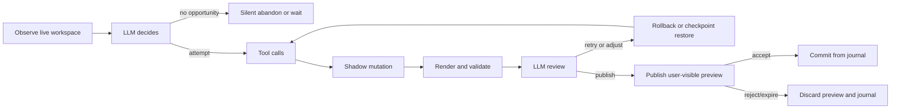

# LLM Participating in Every Step of a Next Action Runtime

## What the existing KiSurf branch already establishes

The KiSurf branch you pointed to already encodes several architectural commitments that strongly shape a workable Next Action Runtime. In the branch README, KiSurf is explicitly framed as an “AI-native PCB editor built on KiCad,” not a plugin, wrapper, or external MCP layer, and the core interaction is “Suggest, Accept, Materialize,” where the system observes design context, proposes the next concrete action, shows it in the real workspace, and only materializes it after acceptance. The same README also states that Chat Agent and Next Action Agent should share editor context, preview, validation, and operation infrastructure while serving different roles: Chat is user-directed and session-based; Next Action is ambient, activity-triggered, and low-friction. For Next Action specifically, the current branch already ties suggestions to editor revision, selection, tool state, and viewport so they can expire when stale, and it already exposes preview-only plumbing, semantic routing anchors, semantic placement candidate anchors, non-mutating anchor markers, observability logs, and a Python-first session runtime with shadow-board state, journals, checkpoints, rollback, validation, and accept replay. Just as important, the branch says autonomous Next Action suggestions are currently preview-only, while real mutation must go through an accepted execution session, which is exactly the right foundation for an LLM-mediated protocol rather than a native auto-apply policy. citeturn11view0turn12view0turn12view1turn12view2

That foundation matters because it makes the design problem narrower and more concrete. You do **not** need to invent a separate speculative-edit subsystem just for Next Action; KiSurf already has the beginnings of one in its session runtime, shadow-board, checkpoints, preview rendering, and accept replay model. The missing layer is the protocol that forces every meaningful semantic decision to flow through the LLM, while keeping deterministic subsystems such as routing planners, validators, and renderers in tool roles only. That is also consistent with mainstream tool-using agent practice: both OpenAI and Anthropic describe tools as functionality the application gives the model, while orchestration, approvals, tool execution, and state remain application-owned. In OpenAI’s current docs, function tools are application-defined and tool calls/tool outputs are correlated by `call_id`; in Anthropic’s docs, client tools are emitted by the model with `tool_use`, executed by the application, and then returned as `tool_result`. citeturn17view0turn17view1turn17view3turn18view0

The other crucial input is KiCad’s own interaction model. KiCad’s router already distinguishes temporary unfixed route segments from fixed committed segments, the interactive router continuously respects design rules in shove and walk-around modes, and dragging a footprint into a DRC-violating position causes it to revert rather than commit. KiCad also exposes semantically meaningful reference points for movement, such as a pad center or footprint anchor, which supports an anchor-first design far better than raw coordinate prediction. These existing editor semantics argue strongly for a protocol in which the LLM reasons over editor-native temporary states, anchors, and validation facts instead of trying to “guess” geometry end-to-end. citeturn13view0

## The recommended execution protocol

The right design is a **single, LLM-mediated runtime loop** with a strict publication boundary:



The **hard rule** should be: **deterministic tools may generate, mutate, score, validate, and render, but they may not publish**. Only the LLM may emit the semantic act that converts an internal attempt into a user-visible preview. This is the runtime equivalent of the repo’s current preview-first rule for `kisurf_run_action`, where a pending preview suggestion is created first and native action execution happens only after explicit acceptance. citeturn12view0turn12view1

That boundary is important for both product behavior and system explainability. If a router or candidate generator can directly publish whatever it deems “best,” then it is no longer a tool; it has become a shadow policy engine. That is exactly what your prompt is trying to avoid. The LLM should remain the “brain” by owning four decisions only:

1. **Should I intervene now?**
2. **Which tool or tool sequence should I invoke?**
3. **Is the attempt good enough after observing the result?**
4. **Should I publish, retry, rollback, or abandon?**

Everything else can be deterministic and as sophisticated as needed inside tools. This division follows both current agent API guidance and the empirical lesson from self-correction research: LLMs do improve when they can iteratively inspect external feedback and tool results, but “just thinking harder” without external feedback is much less reliable. CRITIC explicitly showed gains from tool-interactive critique; Kamoi et al. conclude that self-correction tends to help when reliable external feedback or tools are available; Reflexion shows gains when the agent can incorporate feedback across trials. citeturn16search0turn16search14turn15search1

With that in mind, each **runtime step** should have a minimal contract containing the following fields:

- `step_id`
- `runtime_id`
- `suggestion_slot_id`
- `base_context_version`
- `observation_packet`
- `llm_decision`
- `tool_invocations[]`
- `tool_results[]`
- `shadow_mutation_summary`
- `rendered_frame_refs[]`
- `validation_facts`
- `checkpoint_ref`
- `rollback_target_ref`
- `review_outcome`
- `publish_decision`

This is the smallest object that preserves traceability from “what the model saw” to “what it decided” to “what changed in shadow” to “what was shown to the user.” OpenAI’s current Responses API separation between tool calls and tool outputs, correlated by `call_id`, is a useful precedent here because it prevents the runtime from collapsing model intention and application execution into one opaque blob. citeturn17view1turn17view0

I would recommend implementing the loop as a **bounded micro-episode**, not an open-ended agent conversation. A single Next Action episode should usually be one to three internal attempts, rarely more than five, with a narrow latency budget and a mandatory stop condition. The reason is not only performance; it is also that proactive assistants become annoying when they over-intervene or over-elaborate. Current HCI studies on proactive coding assistants show two recurring findings: suggestions need contextual timing and efficient preview/evaluation, and too many interventions reduce usefulness even when productivity can still rise. A 2026 field study found materially better receptivity at workflow boundaries than mid-task interruptions, while the 2025 proactive programming assistant paper emphasizes timing, contextual relevance, lightweight summaries, previewability, and easy dismissal. citeturn19view0turn19view1

## The observation packet and review contract

The most important protocol object is the **Observation Packet**. If the LLM is supposed to participate in every step, then the runtime cannot merely pass “board state” in the abstract. It needs to pass a compact but decision-relevant packet that combines **visual, structural, temporal, and rule-check signals**.

A good Observation Packet should have six layers.

First, it needs a **workspace identity layer**: project id, editor kind, board/schematic revision hash, active sheet or board id, selection ids, active command, current tool mode, and viewport transform. KiSurf already treats revision, selection, tool state, and viewport as necessary suggestion context, so these belong in the first-class packet rather than hidden runtime metadata. citeturn12view0

Second, it needs a **visual layer**: one or more rendered frames, plus render directives and diagnostic metadata indicating what was intentionally highlighted and whether pixel capture was unavailable. The current KiSurf branch already supports visual frame reads, routing visual directives, placement candidate highlighting, and diagnostics for unavailable pixels. That is valuable because the review step should not depend on the LLM reverse-engineering appearance from raw geometry alone. In practice, the packet should include image references plus a terse structural caption generated by the runtime, such as “candidate anchor A is inside keepout” or “preview trace overlaps highlighted obstacle cluster.” citeturn12view0turn12view1turn12view2

Third, it needs a **structured geometry and diff layer**: the delta since the last checkpoint or live base, expressed in typed editor-native terms rather than raw polygon dumps. For PCB this means placed footprint handles, transformed positions/orientations, added or moved tracks, vias, zones, shapes, changed properties, current ratsnest deltas, and touched nets/layers. For forms or property editing, this becomes a schema-level field diff. The critical idea is that the LLM should review **semantic diffs**, not only screenshots. That matches KiSurf’s session runtime direction, where typed shadow-board handles, typed properties, journals, and replayable atomic operations already exist. citeturn12view1turn12view2

Fourth, it needs a **validation facts layer**. This should not be a monolithic “score.” It should be structured facts grouped by class: DRC violations, clearance conflicts, overlap detections, connectivity failures, keepout hits, net-intent mismatches, route detours, undesirable via counts, symmetry deviations, or schema inconsistencies. This is where self-correction becomes real rather than rhetorical: research suggests external feedback is what makes iterative LLM correction work; ungrounded self-reflection by itself is much weaker. citeturn16search0turn16search14turn15search1

Fifth, it needs a **user activity layer**: recent click and movement events, command history, dwell time, last accepted or rejected suggestion, and whether the user is still in the same micro-task. The KiSurf branch already records commands, selection, movement, mouse clicks, and modifier details in activity logs. That matters because proactive assist timing is inseparable from recent user activity; the HCI literature is very clear that intervention timing changes whether users experience help or disruption. citeturn12view0turn19view0turn19view1

Sixth, it needs a **budget and lease layer**: remaining latency budget, remaining internal attempt count, cancellation token, and any preview-surface lease status. This is not for semantic reasoning in the EDA sense, but it is necessary so the LLM can be instructed to prefer “publish now or abandon” when time is nearly exhausted instead of starting another speculative attempt.

A concrete skeleton could look like this:

```json
{
  "context_version": {
    "board_rev": "brv_4821",
    "selection_rev": "srv_117",
    "tool_rev": "trv_38",
    "viewport_rev": "vrv_72"
  },
  "workspace": {
    "editor": "pcb",
    "tool_mode": "interactive_route",
    "active_net": "USB_D+",
    "active_layer": "F.Cu",
    "selection": ["pad:J3.2", "track:t184"]
  },
  "visual": {
    "frames": ["frame://obs/91/main"],
    "render_directives": ["highlight_route_net", "show_route_anchors"],
    "diagnostics": []
  },
  "diff_context": {
    "shadow_delta_from_live": [],
    "ratsnest_delta": null
  },
  "validation": {
    "drc": [],
    "clearance": [],
    "connectivity": [],
    "heuristics": []
  },
  "activity": {
    "recent_events": ["click pad J3.2", "move cursor", "route start"],
    "last_user_action_ms_ago": 180
  },
  "budget": {
    "attempts_remaining": 2,
    "soft_deadline_ms": 220
  }
}
```

The **Review Step** should then consume the Observation Packet plus tool results and return one of a very small set of outcomes: `approve_publish`, `retry_with_adjustment`, `rollback_and_retry`, or `abandon`. The runtime should resist any richer free-form control here. The goal is not to constrain reasoning; it is to constrain side effects. OpenAI and Anthropic both now support strict schema-conformant tool calling, which is especially useful for engineering runtimes because it reduces the chance that a model emits half-formed control messages or ambiguous publish intents. citeturn7search3turn14search0

## Attempt, checkpoint, rollback, and publish

The internal **Attempt Step** is where most of the engineering specificity belongs. After the LLM issues tool calls, the runtime should create or select a scratch branch of state, execute the tools there, and record five things unconditionally: the mutation journal, a checkpoint before the mutation, the new shadow revision, the render artifact ids, and the validation artifact ids. Even if the LLM ultimately abandons the attempt, these records should exist for observability and debugging. That is consistent with KiSurf’s present journal/checkpoint/rollback model and with the broader agent-runtime pattern where orchestration owns execution, approval, and trace state. citeturn12view1turn12view2turn18view0turn18view2

A good Attempt record should therefore look roughly like this:

```json
{
  "attempt_id": "att_004",
  "base_context_version": "ctx_91",
  "checkpoint_before": "ckpt_12",
  "tool_calls": [
    {"call_id": "c1", "tool": "route_plan_to_anchor", "args": {...}},
    {"call_id": "c2", "tool": "apply_shadow_mutation", "args": {...}},
    {"call_id": "c3", "tool": "validate_shadow_delta", "args": {...}},
    {"call_id": "c4", "tool": "render_shadow_frame", "args": {...}}
  ],
  "tool_results": [...],
  "shadow_revision_after": "sh_44",
  "journal_entries": ["op_201", "op_202"],
  "render_refs": ["frame://att_004/1"],
  "validation_ref": "val_004"
}
```

The critical system rule is that **no attempt is user-visible by default**. Hidden attempts stay hidden unless and until the LLM issues a publish decision. This is where the distinction between **hidden attempt** and **published preview** must be strict. The user-visible preview should be treated as a separate state transition that takes an already-reviewed shadow result and binds it to a preview surface with provenance: which attempt produced it, from which base context version, using which tools, and with which validation snapshot. That separation is exactly what allows internal trial-and-error without flicker or live-board pollution. It also aligns with the repo’s current stance that autonomous Next Action suggestions are preview-only and that real mutation requires an accepted session. citeturn12view0turn12view1

The **Publish Step** should therefore require all of the following predicates to be true:

- the LLM explicitly returned `approve_publish`;
- the attempt still matches the current live context version at least on the dimensions required by this suggestion type;
- a fresh render exists for the exact shadow revision being published;
- a fresh validation bundle exists;
- no higher-priority preview currently owns the surface lease;
- the preview is within its latency freshness window.

If any of those conditions fail, publication should be rejected by the runtime even if the LLM requested it. This does **not** violate the “LLM is the brain” principle. It simply means the brain proposes a semantic act and the runtime validates publication preconditions, just as the current KiSurf branch already rejects stale accept by base hash and keeps autonomous suggestions preview-only. citeturn12view0turn12view1

The **rollback model** should be checkpoint-first, not inverse-operation-first. In principle both can work, but checkpoint-first is cleaner for speculative geometry work because placement and routing attempts often involve multiple coupled operations. A restore-to-checkpoint operation gives the LLM a simple action: “go back to the last clean branch point.” This is also more consistent with KiSurf’s existing session runtime language around checkpoints and rollback. citeturn12view1turn12view2

## State machine and stale behavior

The runtime state machine should be explicit, small, and editor-visible in traces:

```text
Observed
-> Reasoning
-> Attempting
-> Reviewing
-> Retrying
-> Published
-> Accepted | Rejected | Expired | Superseded
-> Committed | Discarded
```

I would define the states this way.

**Observed** means a stable-enough observation window was captured, but no LLM turn has run yet.
**Reasoning** means the LLM is deciding whether to stay silent, attempt, or abandon.
**Attempting** means tools are mutating shadow state or generating candidates.
**Reviewing** means the LLM is evaluating the rendered and validated outcomes.
**Retrying** means a new attempt is starting from a prior checkpoint or adjusted plan.
**Published** means a user-visible preview exists and holds a preview lease.
**Accepted** means the user approved the preview and the runtime may replay the journal into live state.
**Rejected** means the user dismissed it.
**Expired** means its bound context version is no longer current.
**Superseded** means a newer suggestion for the same micro-task replaced it.
**Abandoned** means the LLM or runtime chose not to publish anything.

This state machine is necessary because stale behavior is not a side case in an editor; it is the norm. The KiSurf README already says suggestions must be tied to revision, selection, tool state, and viewport. That should become a formal **context version vector** attached both to attempts and previews. At minimum, use four version components: `board_rev`, `selection_rev`, `tool_state_rev`, `viewport_rev`. For some suggestion types, add `schema_rev` or `form_rev`. On every significant user action, the runtime compares the preview’s binding to the current context. If the mismatch crosses the suggestion’s validity boundary, the preview transitions to `Expired` immediately. citeturn12view0

The validity boundary should be **type-specific**. A route continuation preview should be invalidated by changes to the active routing tool, the start anchor, the active net, nearby geometry, or layer mode. A placement suggestion should be invalidated by board-geometry changes near the candidate region, footprint selection changes, or substantial viewport/context changes if the suggestion is cursor-near. A property-fill suggestion may survive a pan or a board move but should expire on any edit to the same field or row. This type-specific staleness is also supported by proactive-assistant HCI work: users are more receptive when suggestions match the current workflow stage, and mid-task misalignment sharply reduces engagement. citeturn19view0turn19view1

For user experience, **Superseded** should be separate from **Expired**. Expired means “the world changed underneath this suggestion.” Superseded means “a newer, better suggestion for the same slot replaced this one.” That distinction helps both telemetry and tuning. If many suggestions expire, your debounce and cancellation are probably wrong. If many are superseded, your generation frequency or candidate arbitration may be too aggressive.

## Latency, debounce, and cancellation without violating LLM participation

The hardest objection to “LLM participates in every step” is latency. The way around that is **not** to let native policy bypass the LLM. The way around it is to reduce how often a semantic step is opened and to shrink what each step asks the LLM to decide. Current agent infrastructure guidance strongly supports application-owned orchestration, state, approvals, and sandbox/workspace management, while proactive-assistant studies show that timing and frequency are central to usability. citeturn18view0turn17view2turn19view0turn19view1

The runtime should therefore use four latency controls.

The first is **event debounce**. Do not launch a Next Action episode on every mouse move. Aggregate low-level activity into semantically meaningful observation windows such as “user paused after routing start,” “cursor dwelled near empty placement region,” or “focus entered a fillable field and paused.” This reduces calls without changing the rule that actual semantic suggestions require the LLM.

The second is **progressive budget classes**. Use a tiny budget for “opportunity detection,” a moderate budget for one speculative attempt, and a larger budget only if the first attempt gets close and context is still stable. In practice that means the LLM may first receive a compact packet and answer only `wait`, `abandon`, or `attempt`. Only if it chooses `attempt` does the runtime expose richer attempt tools.

The third is **cooperative cancellation**. Every observation packet and every tool call should carry a cancellation token keyed to context version. If the user keeps moving, switches tools, or edits the relevant object, the token invalidates ongoing attempts. The runtime may finish the current deterministic tool call if needed for internal cleanup, but it should suppress review and publication of any results tied to a cancelled token.

The fourth is **preview-surface leasing**. If a Chat Agent is using the primary preview surface for a running accepted session, Next Action should not fight for it. Instead it should either pause, degrade to silent observation, or publish only to a secondary unobtrusive surface such as a subtle hint badge. This follows directly from KiSurf’s own separation of Chat and Next Action roles and from the need to keep acceptance semantics understandable. citeturn11view0turn12view0

A practical latency policy would be:

- opportunity detection budget: about one fast LLM turn;
- speculative attempt budget: one to three tool calls and one review turn;
- maximum retries: usually one, occasionally two;
- hard cancel on context invalidation;
- no publication after deadline even if the result arrives.

That still preserves the principle you care about: **the LLM remains present at every semantic branch**, but the runtime engineers the branches to be few, cheap, and cancellable.

## Tool boundaries and coexistence with Chat Agent

The strongest long-term design principle is this: **stabilize tools around editor semantics and runtime guarantees, not around user tasks**. That means you should not create a permanent tool for every composite behavior such as “place decoupling network near IC” or “continue diff pair around obstacle cluster.” Those are task policies. Stable tools should instead expose reusable primitives with invariant guarantees such as:

- observe context,
- query semantic anchors,
- generate candidates,
- mutate shadow state,
- render shadow state,
- validate shadow state,
- checkpoint,
- rollback,
- publish preview,
- accept replay,
- dismiss preview.

What differentiates one domain from another is not a separate runtime; it is the **tool family behind the same protocol**. Placement tools return candidate anchors, collision facts, ratsnest deltas, symmetry metrics, and placement-region renders. Routing tools return route candidates, active anchors, allowed layers, via counts, clearance facts, connectivity facts, and future-space heuristics. Auto-fill tools return candidate values, schema validations, consistency checks, and field-level previews. But all of them feed the same Observe → Decide → Attempt → Render/Validate → Review → Publish loop. This is exactly how you avoid “three systems.” citeturn12view0turn12view1turn12view2

This is also why high-complexity tools are acceptable. A router may internally run sophisticated planning, shove analysis, and scoring. A validator may internally run incremental DRC or connectivity analysis. A renderer may know how to generate layered focus views. None of that is a problem, as long as those components return **inspectable results** rather than self-authorizing publication. OpenAI and Anthropic’s tool-use model is helpful here: the model decides when to call a tool and the application executes it; the tool is capability, not authority. citeturn17view0turn17view3

For coexistence with Chat Agent, the cleanest model is **shared runtime substrate, separate execution leases**. Chat Agent and Next Action should share the same shadow-board machinery, journal format, validation services, preview rendering, and accept replay semantics, because that keeps editing deterministic and auditable. But they should not share mutable session ownership. A Chat execution session should own its own runtime/session id, checkpoint chain, and accept lease. A Next Action episode should use an ephemeral constrained session with tighter tool vocabulary, smaller budgets, and stricter publication rules. The repo already hints at this division: Chat uses execution sessions and can mutate shadow state toward accepted replay, whereas current autonomous Next Action suggestions are preview-only and stripped of live edit objects. citeturn11view0turn12view0turn12view1

My recommendation is therefore:

- **one shared journal and shadow-state engine**;
- **separate session namespaces** for Chat and Next Action;
- **single preview-surface arbiter** with leases and priorities;
- **accept replay allowed only for the lease holder**;
- **Next Action confined to constrained sessions** unless explicitly escalated by the user into Chat.

That preserves a unified engine while preventing two agents from racing over board state or confusing the user about what “Accept” means.

## Recommended engineering decision

The most robust answer to your prompt is this:

**Implement Next Action as a bounded, LLM-mediated micro-runtime in which every semantic transition is explicit and reviewable, while deterministic geometry, validation, and rendering remain tool capabilities that never publish on their own.**

In practice, that means:

The **minimal unit of execution** is not a “suggestion” but a **step contract** that binds an observation packet, an LLM decision, tool calls and results, a shadow mutation record, rendered evidence, validation facts, and a publication outcome. This gives you the atomic audit trail you will need later for debugging, evals, and product trust. citeturn17view1turn18view0turn12view1

The **minimal unit of user interaction** is not an attempt but a **published preview**. Hidden attempts stay hidden. Users should normally see only the final LLM-reviewed preview, because proactive-assistant research consistently favors lightweight, efficiently evaluated suggestions over noisy continuous intervention. The exception is debugging or explicit “show work” modes, not default interaction. citeturn19view0turn19view1

The **minimal unit of correctness** is not model confidence but **externally grounded feedback**. Every geometry or routing attempt should come back with validation facts and render artifacts, because the evidence base for reliable self-correction is much stronger when the model can critique tool-grounded outcomes rather than only its prior text. citeturn16search0turn16search14turn15search1

The **minimal safety boundary** is that only the LLM may request publication, and only the runtime may authorize it after checking freshness, lease ownership, and preview validity. That gives you an LLM-as-brain architecture without letting publication become either arbitrary model text or silent native auto-policy. citeturn12view0turn17view0turn17view3

Taken together, this yields a runtime that is faithful to KiSurf’s present direction, compatible with KiCad’s existing preview/revert/interactive-router semantics, and extensible enough to add richer placement, routing, refilling, DRC review, or documentation suggestions later without rewriting the execution protocol. citeturn11view0turn12view0turn12view1turn13view0